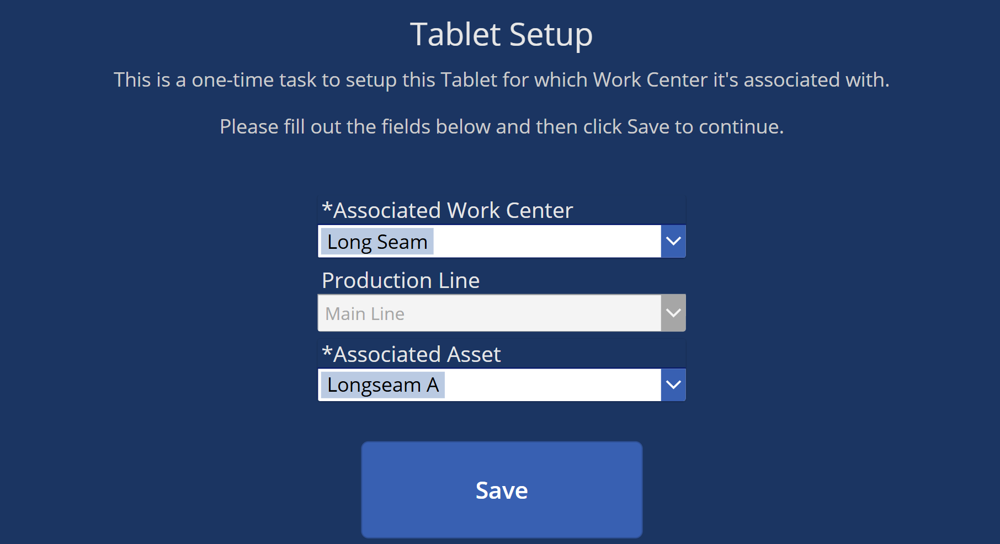
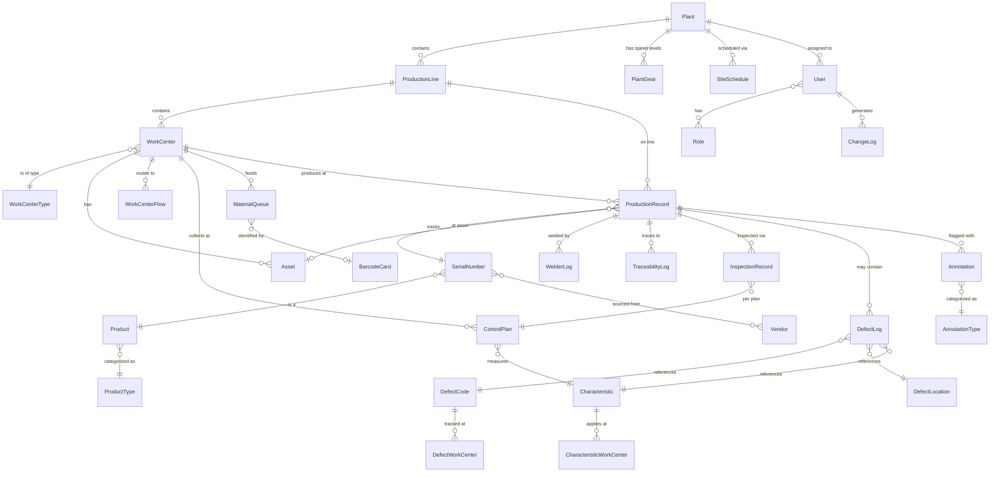

# QSC MES v2 — General Design Input

## Purpose of this document

This document is the **authoritative high-level design reference** for the Quality Steel Corporation (QSC) Manufacturing Execution System version 2. It captures architectural decisions, screen layout concepts, UX patterns, and integration points that apply across the entire application. Individual work center requirements, supervisor screens, and admin screens will each have their own specification documents that reference this one.

> **Audience**: Developers, AI assistants, project stakeholders, and QA.
> **Status**: Living document — updated as design decisions evolve.

---

## 1. Application Overview and Scope

### 1.1 Purpose

Replace the existing MES v1 (Microsoft PowerApp + Azure SQL) with a modern web application for Quality Steel Corporation's **3 manufacturing plants**. The new system will manage production tracking, quality inspection, material traceability, and defect logging at the work center level.

### 1.2 Target Environment

| Attribute | Detail |
|---|---|
| **Primary device** | Samsung 10" or 11" tablets in **landscape** orientation |
| **Mounting** | Fixed tablet installations at each work center on the production line |
| **Mobile use** | Team Leads and Supervisors carry tablets as they move through the plant |
| **Barcode scanner** | USB-connected (primary); Bluetooth (future) |
| **Barcode format** | Code 128 |
| **Network** | Strong plant-wide WiFi (gaps addressed as needed) |
| **Work centers** | 16–30 defined; 18–20 active today |
| **Plants** | 3 |

### 1.3 Guiding Principles

1. **Simplicity first** — 90%+ of users are non-technical plant floor operators. Every interaction must be as simple as possible.
2. **Scan-driven workflow** — Barcode scanning via the External Input toggle is the primary input method. Known action barcodes on laminated cards replace complex on-screen interactions.
3. **Manual fallback** — Every barcode action has an equivalent touch/manual mode for situations where scanning is unavailable.
4. **Dropdowns over typing** — Where manual input is required, use dropdown selectors populated from lookup tables to minimize errors.
5. **Immediate feedback** — Every scan produces an unmistakable full-screen color splash (green = valid, red = invalid).
6. **Kiosk-like operation** — Operators see only their work center screen; no free browser or Android OS navigation.

---

## 2. Technology Stack

Per [REFERENCE_ARCHITECTURE.md](REFERENCE_ARCHITECTURE.md):

| Layer | Technology |
|---|---|
| **Frontend** | React + TypeScript, Fluent UI component library |
| **Bundler** | Vite (or Next.js if SSR/API routes are needed) |
| **Backend** | ASP.NET Core Web API, .NET 8 LTS |
| **ORM** | Entity Framework Core |
| **Database** | Azure SQL Database (new schema; v1 data migrated) |
| **Auth (corporate)** | Microsoft Entra ID |
| **Auth (shop floor)** | Microsoft Entra External ID / B2C with local accounts |
| **App RBAC** | Database-backed roles/permissions |
| **Frontend hosting** | Azure Static Web Apps |
| **Backend hosting** | Azure App Service |
| **Source control** | GitHub |
| **CI/CD** | GitHub Actions |
| **IDE** | VS Code / Cursor |

---

## 3. Screen Architecture and Layout Concepts

### 3.1 Global Shell (Operator Work Center Layout)

All operator work center screens share a persistent shell with a **top bar**, **bottom bar**, and a **content area** between them. The content area is defined by each work center's specification.

```
+------------------------------------------------------------------+
| Work Center Name    | Operator | Welder(s)                       |   ← Top Bar
+------------------------------------------------------------------+
|             |                                     |              |
|  Left Panel |                                     |  WC History  |   ← Shows Count for the Day
|  Icon       |     Work Center Content Area        |--------------|     and Last 5 transactions
|  Features   |   (defined per work center spec)    |              |
|             |                                     |  Future      |   ← Possibly SPC charting
+------------------------------------------------------------------+
| Plant - 🕐 |      [External Input: On/Off]       | Status/Debug |   ← Bottom Bar
+------------------------------------------------------------------+
```

#### Top Bar

| Element | Description |
|---|---|
| **Work Center Name** | Name of the work center this tablet is assigned to |
| **Operator** | Currently logged-in operator's name |
| **Welder(s)** | Current Welder(s) at the work center, the Operator many not always be a Welder, can also add to Welders from this widget |

#### Bottom Bar

| Element | Description |
|---|---|
| **Plant Code and Date/Time** | Plant code logged into a hyphen and then the current date and time, the time is a clock that should increment each second. |
| **External Input Toggle** | When toggled **on**, the screen enters External Input (barcode) mode — a hidden textbox captures all scanner input and touch interaction is locked. When toggled **off**, the screen is in Manual (touch) mode with on-screen controls. |
| **Status/Debug** | Connection status, scanner status, or other system indicators or other debug information |

#### Content Area

| Element | Description |
|---|---|
| **Left Panel** | There are a few functions that Operators have access to that they can intiate via icons from this panel. |
| **Work center Content** | Renders the work-center-specific UI as defined in that work center's specification document. |
| **Work center History** | Displays the current count of transactions at that work center for that day, it's just a number and also lists the last 5 transactions at that work center, showing date/time, Shell or Identifer, Tank Size and a flag for if there's been an annotation to that transaction |
| **Future** | Reserved for future features (e.g., SPC charting). |

### 3.2 Key Screen Types

| Screen | Audience | Description |
|---|---|---|
| **Login** | All users | Employee number text input, plant selector, Login button |
| **Tablet Setup** | Team Lead (5.0)+ | Select work center, production line, and asset; caches selection to the tablet |
| **Operator Work Center** | Operator (6.0)+ | Kiosk-mode; content driven by work center spec |
| **Supervisor / Team Lead** | Supervisor (4.0), Team Lead (5.0) | Separate spec; multi-work-center views, overrides, tablet setup |
| **Admin** | Administrator (1.0) | User management, work center config, barcode card management, roles |

### 3.3 Scan Feedback Overlay

Every barcode scan triggers a **full-screen overlay** providing immediate, unmistakable feedback:

| Result | Background | Icon | Meaning |
|---|---|---|---|
| **Valid / Accepted** | Green (`#28a745`) | Checkmark | Scan was recognized and the action succeeded |
| **Invalid / Rejected** | Red (`#dc3545`) | X mark | Scan was unrecognized, out of context, or the action failed |

- **Duration**: Auto-dismiss after ~1.5–2 seconds (configurable per deployment).
- **Dismiss**: Tap anywhere to dismiss immediately.
- **Z-index**: Overlay sits above all content including the top/bottom bars.
- **Purpose**: Operators in a loud factory environment need a visual signal they can see from arm's length without reading text.

### 3.4 Login Screen


- **Welder Toggle**: In v1, a user would toggle this on if they are a certified welder.  This would also add their name to the Welder(s) list that shows at the top of the Operator Work Center screens.
- **Employee Number**: Large text input field; numeric keyboard presented on the tablet.
- **PIN**: Some users wanted additional security, so they have defined a PIN or password for their user accounts, this only shows up if the user has enabled a PIN for their account.  If this exists both the Employee Number and PIN must match a user record to login.
- **Site**: Dropdown defaulting to the user's assigned plant.
	- **Administrator (1.0) / Directors (2.0)**: Dropdown is **enabled** to select any plant.
	- **All Others (3.0–6.0)**: Dropdown is **disabled/locked** to their assigned plant.
- **Login Button**: Large, high-contrast primary blue button.
- **Test Mode Toggle**: In MES v1, users could log into Test mode and then all of the data was tagged as IsTest=true.  Not sure if this is needed for v2.
- **Debug Button**: Not sure if this is needed, in V1, this was used to display some information about the tablet and user in case we needed it to figure out a problem.
- All touch targets are oversized for ease of use.

### 3.5 Tablet Setup Screen

Accessible to **Team Lead (5.0) and above**. Used to configure which work center a fixed tablet is assigned to. The plant context is inherited from the user's login session — there is no separate plant selector on this screen.  

- **Work center selector**: Dropdown filtered by the logged-in user's plant.
- **Production Line**: Dropdown filtered by the logged-in user's plant.  Defines what production line this tablet is associated with.
- **Asset**: Dropdown filtered by selected Work center.  Some work centers have multiple assets or lanes that we need to capture as part of the data entry record.
- **Save / Confirm**: Caches the selected work center to the tablet's local storage. On subsequent operator logins, the app skips navigation and loads this work center's screen directly.
- **Re-run**: A Team Lead or Supervisor can re-run Tablet Setup at any time to reassign the tablet to a different work center.

---

## 4. Input Mode Design

### 4.1 External Input Mode (Barcode Scanning)

External Input mode is toggled **on** via the External Input toggle in the bottom bar. When enabled, the screen is locked for touch interaction — tapping the screen does nothing. A hidden textbox captures all input from the USB barcode scanner. The cursor is maintained within this textbox at all times so that any scanner input is captured correctly.

**How it works:**
1. A hidden text input field is rendered on the page and kept **permanently focused**.
2. The USB barcode scanner acts as a keyboard wedge — it types the barcode string and sends an Enter/Return keystroke.
3. The app captures the string on Enter, parses the prefix, and routes the command to the appropriate handler.
4. The scan feedback overlay fires (green or red).
5. The hidden input is cleared and re-focused, ready for the next scan.

**Barcode Command Language** (per [MES_V1_BARCODE_LANG.MD](MES_V1_BARCODE_LANG.MD)):

The general format is `PREFIX;PARAMETERS`. This allows the system to distinguish MES command barcodes from third-party vendor barcodes (which won't follow this prefix convention).

| Prefix | Meaning | Example |
|---|---|---|
| `SC;` | Shell code / unit identifier | `SC;00000001` |
| `D;` | Defect code | `D;042` |
| `L;` | Location code | `L;003` |
| `FD;` | Full defect (compound) | `FD;042-007-003` (DefectCode-Characteristic-Location) |
| `INP;` | Input / action command | `INP;1` (e.g., Print), `INP;3` (Yes), `INP;4` (No) |
| `KC;` | Card lookup (reusable barcode card) | `KC;03` |
| `TS;` | Tank size change | `TS;120`, `TS;250`, `TS;500` |
| `S;` | Save | `S;1` |
| `CL;` | Clear all | `CL;1` |
| `O;` | Override save | `O;1` |
| `FLT;` | Fault / error from equipment | `FLT;Button Stuck` |
| `NOSHELL;` | No shell present | `NOSHELL;0` |

- Barcodes with **unrecognized prefixes** are treated as vendor/third-party barcodes and handled contextually by the active work center screen (e.g., a material coil barcode at the Rolls station).
- **Laminated barcode cards** for common actions (Yes, No, Save, Clear, etc.) are printed and placed at each work station.

### 4.2 Manual Mode (Touch)

When the External Input toggle is **off**, the screen operates in Manual mode. On-screen touch controls replace barcode-driven actions:

| Barcode Equivalent | Manual Mode Control |
|---|---|
| `SC;` shell scan | Text input or search/select from list |
| `D;` defect code | Dropdown selector populated from defect code lookup table |
| `L;` location | Dropdown selector populated from location lookup table |
| `INP;3` / `INP;4` (Yes/No) | Large Yes / No touch buttons |
| `S;1` (Save) | Save button |
| `CL;1` (Clear) | Clear button |
| Action-specific commands | Contextual touch buttons per work center spec |

- The **same business logic** executes regardless of input mode; only the input mechanism changes.
- Manual mode is designed as a fallback, not the primary workflow. UI should gently encourage barcode use where possible.

---

## 5. Authentication and Session Management

### 5.1 Login Flow

1. User enters their **employee number** on the Login screen.
2. Frontend sends the employee number to the backend API.
3. Backend validates the employee number against the Users table, authenticates via Entra External ID / B2C, and returns a JWT token.
4. Frontend stores the token and loads the appropriate screen based on:
	- The user's **role** (determines which screen type).
	- The tablet's **cached work center** (determines which work center content to load for operators).

### 5.2 Plant Assignment

| Role Level | Plant Selector Behavior |
|---|---|
| **Operator (6.0)** | Locked to their assigned plant (not changeable) |
| **Team Lead (5.0) / Quality Tech (5.0)** | Locked to their assigned plant |
| **Supervisor (4.0)** | Locked to their assigned plant |
| **Quality Manager (3.0) / Plant Manager (3.0)** | Locked to their assigned plant |
| **Quality Director (2.0) / Operations Director (2.0)** | Can select any plant |
| **Administrator (1.0)** | Can select any plant |

### 5.3 Work Center Routing

- After login, the app reads the tablet's **cached work center ID** from local storage.
- For **Operators**: The work center screen loads automatically — no menu or navigation step.
- For **Team Leads / Supervisors**: They may see their role-specific screen (separate spec) with options to view work centers, run tablet setup, etc.
- For **Admins**: The admin dashboard loads.

### 5.4 Session Management

- **Idle timeout**: Configurable duration. After timeout, a warning prompt appears. If no interaction, auto-logout returns to the Login screen.
- **Token refresh**: JWT tokens are refreshed silently while the session is active.
- **Concurrent sessions**: A user can only be logged in on one tablet at a time (prevents an operator from being "active" at two work centers simultaneously).

### 5.5 Shift Support (Future)

Not active today, but may be added in the future.

---

## 6. Role-Based Access Control

Per [SECURITY_ROLES.md](SECURITY_ROLES.md), the application defines 7 role tiers plus a special-case role:

| Tier | Role | Description |
|---|---|---|
| **1.0** | Administrator | IT staff; full access to everything |
| **2.0** | Quality Director | Quality leadership across all 3 plants |
| **2.0** | Operations Director | Operations leadership across all 3 plants |
| **3.0** | Quality Manager | One per plant; reports to Quality Director |
| **3.0** | Plant Manager | One per plant; reports to Operations Director |
| **4.0** | Supervisor | Reports to Plant Manager; 1–2 per plant |
| **5.0** | Quality Tech | Reports to Quality Manager at a plant |
| **5.0** | Team Lead | Reports to Supervisor at a plant |
| **5.5** | Authorized Inspector | External (non-employee); limited read-only access to logs/inspections |
| **6.0** | Operator | Plant floor workers — work center operators, material handling, etc. |

### 6.1 Feature Access by Role

| Feature | Minimum Role |
|---|---|
| Operator work center screens | Operator (6.0) |
| External Input toggle (On/Off) | All roles |
| Tablet Setup (assign work center) | Team Lead (5.0) |
| View inspection logs | Quality Tech (5.0) / Authorized Inspector (5.5) |
| Override actions (e.g., `O;1`) | Quality Tech (5.0) and above (per work center spec) |
| Supervisor / Team Lead screens | Supervisor (4.0) / Team Lead (5.0) — separate spec |
| View change logs | Quality Manager (3.0) and above |
| Admin screens (user/config management) | Administrator (1.0) |

### 6.2 Authorized Inspector (Special Case)

The Authorized Inspector (AI) is an **external representative** (not a QSC employee) who ensures ASME compliance for propane tank manufacturing. Their access is intentionally restricted:
- **Can view**: Inspection logs, defect records, quality-related data.
- **Cannot view**: Production volumes, cost data, operational configuration, employee details beyond what is needed.
- **Cannot modify**: Any data — strictly read-only.

---

## 7. Data Architecture (High Level)

### 7.1 Database Strategy

- **New schema** designed for MES v2 — the v1 PowerApp schema is not reused directly.
- **One-time data migration** from v1 Azure SQL database (which contains views and stored procedures) into the v2 schema.
- Stored procedures from v1 (used as function substitutes in PowerApps) will be replaced by **application service layer logic** in ASP.NET Core.

### 7.2 Conceptual Domain Entities



**Key entities:**

| Entity | Description |
|---|---|
| **Plant (Site)** | Called "Sites" at QSC. Physical manufacturing facility (3 total). Holds sequence codes for serial number generation. (v1: `mesSite`) |
| **Production Line** | A production line within a plant. Two plants have more than one; one plant has only one. Linked to a PlantGear. (v1: `mesProductionLine`) |
| **WorkCenter** | A station on the production line (16–30 defined). Configured with data entry type, welder count, defect settings, and production sequence. (v1: `mesWorkCenter`) |
| **WorkCenterType** | Category of work center (e.g., Rolls, Long Seam, Inspection, Fit-Up). v2 concept — v1 used a `DataEntryType` string on WorkCenter. |
| **WorkCenterFlow** | Defines downstream routing between work centers — which work center feeds which. (v1: `mesWorkCenterDownsteamWClink`) |
| **Asset** | Physical machine or lane at a work center (e.g., "Longseam A"). Selected during Tablet Setup. Has a maintenance identifier for Limble integration. (v1: `mesAsset`) |
| **User** | Employee record with employee number, PIN (optional), default site, welder certification status. (v1: `mesUser`) |
| **Role** | Application role per the 7-tier hierarchy. v1 used a `UserType` integer on the User record; v2 will use a proper roles table. |
| **Product** | Product master — represents a specific tank model with tank size, tank type, product number, Sage item number, and nameplate number. Replaces the simpler "TankSize" concept. (v1: `mesProduct`) |
| **ProductType** | Product type category (e.g., propane tank, other vessel types). (v1: `mesProductType`) |
| **SerialNumber** | Core tracking entity — everything that is a serial number in the plant. This could be a material lot provided by a vendor or an identifier of a product that QSC has created, including finished products. (v1: `mesSerialNumberMaster`) |
| **Vendor** | Material supplier — mills, steel processors, heads vendors. Linked to serial numbers for ASME traceability. (v1: `mesVendor`) |
| **ProductionRecord** | A manufacturing event — a unit/shell processed at a work center. Links to serial number, work center, production line, asset, operator, and product (in/out). (v1: `mesManufacturingLog`) |
| **WelderLog** | Tracks which certified welders worked on each production record, per characteristic. Required for ASME compliance. (v1: `mesManufacturingLogWelder`) |
| **TraceabilityLog** | Links component serial numbers (coils, heads) to assembly serial numbers (shells) with quantity and tank location. Essential for ASME material traceability. (v1: `mesManufacturingTraceLog`) |
| **InspectionRecord** | Quality inspection result for a unit at an inspection station. Linked to a ControlPlan entry. Can hold text or numeric results. (v1: `mesManufacturingInspectionsLog`) |
| **ControlPlan** | Quality control plan — defines which characteristics are collected at which work centers, whether collection is enabled, result type, and gate check status. (v1: `mesControlPlan`) |
| **DefectLog** | Individual defect entries linked to a production record and serial number. Tracks defect, location, characteristic, location details, repair status, and who repaired it. (v1: `mesDefectLog`) |
| **DefectCode** | Lookup table of defect types with code, name, severity, and system type. (v1: `mesDefectMaster`) |
| **DefectLocation** | Lookup table of defect locations on a unit, with default location detail values. Linked to a characteristic. (v1: `mesDefectLocation`) |
| **Characteristic** | Quality characteristic with spec limits (high, low, target). Linked to product types. Has configurable location detail fields. (v1: `mesCharacteristic`) |
| **CharacteristicWorkCenter** | Junction table — which characteristics apply at which work centers. (v1: `mesCharacteristicWorkCenter`) |
| **DefectWorkCenter** | Junction table — which defects are trackable at which work centers, with earliest detection work center and repair master. (v1: `mesDefectWorkCenter`) |
| **MaterialQueue** | Queue of incoming materials at a work center with position, status, quantity, and kanban card link.  Material queue's are sometimes required at work centers so material handlers can use their time to get key data about materials and operators don't have to spend their time documenting this information. (v1: `mesWorkCenterMaterialQueue`) |
| **BarcodeCard** | Registry of reusable barcode cards (`KC;` prefix) for material identification. Color-coded with barcode values. (v1: `mesKanbanCards`) |
| **Annotation** | Notes/flags attached to production records. Has flag status, resolution notes, and tracks who initiated and resolved. Referenced in WC History panel. (v1: `mesAnnotation`) |
| **AnnotationType** | Types of annotations — defines whether resolution is required, whether operators can create them, display color, and abbreviation. (v1: `mesAnnotationType`) |
| **SiteSchedule** | Production schedule per site — quantity, tank size/type, build date, dispatch date, completion tracking, and status. (v1: `mesSiteSchedule`) |
| **PlantGear** | Production speed/capacity levels for a plant. Linked to production lines and production records. (v1: `mesPlantGears`) |
| **ChangeLog** | Field-level change tracking — records which table, which record, which field changed, from-value, to-value, and who made the change. More granular than a general audit log. (v1: `mesChangeLog`) |
| **SpotXrayIncrement** | Detailed X-ray inspection records per seam, with shot numbers, dates, results, trace shots, and welder assignments. Domain-specific to the X-ray work center. (v1: `mesSpotXrayIncrement`) |

### 7.3 V1 Tables Not Carried Forward as Named Entities

The following v1 tables are implementation-level concerns that don't need to be called out as high-level domain entities but will exist in some form in v2:

| V1 Table | V2 Handling |
|---|---|
| `mesErrorLog` | Replaced by Application Insights and structured backend logging |
| `mesHeartbeat` | Replaced by Azure App Service health checks and Application Insights availability monitoring |
| `mesUsersCurrent` | Replaced by JWT session management and concurrent-session enforcement logic |
| `mesUserNotification` | Removed from initial scope; Future panel reserved for this |
| `mesXrayShotNumber` | Sequence generation will be handled in the application service layer or database sequences |

### 7.4 Future Schema Considerations

- **Shift** table and shift-to-production-record linkage (when shift tracking is reactivated).

---

## 8. Integrations

### 8.1 NiceLabel Cloud (Barcode Printing)

- Some work centers require printing barcode labels (e.g., shell labels at the Rolls station).
- **NiceLabel Cloud** is the label management platform; printers are cloud-connected.
- The MES v2 backend will call the NiceLabel Cloud API to trigger print jobs.
- Print triggers are defined per work center spec (e.g., `INP;1` at Rolls = print/increment label).

### 8.2 Limble CMMS (CMMS Application)

- Limble is used by Maintenance Teams to document and track maintenance activities via work orders.
- The MES v2 backend will call the Limble API to allow users to generate work orders from the MES and also view the status of work orders submitted.

### 8.3 Power BI (Reporting and Analytics)

- Reporting and dashboards are a **separate project**.
- The MES v2 Azure SQL database serves as the **data source** for Power BI.
- No reporting UI is built into the MES v2 application itself.

### 8.4 Microsoft Entra ID / External ID

- **Corporate users** (Directors, Admins): Authenticate via Entra ID.
- **Shop-floor users** (Operators, Team Leads, etc.): Authenticate via Entra External ID / B2C with local accounts.
- Frontend uses MSAL for token acquisition.
- Backend validates JWT bearer tokens.

### 8.5 Future Integrations

| Integration | Description |
|---|---|
| **Bluetooth barcode scanners** | Support wireless scanner connectivity to tablets |
| **Document viewing** | Open reference documents (PDFs, work instructions) in a new browser tab from within the MES app |

---

## 9. Branding and Styling

Per [QSC_STYLE_GUIDE.md](QSC_STYLE_GUIDE.md), the application follows the Quality Steel Corporation / LT Corporation brand guidelines.

### 9.1 Color Palette

| Role | Token | Hex | MES Usage |
|---|---|---|---|
| **Primary** | `--qs-primary` | `#2b3b84` | Top bar, primary buttons, links, headers |
| **Primary Hover** | `--qs-primary-hover` | `#222e67` | Button hover states |
| **Secondary** | `--qs-secondary` | `#e41e2f` | Accent buttons, alerts, CTAs |
| **Success** | `--qs-success` | `#28a745` | Valid scan overlay, success states |
| **Danger** | `--qs-danger` | `#dc3545` | Invalid scan overlay, error states |
| **Warning** | `--qs-warning` | `#ffc107` | Caution states, attention-needed indicators |
| **Info** | `--qs-info` | `#17a2b8` | Informational states |
| **Body Text** | `--qs-body-text` | `#212529` | Default text |
| **Light Background** | `--qs-light` | `#f8f9fa` | Page backgrounds |
| **Dark** | `--qs-dark` | `#343a40` | Dark UI surfaces |

### 9.2 Typography

- **Font family**: `"Roboto", Helvetica, Arial, sans-serif`
- **Weights used**: 400 (regular), 500 (medium), 700 (bold)
- **Base size**: `16px` (`1rem`)
- Plant floor screens should use **larger font sizes** than typical web apps — readability at arm's length is critical.

### 9.3 Buttons

- **Border radius**: `0` — sharp square edges are a brand hallmark.
- **Padding**: `15px 30px` (desktop); even larger for primary action buttons on tablet screens.
- **Hover pattern**: Inverted fill — background and text colors swap on hover/press.
- **Touch targets**: Minimum **48x48px** per Material Design guidelines; **64x64px or larger** recommended for primary operator actions (accounts for gloved hands).

### 9.4 Plant Floor Visibility

- **High contrast** is mandatory — avoid light gray on white or similar low-contrast combinations.
- **Font sizes** on operator screens should be noticeably larger than standard web app sizes.
- **Color-coded states** (green/red/yellow) must be distinguishable and not rely on color alone — pair with icons or text labels for accessibility.

---

## 10. Change Logging and Audit Trail

### 10.1 Purpose

Primary purpose is **troubleshooting** — understanding what happened, when, and by whom when issues arise on the production floor.

The v1 system uses a **field-level ChangeLog** (`mesChangeLog`) that records before/after values for every data change. V2 will continue this approach and extend it with additional event tracking.

### 10.2 What Gets Logged

| Event Category | Logging Mechanism | Examples |
|---|---|---|
| **Data Changes** | ChangeLog (field-level) | Record creation, field updates, deletions — with from-value and to-value |
| **Overrides** | ChangeLog (field-level) | Quality override saves (`O;1`), defect clears (`CL;1`) |
| **Authentication** | Application log | Login, logout, failed login attempts |
| **Scans** | Application log | Every barcode scan (command, raw value, result) |
| **Configuration** | ChangeLog (field-level) | Work center assignments, role changes, user management |
| **System** | Application log | Tablet setup changes, input mode switches |

### 10.3 ChangeLog Record Structure (from v1 `mesChangeLog`)

| Field | Description |
|---|---|
| **RecordTable** | Name of the table containing the changed record |
| **RecordId** | ID of the record that was changed |
| **ChangeDateTime** | UTC date/time of the change |
| **ChangeByUserId** | Employee who made the change |
| **FieldName** | Name of the field that was changed |
| **FromValue** | Previous value (text) |
| **ToValue** | New value (text) |
| **FromValueId** | Previous value (ID, for FK references) |
| **ToValueId** | New value (ID, for FK references) |

### 10.4 Access

- **Quality Manager (3.0) and above** can view change logs.
- **Administrator (1.0)** has full log access including system/config events.
- Change logs are **append-only** — records cannot be modified or deleted through the application.

---

## 11. Offline Considerations

### 11.1 Primary Assumption

The application is designed for **strong WiFi connectivity**. Network gaps will be addressed at the infrastructure level.

### 11.2 Graceful Degradation

Even with strong WiFi, momentary drops can occur. The application should:

1. **Detect** connectivity loss and display an **offline indicator** in the bottom bar status area.
2. **Queue** scan actions locally in the browser when the backend is unreachable.
3. **Sync** queued actions when connectivity is restored, in the order they were captured.
4. **Warn** the operator visually that they are in offline mode (e.g., yellow warning banner).

### 11.3 Architecture Principle

The application architecture should **not preclude** adding robust offline support in the future (e.g., via service workers and IndexedDB), even though it is not a primary requirement today.

---

## 12. Future Considerations

The following items are **out of scope** for the initial release but the architecture and data model should be designed to accommodate them without major rework:

| Item | Notes |
|---|---|
| **Shift tracking** | Shift definitions and user-shift assignments; link production records to shifts |
| **Bluetooth barcode scanners** | Wireless scanner connectivity; may require different input handling |
| **Document viewing** | Open work instructions, SOPs, or reference documents at work centers (new browser tab) |
| **Additional work centers** | Expansion beyond the current 18–20 active work centers |
| **Multi-language support** | English only for initial release; architecture should support i18n later |
| **Real-time dashboards** | Beyond Power BI; potential for in-app supervisor dashboards |
| **Offline-first mode** | Full offline operation with background sync for plants with poor connectivity |

---

## Reference Documents

| Document | Purpose |
|---|---|
| [REFERENCE_ARCHITECTURE.md](REFERENCE_ARCHITECTURE.md) | Standard tech stack, Azure resources, and development workflow |
| [QSC_STYLE_GUIDE.md](QSC_STYLE_GUIDE.md) | Brand colors, typography, design tokens, and visual guidelines |
| [SECURITY_ROLES.md](SECURITY_ROLES.md) | Role hierarchy (7 tiers + Authorized Inspector) |
| [MES_V1_BARCODE_LANG.MD](MES_V1_BARCODE_LANG.MD) | Barcode command language reference from MES v1 |
| [MES_V1_TABLE_SCRIPTS.sql](MES_V1_TABLE_SCRIPTS.sql) | V1 database table creation scripts — schema reference for data migration and entity design |
| [MANFACTURING_CONCEPTS.MD](MANFACTURING_CONCEPTS.MD) | Tank component diagrams and manufacturing process concepts |
| [SPEC_LOGIN_SCREEN.md](SPEC_LOGIN_SCREEN.md) | Login screen specification — layout, flow, validation, and design decisions |
| [SPEC_TABLET_SETUP_SCREEN.md](SPEC_TABLET_SETUP_SCREEN.md) | Tablet Setup screen specification — work center/asset assignment, caching, and cascading dropdowns |
| [SPEC_OPERATOR_WC_LAYOUT.md](SPEC_OPERATOR_WC_LAYOUT.md) | Operator Work Center Layout — persistent shell (top bar, bottom bar, content area, scan overlay, input modes) |
| [SPEC_WC_ROLLS.md](SPEC_WC_ROLLS.md) | Rolls work center — first station; steel plate rolled into shells, dual-label scanning, material queue, thickness inspection |
| [SPEC_WC_LONG_SEAM.md](SPEC_WC_LONG_SEAM.md) | Long Seam work center — scan-through station; longitudinal seam welded, captures timestamp and welder |
| [SPEC_WC_LONG_SEAM_INSPECTION.md](SPEC_WC_LONG_SEAM_INSPECTION.md) | Long Seam Inspection — defect logging with assumed Long Seam characteristic, scan-sheet-driven workflow |
| [SPEC_WC_FITUP.md](SPEC_WC_FITUP.md) | Fitup work center — shell + head assembly, alpha code assignment, reassembly/splitting, kanban card head lots |
| [SPEC_WC_ROUND_SEAM.md](SPEC_WC_ROUND_SEAM.md) | Round Seam — circumferential welds, per-seam welder setup, assembly-level tracking, SAW/MIG asset |
