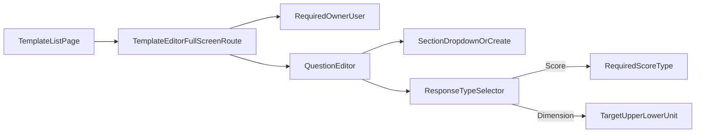

# Checklist Template Expansion

## Purpose

Define the expanded Checklist Template feature for MES v2, including score types, template ownership, question sections, updated response types, and a list-to-fullscreen editing workflow.

This spec is the canonical reference for implementing the checklist template expansion across backend, frontend, and testing.

## Scope

### In Scope

- Add reusable **Score Types** with one or more score values.
- Add required **Owner** on checklist templates.
- Change checklist template admin UX to:
  - template list view, then
  - dedicated full-screen editor route for create/edit.
- Expand question model:
  - optional section
  - updated response type set
  - score-type linkage for score questions
  - dimension metadata fields for dimension questions.
- Remove legacy response types no longer in scope.
- Define rollout behavior for environments with pre-existing checklist question/response data.

### Out of Scope

- Data migration from legacy response types to new response types.
- Runtime/operator checklist UX redesign beyond what is needed to support new response types.
- Advanced scoring analytics/reporting.
- Multi-select score responses.

## Roles and Permissions

### Score Type Management

- **Allowed**: Administrator (1.0), Directors (2.0).
- **Not allowed**: all other roles.
- Allowed operations: create, edit, archive.

### Checklist Template Edit

- Template has one required owner (`OwnerUserId`).
- **Owner-only edit policy**:
  - template owner can edit regardless of role tier.
  - non-owners cannot edit the template.
- Read/list access follows existing checklist visibility behavior unless overridden by a future spec.

## Domain Model Additions

### ScoreType

| Field | Type | Rules |
|---|---|---|
| `Id` | GUID (PK) | Required |
| `Name` | string | Required, unique among active score types (case-insensitive) |
| `IsActive` | bool | Archive flag (`false` = archived) |
| `CreatedByUserId` | GUID | Required |
| `CreatedAtUtc` | datetime | Required |
| `ModifiedByUserId` | GUID (nullable) | Optional |
| `ModifiedAtUtc` | datetime (nullable) | Optional |

### ScoreTypeValue

| Field | Type | Rules |
|---|---|---|
| `Id` | GUID (PK) | Required |
| `ScoreTypeId` | GUID (FK) | Required |
| `Score` | decimal | Required |
| `Description` | string | Required |
| `SortOrder` | int | Required for deterministic option display |

Rules:
- Each score type must have **at least one** score value.
- Score values within a score type must be unique by `(Score, Description)` pair.

### ChecklistTemplate Additions

| Field | Type | Rules |
|---|---|---|
| `OwnerUserId` | GUID (FK User) | Required |

### ChecklistTemplateItem Additions/Changes

| Field | Type | Rules |
|---|---|---|
| `Section` | string (nullable) | Optional section name |
| `ResponseType` | string | Must be one of the allowed values in this spec |
| `ScoreTypeId` | GUID (nullable) | Required when `ResponseType = Score`; otherwise null |
| `DimensionTarget` | decimal (nullable) | Required when `ResponseType = Dimension` |
| `DimensionUpperLimit` | decimal (nullable) | Required when `ResponseType = Dimension` |
| `DimensionLowerLimit` | decimal (nullable) | Required when `ResponseType = Dimension` |
| `DimensionUnitOfMeasure` | string (nullable) | Required when `ResponseType = Dimension`; currently fixed to `inches` |

## Response Type Contract

### Allowed Response Types

- `Checkbox`
- `Datetime`
- `Number`
- `Image`
- `Dimension`
- `Score`

### Removed Response Types

- `PassFail` (legacy)
- `Select` (legacy)

### Response-Type-Specific Rules

- `Score`:
  - requires `ScoreTypeId`.
  - response is single-choice from the selected score type values.
- `Dimension`:
  - requires `DimensionTarget`, `DimensionUpperLimit`, `DimensionLowerLimit`, `DimensionUnitOfMeasure`.
  - `DimensionUnitOfMeasure` must be `inches` for this release.
  - system should validate `LowerLimit <= Target <= UpperLimit`.
- `Checkbox`:
  - response is boolean.
- `Datetime`:
  - response is timestamp/date-time per existing UTC conventions.
- `Number`:
  - response is numeric.
- `Image`:
  - response requires image attachment payload reference (per existing upload handling).

## Sections Behavior

- A question section is optional.
- Section selector supports:
  - selecting an existing section already used by the template, or
  - creating a new section inline.
- Section ordering in template editor and runtime checklist display is alphabetical by section name.
- Questions without section appear in an unsectioned group.

## Admin UX Flow

Template management moves to list + full-screen route workflow.

Required UI behavior:
- List view supports open/create template actions.
- Editing occurs on a dedicated full-screen page/route, not inline list editing.
- Owner field is required and validated before save.
- Question editor dynamically shows:
  - score type picker for `Score`.
  - target/upper/lower/unit fields for `Dimension`.

## API and Validation Requirements

- Server must reject template create/update requests when:
  - owner is missing.
  - response type is unsupported.
  - `Score` question has no `ScoreTypeId`.
  - `Dimension` question is missing required dimension fields.
  - `Dimension` limits are logically invalid.
- Server must enforce owner-only template edits.
- Server must enforce score-type management role restrictions (admin/director only).

## Data Reset and Rollout Policy

- No legacy migration is required for this feature.
- If any checklist template question data and/or checklist responses exist in environment, delete that legacy checklist question/response data before enabling the new response type set.
- Rollout sequence:
  1. deploy schema/API updates,
  2. clear legacy checklist question/response data if present,
  3. deploy frontend updates,
  4. validate create/edit and runtime checklist flows.

## Implementation Mapping Appendix

### Backend

- `backend/MESv2.Api/Models/Checklist.cs`
  - response type constants and checklist entities.
- `backend/MESv2.Api/Data/Configurations/ChecklistEntityConfigurations.cs`
  - EF mappings for new fields and relationships.
- `backend/MESv2.Api/DTOs/ChecklistDtos.cs`
  - API contracts for template owner, section, score linkage, and dimension fields.
- `backend/MESv2.Api/Services/ChecklistService.cs`
  - validation, normalization, permission checks (owner-only edit + score-type RBAC).

### Frontend

- `frontend/src/features/admin/ChecklistTemplatesScreen.tsx`
  - list screen behavior and navigation to full-screen editor route.
- `frontend/src/types/api.ts`
  - request/response type contracts.
- `frontend/src/types/domain.ts`
  - domain response type union and question metadata types.
- `frontend/src/api/endpoints.ts`
  - score type endpoints and updated template payloads.

## Testing Matrix

### Backend Unit Tests

- Score type CRUD authorization:
  - admin/director allowed,
  - non-admin/director denied.
- Template save validation:
  - owner required,
  - `Score` requires score type,
  - `Dimension` requires all four fields,
  - invalid dimension limits rejected.
- Owner-only edit:
  - owner can edit regardless of role tier,
  - non-owner denied.
- Response type allow-list enforcement and removed type rejection.

### Backend Integration Tests

- End-to-end template create/edit with sectioned questions and mixed response types.
- Score question returns score options from selected score type.
- Dimension question persists and returns target/limits/unit.
- Legacy data reset script/process can run safely when data exists.

### Frontend Tests (Vitest/RTL)

- Template list opens full-screen editor route.
- Owner field required validation.
- Section selector:
  - shows existing sections,
  - accepts creating a new section.
- Response type conditional UI:
  - `Score` shows score type selector and requires selection.
  - `Dimension` shows target/upper/lower/unit fields.
- Section grouping renders in alphabetical order.

## Acceptance Criteria

1. Admin/director users can create, edit, and archive score types with one or more score values.
2. Non-admin/director users cannot manage score types.
3. Checklist templates require an owner user.
4. Template editing is owner-only; owner can edit regardless of role tier.
5. Checklist template admin UX is list view plus full-screen editor route.
6. Question section is optional and supports existing-section selection and new-section creation.
7. Section display order is alphabetical by section name.
8. Allowed question response types are exactly `Checkbox`, `Datetime`, `Number`, `Image`, `Dimension`, `Score`.
9. `PassFail` and `Select` are not valid response types.
10. `Score` questions require a score type and store a single selected score value response.
11. `Dimension` questions require target, upper limit, lower limit, and unit of measure (`inches`).
12. If legacy checklist question/response data exists, it is deleted before new type set activation.

