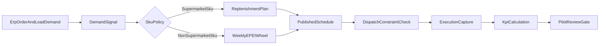

# Heijunka + EPEI + Supermarket Hybrid Scheduling

## Purpose

Define a practical operating model that combines:

- weekly EPEI wheel scheduling for predictable cadence,
- supermarket replenishment control for high-volume SKUs,
- execution telemetry required to publish reliable KPIs.

This spec establishes "schedule first, KPI second" so KPI calculations are based on controlled planning and actual execution signals, not assumptions.

## Business Outcome

1. Stabilize weekly production by site and line without over-rigid plans.
2. Protect service on high-volume SKUs through supermarket replenishment policies.
3. Standardize KPI definitions across plants while allowing plant-specific SKU mix.
4. Create a repeatable pilot method before expanding to all sites/lines.

## Current Baseline

- EPEI is currently weekly.
- Sites typically assign tank sizes to fixed weekdays and keep a similar order each week.
- Plants use supermarket behavior for roughly 10 to 20 high-volume items, with item sets varying by plant.
- Customer demand is entered in ERP as sales orders and organized into truck-load groupings with load identifiers and dispatch dates.
- Most ERP orders represent full-truck demand; partial loads are combined and represented as multi-order load groups.

## Scope

### In Scope

- Policy model for hybrid scheduling (EPEI wheel plus supermarket replenishment).
- Scheduling MVP workflow, lifecycle states, freeze controls, and change logging.
- Minimum execution capture required for KPI eligibility.
- KPI definitions, formulas, reporting grain, and exclusions.
- Role ownership and governance for pilot and rollout gates.

### Out of Scope

- Advanced automatic optimizer/solver for sequence generation.
- Plant-wide APS replacement in this phase.
- New work center transaction workflows unrelated to planning/execution telemetry.

## ERP Integration Requirements

Scheduling depends on ERP demand and dispatch commitments. ERP integration is required to prevent local schedule decisions from missing ship-date obligations.

### Business Context

- Sales orders are created in ERP and commonly represent full-truck demand.
- One truck load may contain one order (`-0`) or multiple orders (`-1` to `-4`).
- Dispatch date is the operational ship commitment date and is often Friday.
- Legacy load-code components may continue for external familiarity, but planning logic should rely on normalized fields.

### Integration Scope (Minimum)

Inbound from ERP to MES planning:

- Sales order demand lines by site and product.
- Load grouping metadata (single-order or multi-order truck grouping).
- Dispatch date per load group.
- Required quantity per product within each load group.

Optional but recommended:

- Promised customer date and customer priority.
- Order hold/release state.
- Last update timestamp and source system audit metadata.

### ERP Raw Landing Contract (Ingestion)

To support legacy ERP integration where APIs are unavailable, this spec standardizes a single raw landing dataset and table shape for ERP-to-MES ingestion.

Raw ingestion table (MES-owned):

- `ErpSalesOrderDemandRaw`

One row per ERP sales-order line demand record with minimal transformation at ingestion time.

Required fields in the inbound ERP extract:

- `ErpSalesOrderId` (business order key, not an internal surrogate database id)
- `ErpSalesOrderLineId` (business line key within the order)
- `ErpSkuCode`
- `SiteCode`
- `ErpLoadNumberRaw`
- `DispatchDateLocal`
- `RequiredQty`
- `OrderStatus`
- `SourceExtractedAtUtc`

Optional but recommended fields:

- `ErpLastChangedAtUtc`
- `SourceBatchId`

Ingestion behavior:

1. ADF (or equivalent ETL) should transport ERP rows to MES raw landing with no planning/business-rule logic.
2. Preferred pattern is incremental pull using `ErpLastChangedAtUtc` when available.
3. If no reliable ERP "last changed" field exists, full scheduled extracts are acceptable; MES downstream processing must deduplicate and detect effective changes.
4. MES normalization/mapping logic runs after raw ingestion and populates canonical planning data structures.

Scheduling cadence guidance:

- Start with every 15 minutes during operating hours.
- Use hourly cadence during off-hours unless dispatch risk requires higher frequency.

### Canonical ERP-MES Fields

The planning service should map ERP payloads to canonical fields:

- `ErpSalesOrderId`
- `ErpSalesOrderLineId`
- `ErpLoadNumberRaw` (kept for traceability)
- `LoadGroupId` (normalized truck-load key without string parsing dependency)
- `LoadLegIndex` (0..4)
- `DispatchDateLocal`
- `SiteCode`
- `ProductId` (or item mapping key)
- `RequiredQty`
- `OrderStatus`
- `ErpLastChangedAtUtc`

### ERP SKU to MES Planning Group Mapping Strategy

Current-state constraint: MES planning and scheduling are group-based, while ERP demand is SKU-based.  
This specification uses a normalization layer so ERP demand can drive schedules without requiring immediate SKU-level scheduling in MES.

Mapping contract:

- `ErpSkuCode`
- `MesPlanningGroupId`
- `SiteCode` (nullable when global mapping applies)
- `EffectiveFromUtc`
- `EffectiveToUtc` (nullable)
- `IsActive`
- `MappingOwnerUserId`
- `LastReviewedAtUtc`
- `RequiresReview` (bool)

Behavior rules:

1. Scheduling engine consumes mapped `MesPlanningGroupId` demand for weekly planning and priority logic.
2. ERP SKU detail remains attached in demand snapshots for traceability and later drill-down.
3. Unmapped ERP SKUs must not be auto-ignored; they enter an explicit planner exception queue.
4. Schedules with unresolved unmapped demand are flagged as at-risk for dispatch fulfillment.

Unmapped demand handling:

- Create `UnmappedDemandException` entries with:
  - `ErpSkuCode`
  - `SiteCode`
  - `LoadGroupId`
  - `DispatchDateLocal`
  - `RequiredQty`
  - `DetectedAtUtc`
  - `ExceptionStatus` (`Open`, `Resolved`, `Deferred`)
  - `ResolutionNotes`
- Require Planner resolution before final schedule publish cutoff.

Phased maturity:

- **Stage A (required):** ERP SKU demand mapped to MES planning groups; schedule remains group-based.
- **Stage B (optional):** Group schedule allocation to SKU-level dispatch-prep view.
- **Stage C (future):** SKU-level scheduling and leveling where operationally justified.

### Scheduling Rules with ERP Constraints

1. Schedule generation must account for `DispatchDateLocal` as a hard outbound commitment.
2. For each `LoadGroupId`, all required product quantities must be planned and execution-ready before dispatch cutoff.
3. Schedule revisions that jeopardize a dispatch commitment must be flagged as high-risk and require override reasoning.
4. Legacy load number text is stored for audit/reference but should not be the primary key for internal planning joins.

### Priority and Allocation Rules

Default scheduling priority order:

1. **Customer load commitments (ERP dispatch-constrained demand)**  
   Demand tied to due/near-due `DispatchDateLocal` has highest priority.
2. **Supermarket risk protection**  
   Replenish SKUs below policy thresholds (`ReorderPoint`, `MinDOS`) using remaining capacity.
3. **Heijunka smoothing / wheel optimization**  
   Use residual capacity for sequence leveling and interval stability improvements.

Capacity allocation guardrails:

- Reserve finite near-term capacity for load groups due inside the dispatch window.
- Do not schedule supermarket replenishment that causes a projected miss of dispatch-committed load demand.
- Allow supermarket to preempt only when stockout risk would directly block already committed near-term demand.

Tie-breakers (when capacity is constrained):

1. Earliest `DispatchDateLocal`.
2. Highest projected customer shortage severity.
3. Lowest feasible changeover penalty, provided dispatch commitment is not compromised.
4. Higher margin/strategic rule (optional and configurable by plant governance).

## References

- [SPEC_LEAN_GAP_PRIORITIZATION.md](SPEC_LEAN_GAP_PRIORITIZATION.md)
- [GENERAL_DESIGN_INPUT.md](GENERAL_DESIGN_INPUT.md)
- [SPEC_DATA_REFERENCE.md](SPEC_DATA_REFERENCE.md)
- [SECURITY_ROLES.md](SECURITY_ROLES.md)
- [SPEC_LEAN_PHASE4_REPLENISHMENT_KANBAN.md](SPEC_LEAN_PHASE4_REPLENISHMENT_KANBAN.md)

## Operating Model

### Hybrid Policy by SKU Class

All scheduled items are classified per plant and line into one of two planning paths:

1. **Supermarket SKU (Make-to-Stock path)**
  - Build signal comes from replenishment policy (min/max, reorder point, or target DOS band).
  - Day assignment remains within weekly schedule windows but quantity and release timing are replenishment-driven.
  - Goal: avoid stockouts while avoiding overbuild.
2. **Non-Supermarket SKU (Make-to-Order or wheel-managed path)**
  - Build signal comes from weekly EPEI wheel sequence and order demand.
  - Fixed sequence discipline remains primary control.
  - Goal: maintain interval regularity and reduce pattern volatility.

### SKU Classification Policy

Each plant maintains an explicit classification table with:

- `SiteCode`
- `ProductionLineId`
- `ProductId` (or product family key)
- `PlanningClass` (`Supermarket`, `Wheel`)
- `PolicyType` (`MinMax`, `ReorderPoint`, `TargetDOS`, `FixedWheel`)
- `OwnerRole` and `LastReviewedAtUtc`
- `IsActive`

Classification review cadence:

- weekly during pilot,
- then monthly after stabilization,
- immediate review after repeated stockout or chronic overbuild.

### Scheduling and KPI Flow

## Scheduling MVP

### Planning Horizon and Grain

- Primary horizon: 7-day rolling weekly schedule by `SiteCode + ProductionLineId`.
- Bucket grain: day-level slots with optional intra-day sequence index.
- Planning cycle: at least one publish per week, with controlled intra-week revisions.

### Lifecycle and State Model

Schedule header status:

- `Draft`
- `Published`
- `InExecution`
- `Closed`

Transition rules:

1. `Draft -> Published`: requires planner completion checks.
2. `Published -> InExecution`: automatic at local plant day-start of first scheduled day.
3. `InExecution -> Closed`: end of week after reconciliation.
4. Re-open closed schedule only via authorized exception with reason code.

### Freeze Window and Change Controls

- Freeze horizon: default 24 to 48 hours before planned execution slot.
- Inside freeze window:
  - changes require elevated authorization,
  - reason code is mandatory,
  - previous and new values are both retained for audit.

Reason code examples:

- Demand shock
- Capacity loss
- Material shortage
- Quality hold
- Planned maintenance
- Safety event

### Minimum Schedule Fields

`Schedule` (header):

- `Id`
- `SiteCode`
- `ProductionLineId`
- `WeekStartDateLocal`
- `Status`
- `PublishedAtUtc`
- `PublishedByUserId`
- `FreezeHours`
- `RevisionNumber`

`ScheduleLine` (detail):

- `Id`
- `ScheduleId`
- `PlannedDateLocal`
- `SequenceIndex` (nullable)
- `ProductId`
- `PlanningClass` (`Supermarket`, `Wheel`)
- `PlannedQty`
- `PlannedStartLocal` (nullable)
- `PlannedEndLocal` (nullable)
- `PolicySnapshot` (JSON/text; optional in MVP)
- `LoadGroupId` (nullable for non-load-constrained production)
- `DispatchDateLocal` (nullable but required when sourced from ERP load demand)

`ScheduleChangeLog`:

- `Id`
- `ScheduleId`
- `ScheduleLineId` (nullable for header changes)
- `ChangedAtUtc`
- `ChangedByUserId`
- `ChangeReasonCode`
- `FieldName`
- `FromValue`
- `ToValue`

`ErpDemandSnapshot` (recommended for traceability and replay):

- `Id`
- `SiteCode`
- `ErpSalesOrderId`
- `ErpSalesOrderLineId`
- `ErpLoadNumberRaw`
- `LoadGroupId`
- `LoadLegIndex`
- `DispatchDateLocal`
- `ProductId`
- `ErpSkuCode`
- `MesPlanningGroupId` (nullable until mapping resolved)
- `RequiredQty`
- `OrderStatus`
- `CapturedAtUtc`

## Execution Capture (KPI Eligibility Prerequisite)

KPIs are only publishable for periods where execution capture completeness exceeds threshold.

### Minimum Execution Fields

`ExecutionEvent`:

- `Id`
- `SiteCode`
- `ProductionLineId`
- `ProductId`
- `ExecutionDateLocal`
- `ActualQty`
- `RunStartUtc` (nullable if not available)
- `RunEndUtc` (nullable if not available)
- `ScheduleLineId` (nullable but strongly recommended)
- `ExecutionState` (`Completed`, `Short`, `Missed`, `Moved`)
- `ShortfallReasonCode` (nullable)
- `RecordedAtUtc`
- `RecordedByUserId`

### Supermarket Position Snapshot

For supermarket KPI support, capture at minimum:

- `OnHandQty`
- `InTransitQty`
- `DemandQty` (consumed in period)
- `StockoutStartUtc` / `StockoutEndUtc` events (or equivalent status log)

### KPI Eligibility Rules

Period is eligible when all are true:

1. Published schedule exists for the period and context.
2. At least 95% of schedule lines have execution outcome.
3. Required denominator fields are non-null and greater than zero.
4. Event timestamps are timezone-safe and mapped to plant-local day boundaries.

If not eligible, KPI returns null with an explicit data-quality reason.

## KPI Contract

All KPI outputs must include `SiteCode`, `ProductionLineId`, period range, and data-quality status.

### Phase 1 KPI Profile (Pilot Lite)

To reduce startup complexity and focus adoption, Phase 1 should use a minimal operational KPI set.

Required in Phase 1 pilot dashboards and weekly gates:

1. `ScheduleAdherencePercent`
2. `PlanAttainmentPercent`
3. `LoadReadinessPercent`
4. `SupermarketStockoutDurationMinutes`

Phase 1 design intent:

- Keep KPI set limited to metrics that directly trigger planner/supervisor weekly actions.
- Prefer data that can be sourced from existing planning + final execution signals.
- Do not block pilot adoption on advanced KPI pipelines that require additional lineage or telemetry not yet stabilized.

Deferred to post-stabilization (recommended after 4 to 8 weeks of stable pilot operation):

- `IntervalStabilityIndex`
- `DOSBandCompliancePercent`
- `OnTimeDispatchPercent` (enable when dispatch event timestamps are confirmed reliable)
- `DemandMappingCoveragePercent` (track as data-quality companion metric during pilot)
- `UnmappedDemandAgingHoursP95` (track as data-quality companion metric during pilot)

### KPI Definitions

| KPI                                | Definition                                                                               | Formula                                           |
| ---------------------------------- | ---------------------------------------------------------------------------------------- | ------------------------------------------------- |
| ScheduleAdherencePercent           | Percent of planned schedule lines executed on planned day and planned sequence tolerance | `OnPlanLines / EligiblePlannedLines * 100`        |
| PlanAttainmentPercent              | Production quantity attainment against plan                                              | `ActualQty / PlannedQty * 100`                    |
| IntervalStabilityIndex             | Weekly sequencing stability                                                              | `1 - (ChangedSequenceSlots / TotalSequenceSlots)` |
| SupermarketStockoutDurationMinutes | Total minutes SKU was below serviceable stock state in period                            | `Sum(stockoutDurationMinutes)`                    |
| SupermarketFillRatePercent         | Demand fulfilled directly from supermarket in period                                     | `FulfilledDemandQty / TotalDemandQty * 100`       |
| DOSBandCompliancePercent           | Portion of observed time with DOS inside policy min/max band                             | `TimeWithinBand / TotalObservedTime * 100`        |
| LoadReadinessPercent               | Percent of ERP load groups fully ready by dispatch cutoff                               | `LoadGroupsReadyByCutoff / TotalLoadGroupsDue * 100` |
| OnTimeDispatchPercent              | Percent of load groups dispatched on or before planned dispatch date                    | `OnTimeDispatchedLoadGroups / TotalDispatchedLoadGroups * 100` |
| DemandMappingCoveragePercent       | Percent of ERP demand lines mapped to MES planning groups                                | `MappedDemandLines / TotalErpDemandLines * 100` |
| UnmappedDemandAgingHoursP95        | 95th percentile age of open unmapped-demand exceptions                                   | `P95(OpenExceptionAgeHours)` |

### Grain and Cadence

- Core reporting grain: daily and weekly.
- Pilot review cadence: weekly by site/line.
- Plant comparison view: weekly normalized KPI package.

### Exclusions and Null Handling

- Exclude explicitly marked non-production periods.
- Exclude test/demo data where applicable.
- Exclude cancelled ERP orders/load groups from dispatch KPIs.
- For dispatch and readiness KPIs, include only mapped demand lines; report unmapped demand counts as a data-quality companion metric.
- Return null for zero-denominator cases and attach reason:
  - `NoPlannedQty`
  - `NoDemand`
  - `InsufficientExecutionData`
  - `NoPublishedSchedule`
  - `NoLoadGroupsDue`
  - `NoMappedDemand`

## Roles and Governance

Role tiers map to existing security model and should not bypass current RBAC hierarchy.

### Planner Role Definition

This phase introduces a dedicated **Planner** function at each site.

- Exactly one primary planner is expected per site (with an optional backup planner).
- Planner is the default owner of weekly schedule creation and revision quality.
- Planner is a functional role for this spec and must map to an existing app tier until a formal `Planner` security role is added in role definitions.
- Recommended interim tier mapping: equivalent to Supervisor-level planning permissions, limited to the planner's assigned site.

### Responsibility Matrix

| Activity                          | Responsible                               | Accountable         | Consulted                                         | Informed                |
| --------------------------------- | ----------------------------------------- | ------------------- | ------------------------------------------------- | ----------------------- |
| Weekly schedule draft/publish     | Planner (site)                            | Plant Manager (3.0) | Supervisor (4.0), Team Lead (5.0)                | Operators (6.0)         |
| Supermarket policy maintenance    | Planner (site) + Material Handler Leads   | Plant Manager (3.0) | Operations Director (2.0), Quality Manager (3.0) | Supervisors             |
| Freeze-window override approval   | Supervisor (4.0)                          | Plant Manager (3.0) | Planner (site), Operations Director (2.0) for repeated overrides | Scheduling stakeholders |
| KPI review and corrective actions | Planner (site) + Supervisor (4.0)         | Plant Manager (3.0) | Operations Director (2.0), Quality Director (2.0) | Site teams              |
| Multi-plant standardization       | Ops Director (2.0)                        | Ops Director (2.0)  | Plant Managers, Planners, Quality Director       | All plants              |

### Access Guidance

- Operators: view only relevant schedule and current status.
- Planners (site): create/edit draft schedules, publish plans, maintain supermarket policy assignments, and document reasoned changes.
- Team Leads: provide line-level execution constraints and validate day-of-execution feasibility.
- Supervisors: approve freeze-window exceptions and own adherence recovery actions.
- Plant Managers: accountable owners of schedule quality, on-time publish discipline, and site-level schedule governance.
- Directors: cross-line and cross-plant governance, threshold setting, and escalation.

### ERP Mapping Ownership (RACI)

| Mapping Activity | Responsible | Accountable | Consulted | Informed |
|---|---|---|---|---|
| Create/update ERP SKU -> MES planning group mapping | Planner (site) | Plant Manager (3.0) | Team Lead (5.0), IT/Admin (1.0) for master data support | Supervisor (4.0) |
| Resolve unmapped demand exceptions before publish cutoff | Planner (site) | Plant Manager (3.0) | Supervisor (4.0) | Operations Director (2.0) |
| Approve cross-site mapping standards | Operations Director (2.0) | Operations Director (2.0) | Plant Managers, Planners, IT/Admin (1.0) | All sites |
| Audit mapping quality KPIs and aging exceptions | Supervisor (4.0) + Planner (site) | Plant Manager (3.0) | Quality Manager (3.0), Operations Director (2.0) | Site teams |

## Pilot and Rollout

### Pilot Definition

- Scope: one site and one production line.
- Duration: 2 to 4 weeks.
- Start only after baseline data-readiness checks pass.

### Entry Criteria

1. SKU classification completed and approved for pilot context.
2. Schedule lifecycle states operational (`Draft`, `Published`, `InExecution`, `Closed`).
3. Change reason codes configured and used.
4. Execution capture completeness >= 95% for one baseline week.

### Weekly Gate Checks

- Gate 1: schedule publish on time.
- Gate 2: freeze-window compliance.
- Gate 3: execution data completeness and timestamp integrity.
- Gate 4: KPI stability and plausibility review using the Phase 1 required KPI set.
- Gate 5: corrective actions assigned for misses and repeated overrides.

### Expansion Criteria

Expand to next line/site when all are true for two consecutive weeks:

- ScheduleAdherencePercent meets threshold agreed by operations.
- PlanAttainmentPercent is stable or improving.
- Supermarket stockout duration trend is down or controlled.
- DOS band compliance is within target range.
- No unresolved critical data-quality defects.

## Risks and Mitigations

| Risk                                                 | Impact                                 | Mitigation                                                             |
| ---------------------------------------------------- | -------------------------------------- | ---------------------------------------------------------------------- |
| Fixed weekly pattern becomes too rigid               | Service misses during demand mix shift | Weekly policy review and controlled revision process                   |
| Excessive rescheduling                               | KPI trust erosion                      | Freeze window + mandatory reason codes + override review               |
| Plant-specific supermarket mix reduces comparability | Misleading benchmark conclusions       | Standard KPI math, local policy metadata, normalized reporting package |
| Incomplete execution logging                         | Invalid KPI outputs                    | KPI eligibility rules and explicit null reasons                        |
| Operational burden during startup                    | Low adoption                           | Keep MVP capture minimal, role-based workflow, pilot-first rollout     |

## Acceptance Criteria

1. This spec defines a complete hybrid policy covering supermarket and wheel-managed SKUs.
2. Scheduling MVP includes lifecycle states, freeze controls, and auditable change reasons.
3. ERP integration requirements for order/load/dispatch constraints are explicitly documented.
4. KPI formulas, grain, exclusions, and null-handling rules are explicitly documented, including dispatch-aligned KPIs.
5. Pilot entry/exit gates and governance ownership are documented and role-aligned.
6. The document is implementation-ready for follow-on API/UI/test specs.

## Follow-On Spec Work (Next Step)

After this design spec is approved, produce implementation specs for:

- backend API contract and DTOs,
- frontend planner/supervisor views,
- persistence model and migration plan,
- automated test matrix and rollout checklist updates.

