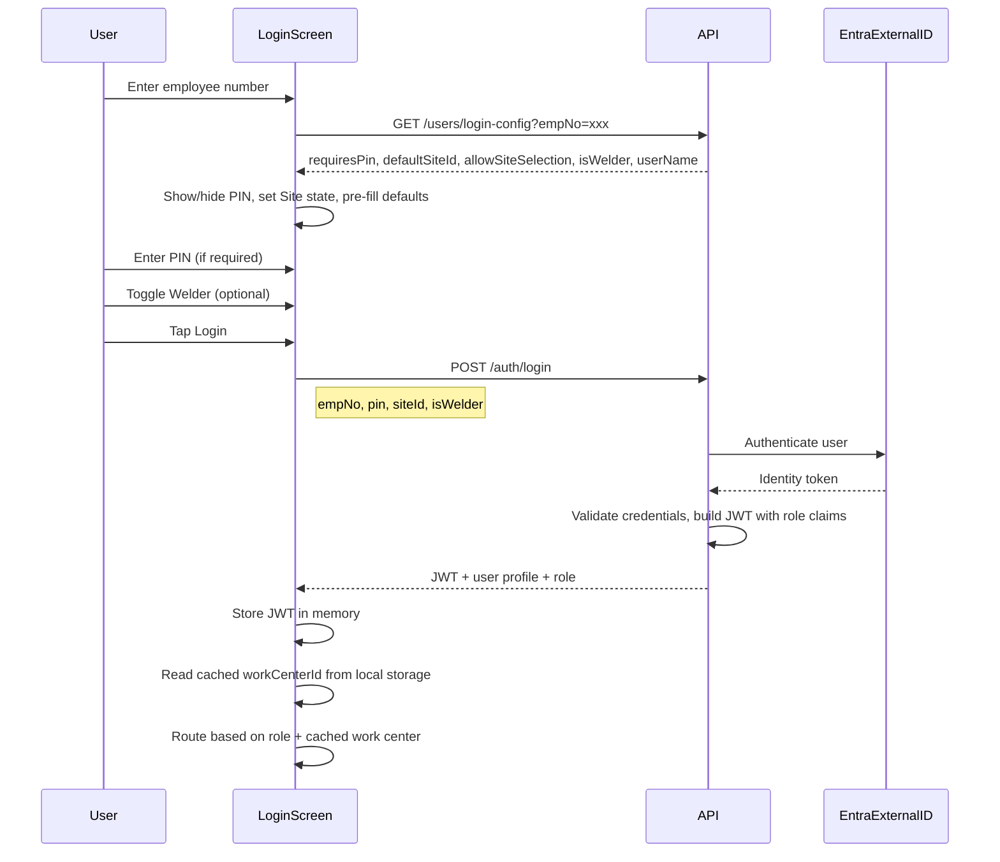

# MES v2 — Login Screen Specification

## 1. Screen Purpose and Context

The Login screen is the **entry point** for every user of the MES v2 application, from Operator (6.0) through Administrator (1.0).

**Displayed when:**
- The app is first opened (no active session).
- The user's session times out due to idle timeout.
- The user explicitly logs out.

**After successful login**, the app routes the user based on their role and the tablet's cached work center, as defined in [GENERAL_DESIGN_INPUT.md](GENERAL_DESIGN_INPUT.md) Section 5.3:
- **Operators (6.0)**: Cached work center screen loads automatically.
- **Team Leads (5.0) / Supervisors (4.0)**: Role-specific screen (separate spec).
- **Administrators (1.0)**: Admin dashboard.
- **If no cached work center** and the user is an Operator: Redirect to Tablet Setup screen, or display a message instructing the user to contact a Team Lead to run Tablet Setup.

---

## 2. Screen Layout

Landscape orientation on a 10–11" Samsung tablet. The layout is centered both vertically and horizontally, with a dark background matching the v1 aesthetic.


```
+------------------------------------------------------------------+
|                                                                    |
|                    [QSC Logo - Centered]                          |
|                     MES Login   v2.x.x                            |
|                                                                    |
|             Welder  [Toggle: No/Yes]                              |
|                                                                    |
|             Employee No.  [____________]                          |
|             PIN           [____________]  <- conditional           |
|                                                                    |
|             Site          [▾ Dropdown  ]                          |
|                                                                    |
|             [          LOGIN          ]                            |
|                                                                    |
+------------------------------------------------------------------+
```

### V2 Changes from V1

| Element | V1 | V2 |
|---|---|---|
| **Test Mode toggle** | Present — tags data as `IsTest=true` | **Removed** — v2 uses separate dev/test/prod environments |
| **Debug button** | Present — shows tablet/user info | **Removed** — troubleshooting via Application Insights and the Status/Debug area in the operator work center bottom bar |
| **Version number** | Clickable link | **Plain text** (not clickable) |
| **PIN field** | Always visible | **Conditional** — appears only when the user's account requires a PIN |

---

## 3. Element Specifications

### 3.1 QSC Logo

| Property | Value |
|---|---|
| **Position** | Centered horizontally, top of form area |
| **Image** | Quality Steel Corporation logo (same as v1) |
| **Size** | Proportional, approximately 150–200px wide |

### 3.2 Title and Version

| Property | Value |
|---|---|
| **Title text** | "MES Login" |
| **Version text** | Current app build version (e.g., "v2.1.0"), displayed as plain text next to or below the title |
| **Font** | Roboto, weight 400–500 |
| **Color** | White or light text on dark background |

### 3.3 Welder Toggle

| Property | Value |
|---|---|
| **Type** | On/Off toggle switch |
| **Default** | Off (No) |
| **Label** | "Welder" with "No" / "Yes" indicators |
| **Behavior** | When toggled **on**, the logged-in user is added to the Welder(s) list displayed in the operator work center top bar for the duration of their session. Welders can also be added/removed from the top bar widget after login (see operator work center layout spec). |
| **Availability** | All users can toggle this. The system tracks who is a certified welder in the User record, but the toggle is not restricted — an operator may need to indicate they are welding at a particular station even if they are not the primary welder. |
| **Position** | Above the Employee Number field |

### 3.4 Employee Number

| Property | Value |
|---|---|
| **Type** | Text input (numeric) |
| **Label** | "Employee No." |
| **Keyboard** | Numeric keyboard on tablet (input type `tel` or `inputmode="numeric"`) |
| **Auto-focus** | This field receives focus automatically when the Login screen loads |
| **Size** | Large touch target — minimum 48px height, recommended 56–64px |
| **Behavior** | After the user enters their employee number and the field loses focus (blur) or after a short debounce (~500ms), the app calls the backend to retrieve user login configuration. See Section 4. |
| **Masking** | Employee number is masked with dots (same as v1) for privacy in the plant environment |

### 3.5 PIN Field

| Property | Value |
|---|---|
| **Type** | Text input (numeric), masked with dots |
| **Label** | "PIN" |
| **Default visibility** | **Hidden**. The field is not shown until the backend confirms the user requires a PIN. |
| **Appearance** | Slides in smoothly below the Employee Number field when required |
| **Keyboard** | Numeric keyboard on tablet |
| **Size** | Same dimensions as Employee Number field |
| **Behavior** | If the user's account has `RequirePinForLogin = true`, this field appears after the employee number is validated. Both Employee Number and PIN must match for login to succeed. |
| **Masking** | This is essentially a password, need privacy in the plant environment |

### 3.6 Site Dropdown

| Property | Value |
|---|---|
| **Type** | Dropdown selector |
| **Label** | "Site" |
| **Data source** | Populated from the Sites/Plants table |
| **Default value** | The user's assigned site (`DefaultSiteId` from the User record) |
| **State before employee number** | Disabled — no site list loaded until the employee number is validated |
| **State after employee number** | Depends on the user's role: |

| Role | Dropdown State |
|---|---|
| **Administrator (1.0)** | Enabled — can select any site |
| **Quality Director (2.0) / Operations Director (2.0)** | Enabled — can select any site |
| **All others (3.0–6.0)** | Disabled/locked to their assigned site |

### 3.7 Login Button

| Property | Value |
|---|---|
| **Type** | Button |
| **Label** | "Login" |
| **Background** | Primary blue `#2b3b84` |
| **Text color** | White `#ffffff` |
| **Hover/press** | Inverted — white background, blue text (per QSC style guide) |
| **Border radius** | `0` (sharp corners) |
| **Size** | Full width within the form area, minimum 64px height |
| **Disabled state** | Disabled until at least the Employee Number is entered. Visual: reduced opacity. |

---

## 4. Login Flow

### 4.1 Sequence Diagram



### 4.2 Step-by-Step Flow

1. **Screen loads**: Employee Number field auto-focuses. PIN field is hidden. Site dropdown is disabled. Login button is disabled.

2. **User enters employee number**: On blur or after ~500ms debounce, the app calls `GET /users/login-config?empNo=xxx`.
	- **If user found**: The response includes `requiresPin`, `defaultSiteId`, `allowSiteSelection`, `isWelder`, and `userName`.
		- If `requiresPin` is true, the PIN field slides in.
		- The Site dropdown is populated and set to `defaultSiteId`. If `allowSiteSelection` is true, the dropdown is enabled; otherwise it is locked.
		- The Login button becomes enabled.
	- **If user not found**: An inline error message appears below the Employee Number field: "Employee number not recognized."

3. **User optionally toggles Welder**: If the user is a certified welder and will be welding, they toggle this on.

4. **User optionally enters PIN**: If the PIN field is visible, the user enters their PIN.

5. **User taps Login**: The app calls `POST /auth/login` with the employee number, PIN (if provided), selected site ID, and welder toggle state.
	- **If successful**: The backend returns a JWT token, user profile, and role. The app stores the token and routes the user.
	- **If failed**: An error message is displayed (see Section 5).

6. **Routing after login**: Per [GENERAL_DESIGN_INPUT.md](GENERAL_DESIGN_INPUT.md) Section 5.3:
	- Read the tablet's cached `workCenterId` from local storage.
	- If the user is an **Operator** and a work center is cached: load that work center screen.
	- If the user is an **Operator** and no work center is cached: redirect to Tablet Setup or display a message.
	- If the user is a **Team Lead / Supervisor**: load their role-specific screen.
	- If the user is an **Administrator**: load the admin dashboard.

---

## 5. Validation and Error Handling

### 5.1 Validation Rules

| Field | Rule | Error Message |
|---|---|---|
| **Employee Number** | Required; must match a user record | "Employee number not recognized." |
| **PIN** | Required only if `requiresPin` is true; must match the user's stored PIN | "Incorrect PIN." |
| **Site** | Required; must be a valid site | (Pre-selected — user cannot enter an invalid value) |

### 5.2 Error Display

- Errors are displayed as **inline messages** directly below the relevant field.
- Error text uses the danger color `#dc3545` (per [QSC_STYLE_GUIDE.md](QSC_STYLE_GUIDE.md)).
- The field border highlights in the same danger color.

### 5.3 Security Considerations

- **Do not reveal whether a user exists** on a failed login attempt. After the Login button is tapped, if credentials are wrong, display a generic message: "Login failed. Check your employee number and PIN."
- The pre-login config check (`GET /users/login-config`) returns minimal information. If the employee number is not found, the response should be indistinguishable from a "no PIN required" response to avoid user enumeration. The actual validation happens at `POST /auth/login`.

> **Note**: The security behavior of the pre-login config check needs a design decision — returning `requiresPin` for a valid employee number but nothing for an invalid one could leak information about which employee numbers exist. Options:
> - Always return a generic response (never show PIN field until login attempt fails and says "PIN required").
> - Accept the minor information disclosure since the app is on a private plant network, not public internet.

### 5.4 Network Errors

- If the backend is unreachable, display: "Unable to connect to the server. Please check your network connection and try again."
- Show a retry button.
- The error message uses the warning color `#ffc107` (yellow) since this is a connectivity issue, not a validation error.

---

## 6. Styling

Per [QSC_STYLE_GUIDE.md](QSC_STYLE_GUIDE.md) design tokens:

### 6.1 Background and Layout

| Property | Value |
|---|---|
| **Background** | Dark — `--qs-primary` (`#2b3b84`) or `--qs-dark` (`#343a40`), matching v1 |
| **Layout** | Form centered both vertically and horizontally on screen |
| **Form width** | Max ~500px, centered |
| **Font family** | Roboto, Helvetica, Arial, sans-serif |

### 6.2 Form Elements

| Property | Value |
|---|---|
| **Input height** | 56–64px (large touch targets for gloved hands) |
| **Input background** | White `#ffffff` |
| **Input text color** | Body text `#212529` |
| **Input border** | 1px solid, light gray when inactive, primary blue when focused |
| **Label color** | White `#ffffff` |
| **Label font weight** | 400 (regular) |
| **Dropdown** | Same height and styling as text inputs |
| **Button border radius** | `0` (sharp corners — brand hallmark) |
| **Button padding** | 15px 30px minimum, full form width |

### 6.3 Toggle Switch

| Property | Value |
|---|---|
| **Off state** | Gray track, "No" label |
| **On state** | Primary blue track, "Yes" label |
| **Size** | Large enough for easy touch (minimum 48px tap target) |

---

## 7. Behavioral Notes

### 7.1 Orientation

The tablet is locked to **landscape** orientation. The Login screen is designed exclusively for landscape layout.

### 7.2 Auto-Focus

When the Login screen loads, the **Employee Number** field receives focus immediately. On a tablet, this will bring up the numeric keyboard automatically.

### 7.3 No Cached Work Center

If an Operator logs in and the tablet has **no cached work center** (i.e., Tablet Setup has never been run on this device):
- Do not show a blank operator screen.
- Either redirect to the Tablet Setup screen (if the user's role allows it — Team Lead 5.0+), or display a message: "This tablet has not been set up. Please contact a Team Lead or Supervisor to run Tablet Setup."

### 7.4 Concurrent Session Enforcement

If the user is already logged in on another tablet, the previous session is terminated and the new login takes precedence. The previous tablet returns to the Login screen on its next API call. No confirmation prompt is shown — the most recent login always wins.

### 7.5 Session Timeout Return

When a session times out, the Login screen loads with the Employee Number field empty. The Site dropdown retains its last value (since the tablet is still at the same plant). The Welder toggle resets to off.

### 7.6 Keyboard Handling

- **Employee Number**: Opens numeric keyboard (`inputmode="numeric"`).
- **PIN**: Opens numeric keyboard (`inputmode="numeric"`).
- **Enter/Return key** on the keyboard should:
	- From Employee Number (if PIN is visible): Move focus to PIN field.
	- From Employee Number (if PIN is hidden): Submit the login form.
	- From PIN field: Submit the login form.

---

## Key Design Decisions

| Decision | Resolution | Rationale |
|---|---|---|
| **Welder Toggle** | Keep on Login screen AND in top bar widget | Operators who are welders toggle once at login; additional welders can be added from the top bar during the shift |
| **Test Mode** | Removed for v2 | V2 uses separate dev/test/prod Azure environments instead of a data-level `IsTest` flag |
| **Debug Button** | Removed for v2 | Troubleshooting handled via Application Insights and the Status/Debug area in the operator bottom bar |
| **PIN Field** | Conditional — appears after employee number validation | Keeps the screen clean for the majority of users who don't use a PIN |
| **Version Number** | Plain text, not a clickable link | Displayed for reference only |

---

## References

| Document | Relevance |
|---|---|
| [GENERAL_DESIGN_INPUT.md](GENERAL_DESIGN_INPUT.md) | Sections 3.4, 5.1–5.4, 6.1 — login screen overview, auth flow, role-based access |
| [QSC_STYLE_GUIDE.md](QSC_STYLE_GUIDE.md) | Colors, typography, button styles, design tokens |
| [SECURITY_ROLES.md](SECURITY_ROLES.md) | Role tiers and site selection permissions |
