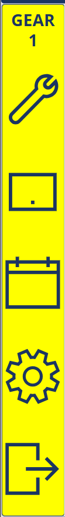

# MES v2 — Operator Work Center Layout Specification

## 1. Purpose and Scope

This document specifies the **persistent shell** that wraps every operator work center screen. It defines the top bar, bottom bar, content area structure, left panel, work center history panel, scan feedback overlay, and input mode behavior. The actual work center content rendered in the center of the screen is defined by each work center's own specification document.

**Who sees this layout?**
- **Operators (6.0)** — this is their primary and only view after login.
- **Team Leads (5.0) and above** — when they navigate into a specific work center view from their role menu.

**When is it displayed?**
- Immediately after login for Operators, once the app reads the cached work center from `localStorage` (per [SPEC_TABLET_SETUP_SCREEN.md](SPEC_TABLET_SETUP_SCREEN.md)).
- On demand for higher roles when they select a work center to view or interact with.

---

## 2. Layout Overview

Landscape orientation on a 10–11" Samsung tablet. The layout is a fixed shell with no scrolling on the outer frame — only the work center content area may scroll internally if needed.

```
+------------------------------------------------------------------+
| WC Name · Line · Asset | Operator       | Welder(s)              |   ← Top Bar
+------------------------------------------------------------------+
|           |                                  |                    |
| Left      |                                  | WC History         |
| Panel     |    Work Center Content Area       |--------------------|
| (Icons)   |  (defined per work center spec)   |                    |
|           |                                  | Future             |
+------------------------------------------------------------------+
| Plant - 🕐 Date/Time |  [External Input: On/Off]  | Status/Debug |   ← Bottom Bar
+------------------------------------------------------------------+
```

### Layout Grid

| Region | Width | Height | Behavior |
|---|---|---|---|
| **Top Bar** | Full width | ~56–64px | Fixed; always visible |
| **Left Panel** | ~60–80px | Stretches between top and bottom bars | Fixed; icon buttons |
| **Work Center Content** | Remaining center | Stretches between top and bottom bars | Defined per work center spec; may scroll internally |
| **WC History** | ~220–280px | Upper portion of right column | Fixed; shows count + last 5 records |
| **Future** | ~220–280px | Lower portion of right column | Reserved; hidden or collapsed until features are added |
| **Bottom Bar** | Full width | ~48–56px | Fixed; always visible |

---

## 3. Top Bar

The top bar provides at-a-glance context: where the user is, who they are, and who is welding.

### 3.1 Elements

| Element | Position | Description |
|---|---|---|
| **Work Center Name** | Left | The **display name** of the work center at this production line (read from `cachedWorkCenterDisplayName` in `localStorage`; falls back to `cachedWorkCenterName`). This comes from the `WorkCenterProductionLine` configuration and may differ from the base `WorkCenter.Name`. Must also include the production line and asset name. |
| **Operator** | Center | The currently logged-in operator's display name. |
| **Welder(s)** | Right | List of current welder(s) at this work center. An operator who logged in with the Welder toggle ON is automatically added. Additional welders can be added/removed via this widget.  To add a Welder, a popup should show that allows the welder to enter their employee number and then they would be added to the welder's list. |

### 3.2 Work Center Name / Line / Asset

| Property | Value |
|---|---|
| **Source** | `cachedWorkCenterDisplayName` (preferred) or `cachedWorkCenterName` (fallback), `cachedProductionLineName`, and `cachedAssetName` from `localStorage` |
| **Display format** | `{DisplayName} · {ProductionLineName} · {AssetName}` (e.g., "Long Seam · Main Line · Longseam A"). Use a separator that is visually lightweight (middle dot, pipe, or dash). |
| **Font** | Roboto, weight 600–700 for work center name; weight 400 for production line and asset if space is tight |
| **Color** | White on primary background |
| **Space constraints** | If the combined string exceeds the allotted space, abbreviate or stack vertically (work center on top, line/asset on a second smaller line). The Asset name must always be visible. |

### 3.3 Operator Display

| Property | Value |
|---|---|
| **Source** | JWT claims / user profile from login |
| **Format** | Display name (e.g., "John D.") |
| **Font** | Roboto, weight 400 |
| **Color** | White on primary background |

### 3.4 Welder(s) Widget

The Welder(s) section displays currently active welders at this work center and allows adding or removing welders.

| Property | Value |
|---|---|
| **Display** | Comma-separated list of welder names. If no welders, display "No Welders".  NOTE: Certain work centers MUST have at least 1 welder to log data. |
| **Auto-add** | When an operator logs in with the Welder toggle ON (from the Login screen), they are automatically added to the welder list for this work center. |
| **Manual add** | Tapping the Welder(s) area opens a popover or modal where a Team Lead or the operator can add a welder by employee number. This supports scenarios where a second welder arrives at the station. |
| **Remove** | Each welder in the list has a small remove (X) action. Removing a welder does not log them out — it only removes them from the active welder list at this work center. |
| **Persistence** | The welder list is stored server-side against the work center's current session. If the operator logs out, the welder list is cleared. |
| **API** | `POST /workcenters/{id}/welders` to add, `DELETE /workcenters/{id}/welders/{userId}` to remove, `GET /workcenters/{id}/welders` to refresh. |

#### Welder Minimum Enforcement (Welder Gate)

Certain work centers require a minimum number of active welders before production data can be logged. This is driven by the `NumberOfWelders` field — sourced from the `WorkCenterProductionLine` configuration if one exists for the selected WC/PL combination, otherwise falling back to the default `WorkCenter.NumberOfWelders` (0 = no welders required, 1+ = that many welders must be signed in). The value is cached in `localStorage` (`cachedNumberOfWelders`) during Tablet Setup so the operator layout can enforce it immediately.

**Blocking Dialog (Welder Gate):**

When a user navigates to the operator screen and the work center's `NumberOfWelders > 0` but fewer welders are currently signed in, a **full-screen blocking dialog** is displayed that prevents all interaction with the work center content behind it. The dialog:

1. Displays the title "Welder Sign-In Required" and a status message indicating how many welders are needed (e.g., "This work center requires 1 welder. Add a welder to continue.").
2. Shows any welders already signed in as removable chips (name + employee number).
3. Provides an **Employee Number** input field and an **Add Welder** button. When the employee number is submitted, the API is called (`POST /workcenters/{id}/welders`) to look up and add the welder. If the employee is not found or not a certified welder, an error message is shown.
4. Provides a **Cancel** button. Pressing Cancel navigates the user back to the **Tablet Setup** screen (`/tablet-setup`), effectively returning them to the main menu.
5. The dialog **cannot be dismissed** by tapping outside it. The only ways past it are: (a) adding enough welders to meet the minimum, or (b) pressing Cancel.
6. Once `welders.length >= NumberOfWelders`, the dialog disappears automatically and the work center screen becomes fully interactive.

| Scenario | Behavior |
|---|---|
| **Welders signed in < NumberOfWelders** | Welder Gate dialog blocks the screen. All work center interaction is prevented until the minimum is met. |
| **Welders signed in >= NumberOfWelders** | Normal operation — no dialog, all save/submit actions enabled. |
| **NumberOfWelders = 0** | Normal operation regardless of welder list state. |
| **Welder removed, count drops below minimum** | The Welder Gate dialog reappears immediately and blocks the screen until a replacement welder is added or the user cancels. |
| **Auto-add via login** | If the operator logged in with the Welder toggle ON, they are automatically added to the welder list. If this satisfies the minimum, the Welder Gate does not appear. |

Enforcement is applied both **client-side** (Welder Gate dialog) and **server-side** (API rejects production record submissions if the active welder count is below the work center's `NumberOfWelders` minimum).

**Note on per-screen enforcement:** Individual work center screens do **not** need to implement their own welder checks. The Welder Gate in the operator layout is the single point of enforcement. Screens receive the `welders` array and `numberOfWelders` count via props for display or record-creation purposes, but they rely on the layout to guarantee the minimum is met before they become accessible.

### 3.5 Top Bar Styling

| Property | Value |
|---|---|
| **Background** | `--qs-primary` (`#2b3b84`) |
| **Text color** | `#ffffff` |
| **Height** | 56–64px |
| **Border** | None, or a subtle 1px bottom border in a slightly lighter shade |
| **Font** | Roboto |

---

## 4. Bottom Bar

The bottom bar provides plant context, time, input mode control, and system status.

### 4.1 Elements

| Element | Position | Description |
|---|---|---|
| **Plant Code & Date/Time** | Left | Plant code followed by a hyphen and the current date/time. The time is a live clock that increments every second. |
| **External Input Toggle** | Center | Toggle switch to enable/disable External Input (barcode scanning) mode. |
| **Status/Debug** | Right | Connection status, scanner status, or other system indicators for troubleshooting. |

### 4.2 Plant Code & Date/Time

| Property | Value |
|---|---|
| **Format** | `{PlantCode} - {MM/DD/YY hh:mm:ss A}` (e.g., "PLT1 - 2/19/2026 02:34:15 PM") |
| **Source** | Plant code from the user's login session; date/time from the client clock |
| **Live clock** | The time portion updates every second via a `setInterval` or equivalent timer |
| **Font** | Roboto, weight 400, smaller size (~14px) |
| **Color** | White or light gray on dark background |

### 4.3 External Input Toggle

This is the primary mechanism for switching between barcode scanning and manual touch modes.

| Property | Value |
|---|---|
| **Type** | Toggle switch (On/Off) |
| **Label** | "External Input" — displayed next to the toggle |
| **Default** | Off (Manual mode) on fresh page load. Work centers where barcode use is expected may default to On (configurable per work center). |
| **Visual states** | **On**: highlighted/active appearance (e.g., green accent or bright indicator). **Off**: muted/default appearance. |
| **Size** | Large enough to be tapped accurately — minimum 48px toggle height |
| **Access** | All roles (per GENERAL_DESIGN_INPUT.md Section 6.1) |

#### External Input Mode Behavior (Toggle ON)

When the External Input toggle is switched **ON**:

1. A hidden text input field is rendered and given **permanent focus**.
2. The USB barcode scanner acts as a keyboard wedge — it types the barcode string and sends an Enter/Return keystroke.
3. The app captures the string on Enter, parses the prefix (per [MES_V1_BARCODE_LANG.MD](MES_V1_BARCODE_LANG.MD)), and routes the command to the appropriate handler in the active work center screen.
4. The scan feedback overlay fires (green for valid, red for invalid).
5. The hidden input is cleared and re-focused, ready for the next scan.
6. **Touch is locked** — tapping the screen does nothing except dismiss the scan overlay. The only interactive element is the External Input toggle itself (so the user can turn it off).

#### Manual Mode Behavior (Toggle OFF)

When the External Input toggle is switched **OFF**:

1. The hidden text input is removed or defocused.
2. All on-screen touch controls are active — buttons, dropdowns, text inputs, etc.
3. The same business logic executes regardless of input mode; only the input mechanism changes.
4. Manual mode is the fallback for when a scanner is unavailable or malfunctioning.

### 4.4 Status/Debug Area

| Property | Value |
|---|---|
| **Content** | Connection status indicator (online/offline), scanner status, and optionally other debug info |
| **Online indicator** | Small green dot or icon when connected to the API |
| **Offline indicator** | Red dot or icon with "Offline" text when connection is lost |
| **Font** | Roboto, weight 400, small size (~12–14px) |
| **Use case** | Primarily for troubleshooting. Operators generally ignore this; IT or Team Leads use it to diagnose connectivity issues. |

### 4.5 Bottom Bar Styling

| Property | Value |
|---|---|
| **Background** | `--qs-dark` (`#343a40`) or slightly darker than the content area to visually anchor the bottom |
| **Text color** | `#ffffff` or light gray |
| **Height** | 48–56px |
| **Border** | None, or a subtle 1px top border |
| **Font** | Roboto |

---

## 5. Content Area

The content area sits between the top and bottom bars and is divided into three columns: the Left Panel, the Work Center Content (center), and the right-side panels (WC History + Future).

### 5.1 Left Panel

The Left Panel contains a vertical stack of icon buttons for operator-accessible features that are not specific to a single work center's workflow. These are common actions available across all (or most) work center screens.

| Property | Value |
|---|---|
| **Width** | ~60–80px |
| **Layout** | Vertical stack of square icon buttons |
| **Icon size** | 40–48px per icon (large touch targets) |
| **Background** | Slightly darker or subtly different from the content area for visual separation |
| **Tooltip** | On hover (desktop) or long-press (tablet), show a text label for the icon |

#### Left Panel Features

The icons/features are the following.  See 

| Icon | Action | Notes |
|---|---|---|
| **Current Gear** | No action, text only | Each plant can operate in a production gear that defines the speed/capacity of the plant, this shows what gear the plant is currently in. |
| **Maintenance Request** | Opens a screen within the MES to create a Maintenance Work Order or view the status of recent submissions. The backend API handles integration with **Limble CMMS** — creating work orders in Limble on submission and fetching recent work order status from Limble for display. | Data is not stored in MES; Limble is the system of record for maintenance. |
| **Tablet Setup** | Opens the Tablet Setup screen | Since this is rarely needed and conflicts with security, this will be changed in v2. |
| **Schedule** | Shows the current schedule for the Plant and/or Work Center | This is not 100% used in V1, lower priority for now. |
| **Gear Icon** | Opens up a menu with additional items that an Operator needs to be able to do.    | In V1, allows the user to change user specific options, see one of the Logs, or do a Serial Number review. |
| **Logout** | Logs out the current operator and returns to the Login screen | Important for shift changes |

#### Printing

There is no dedicated Print button in the left panel. Barcode label printing (via NiceLabel Cloud) is triggered **automatically** by the work center's workflow when applicable — e.g., after a production record is saved at a work center that requires a label. Whether printing occurs and which label template is used is defined in each work center's specification document.

### 5.2 Work Center Content Area

| Property | Value |
|---|---|
| **Width** | Remaining space after Left Panel and right panels |
| **Height** | Full height between top and bottom bars |
| **Content** | Defined by each work center's specification document |
| **Scrolling** | The content area may scroll vertically if the work center content exceeds the viewport height. The top bar, bottom bar, and left panel remain fixed. |
| **Background** | White (`#ffffff`) or light (`#f8f9fa`) — provides contrast for form elements and data |

### 5.3 Work Center History Panel

Displays production activity at this work center for the current day. Provides operators a quick sense of throughput and recent work.

| Property | Value |
|---|---|
| **Width** | ~220–280px |
| **Position** | Right side, upper portion |
| **Background** | Slightly different shade from content area (e.g., `#f8f9fa` or a subtle border separation) |

#### History Content

| Element | Description |
|---|---|
| **Day Count** | A large, prominent number showing the total count of transactions (production records) at this work center for the current calendar day. Refreshed on each new transaction. |
| **Last 5 Transactions** | A compact list showing the 5 most recent production records at this work center. Each row displays: |

**Last 5 Transaction Row Fields:**

| Field | Description |
|---|---|
| **Date/Time** | Timestamp of the transaction |
| **Shell / Identifier** | The shell code or unit identifier for the production record |
| **Tank Size** | The tank size associated with the record |
| **Annotation Flag** | A tappable visual indicator (icon or colored dot) if an annotation has been attached to this record. Tapping the flag on any transaction row opens an annotation dialog to create or view annotations for that specific production record. If no annotation exists yet, the flag is muted/greyed and tapping it creates a new annotation. |

| Property | Value |
|---|---|
| **API** | `GET /workcenters/{id}/history?date={today}&limit=5` |
| **Refresh** | Automatically refreshes when a new production record is created at this work center |
| **Font** | Roboto; day count uses a large bold number (~32–40px), transaction rows use smaller text (~12–14px) |

### 5.4 Future Panel

| Property | Value |
|---|---|
| **Width** | Same as WC History (~220–280px) |
| **Position** | Right side, lower portion (below WC History) |
| **Current state** | Reserved / hidden. No content in v2 initial release. |
| **Planned use** | SPC (Statistical Process Control) charting, real-time metrics, or other data visualization |
| **Implementation** | Render an empty container with no visible UI. Space can be reclaimed by the History panel until this feature is implemented. |

---

## 6. Scan Feedback Overlay

Every barcode scan triggers a **full-screen overlay** providing immediate, unmistakable visual feedback. This is critical in a loud factory environment where audible cues are unreliable.

### 6.1 Overlay States

| Result | Background Color | Icon | Meaning |
|---|---|---|---|
| **Valid / Accepted** | Green `#28a745` | Large checkmark (centered) | Scan was recognized and the action succeeded |
| **Invalid / Rejected** | Red `#dc3545` | Large X mark (centered) | Scan was unrecognized, out of context, or the action failed |

### 6.2 Overlay Behavior

| Property | Value |
|---|---|
| **Z-index** | Above all content including the top bar, bottom bar, and left panel |
| **Coverage** | Full viewport — edge to edge |
| **Duration** | Auto-dismiss after ~1.5–2 seconds (configurable per deployment) |
| **Dismiss** | Tap anywhere to dismiss immediately |
| **Icon size** | Large — ~120–160px — visible from arm's length |
| **Opacity** | Slight transparency (~0.90–0.95) so the underlying screen is faintly visible |
| **Animation** | Fade in quickly (~100ms), hold, then fade out (~200ms) |
| **Text** | Optional — a brief message below the icon (e.g., "Shell 00000001 scanned" or "Unknown barcode"). Keep it minimal; the color is the primary signal. |

### 6.3 Overlay During External Input Mode

When External Input is toggled ON and a scan occurs:
1. The barcode string is captured by the hidden input.
2. The app parses and processes the command.
3. The overlay fires immediately.
4. The hidden input is cleared and re-focused.
5. The overlay auto-dismisses, and the app is ready for the next scan.

The overlay does **not** interfere with the hidden input's focus — scans can still be captured even while the overlay is visible (queued and processed after the overlay dismisses).

---

## 7. Input Mode Interaction Map

This table summarizes how the External Input toggle affects each area of the layout:

| Layout Region | External Input ON | External Input OFF (Manual) |
|---|---|---|
| **Top Bar** | Visible, non-interactive (except Welder widget for add/remove — see note below) | Fully interactive |
| **Left Panel** | Non-interactive (icons disabled) | Icons are tappable |
| **Work Center Content** | Non-interactive; all input comes from barcode scanner | Fully interactive touch controls |
| **WC History** | Visible but non-interactive | Visible and scrollable/tappable if needed |
| **Bottom Bar** | Only the External Input toggle is tappable (to turn it off) | Fully interactive |

**Note on Welder widget in External Input mode**: The Welder widget in the top bar should remain functional even in External Input mode if adding a welder can be done via barcode scan. If not, the user must toggle External Input off to manage welders manually.

---

## 7b. Work Center Screen Routing (DataEntryType)

The operator layout determines which work center content screen to render based on the `DataEntryType` cached in `localStorage` (`cachedDataEntryType`). This replaces the fragile approach of matching on the work center name.

| DataEntryType | Screen |
|---|---|
| `Rolls` | Rolls Screen |
| `Barcode-LongSeam` | Long Seam Screen |
| `Barcode-LongSeamInsp` | Long Seam Inspection Screen |
| `Barcode-RoundSeam` | Round Seam Screen |
| `Barcode-RoundSeamInsp` | Round Seam Inspection Screen |
| `Fitup` | Fitup Screen |
| `Hydro` | Hydro Screen |
| `Spot` | Spot X-ray Screen |
| `DataPlate` | Nameplate Screen |
| `RealTimeXray` | RT X-ray Queue Screen |
| `MatQueue-Material` | Rolls Material Screen |
| `MatQueue-Fitup` | Fitup Queue Screen |
| `MatQueue-Shell` | RT X-ray Queue Screen |

Each `DataEntryType` maps directly to a single screen component with no secondary routing needed. If the `DataEntryType` does not match any known value, a fallback message is displayed.

---

## 8. Role-Specific Behavior

### 8.1 Operator (6.0)

- This is their **only view** after login. They cannot navigate away to other screens (kiosk mode).
- The only way to leave this screen is to log out (via the Left Panel logout icon or session timeout).
- The work center loaded is determined by `cachedWorkCenterId` from `localStorage`.

### 8.2 Team Lead (5.0) / Supervisor (4.0)

- They access this layout when they navigate into a specific work center from their role-specific menu.
- They have the same layout but may see additional icons in the Left Panel (e.g., override actions, access to Tablet Setup).
- A **Back** or **Menu** button should appear in the top bar or left panel allowing them to return to their role menu.
- They are not locked into kiosk mode.

### 8.3 Higher Roles (3.0 and above)

- Quality Manager, Directors, and Administrators can view work center screens in a read-only or supervisory capacity.
- Any role-specific additions to the layout when viewed by higher roles will be defined in their respective spec documents.

---

## 9. Responsive Considerations

This layout is designed exclusively for **landscape orientation** on 10–11" Samsung tablets. It is not responsive to smaller screens or portrait mode.

| Property | Value |
|---|---|
| **Orientation lock** | Landscape only |
| **Min viewport** | ~1280 x 800 (typical 10" tablet in landscape) |
| **Max viewport** | ~1920 x 1200 (typical 11" tablet in landscape) |
| **Scaling** | Use rem-based sizing with a root font size that adapts slightly between the min/max viewport widths |

---

## 10. Offline / Connectivity Behavior

| Scenario | Behavior |
|---|---|
| **Connection lost** | Status/Debug area in the bottom bar shows offline indicator. The app continues to function in a degraded mode — scans and actions are queued locally. |
| **Connection restored** | Queued actions are synced to the server. Status indicator returns to online (green). |
| **Stale history** | If the WC History panel cannot refresh, it shows the last known data with a "Last updated: {timestamp}" note. |

---

## 11. Styling Summary

Per [QSC_STYLE_GUIDE.md](QSC_STYLE_GUIDE.md):

| Element | Style |
|---|---|
| **Top bar background** | `#2b3b84` (primary) |
| **Bottom bar background** | `#343a40` (dark) |
| **Content area background** | `#ffffff` or `#f8f9fa` (light) |
| **Left panel background** | `#f0f0f0` or a subtle contrast against the content area |
| **Font family** | Roboto throughout |
| **Button border radius** | `0` (sharp corners) |
| **Touch targets** | Minimum 48px, recommended 64px for primary actions |
| **Scan overlay green** | `#28a745` |
| **Scan overlay red** | `#dc3545` |

---

## Key Design Decisions

| Decision | Resolution | Rationale |
|---|---|---|
| **Fixed shell, scrollable content** | Top bar, bottom bar, and left panel are always fixed; only the work center content area scrolls | Operators always see their context (who, where, input mode) without scrolling |
| **External Input toggle in bottom bar** | Matches v1 placement | Operators are already trained on this location; consistency reduces retraining |
| **Kiosk mode for Operators** | No navigation beyond the assigned work center screen | Prevents accidental navigation; keeps focus on the task |
| **Full-screen scan overlay** | Green/red splash covering entire viewport | Factory environment demands unmistakable visual feedback visible from arm's length |
| **Welder(s) in top bar** | Server-side persistence per work center session | Multiple welders may rotate through a station during a shift; tracking them is a traceability requirement |
| **WC History always visible** | Right-side panel, not hidden behind a tab | Operators benefit from a constant throughput indicator; no extra tap required |
| **Left Panel for common actions** | Vertical icon strip | Keeps common features accessible without cluttering the work center content |
| **Automatic printing** | No print button; printing triggered by work center workflow | Reduces operator actions; each work center spec defines if/when a label prints |
| **Annotations via WC History** | Tapping the flag on a history row creates/views annotations | Keeps annotations contextual to a specific production record rather than a generic action |
| **Maintenance via Limble CMMS** | MES screen for input, Limble as backend system of record | Operators stay in MES; integration is transparent |
| **Future panel reserved** | Empty container, space reclaimed by History until needed | Avoids wasted space now but preserves the architectural slot for SPC charting later |

---

## References

| Document | Relevance |
|---|---|
| [GENERAL_DESIGN_INPUT.md](GENERAL_DESIGN_INPUT.md) | Section 3.1 — Global Shell layout; Section 3.3 — Scan Feedback Overlay; Section 4 — Input Mode Design |
| [QSC_STYLE_GUIDE.md](QSC_STYLE_GUIDE.md) | Colors, typography, button styles, touch target sizing |
| [MES_V1_BARCODE_LANG.MD](MES_V1_BARCODE_LANG.MD) | Barcode command language — prefix parsing and routing |
| [SPEC_LOGIN_SCREEN.md](SPEC_LOGIN_SCREEN.md) | Welder toggle on login — auto-adds operator to welder list |
| [SPEC_TABLET_SETUP_SCREEN.md](SPEC_TABLET_SETUP_SCREEN.md) | Work center caching — determines which content loads in this layout |
| [SECURITY_ROLES.md](SECURITY_ROLES.md) | Role tiers — determines kiosk mode vs. navigation access |
