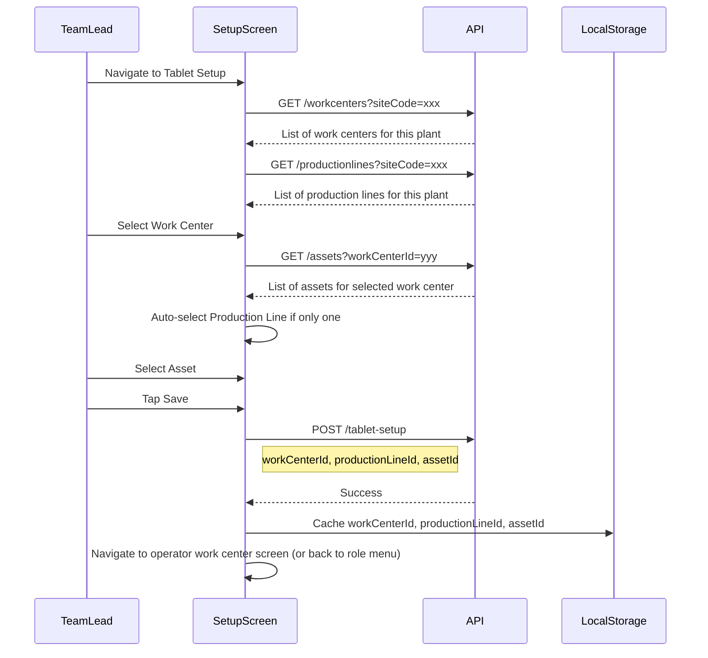

# MES v2 — Tablet Setup Screen Specification

## 1. Screen Purpose and Context

The Tablet Setup screen configures which **work center**, **production line**, and **asset** a fixed tablet is associated with. Once saved, this configuration is cached in the tablet's local storage. On every subsequent operator login, the app reads this cache and loads the assigned work center screen automatically — no navigation required.

**When is this screen displayed?**
- When a Team Lead, Supervisor, or higher-role user explicitly navigates to Tablet Setup (e.g., from their role-specific menu).
- When an Operator logs in but the tablet has **no cached work center** (first-time setup or cache was cleared), and the user's role permits running Tablet Setup (Team Lead 5.0+). If the user is an Operator (6.0), they see a message to contact a Team Lead instead.

**Who can access this screen?**
- **Team Lead (5.0) and above** — per [GENERAL_DESIGN_INPUT.md](GENERAL_DESIGN_INPUT.md) Section 6.1.
- Operators (6.0) cannot access this screen directly.

**Plant context**: The plant/site is inherited from the user's login session. There is no plant selector on this screen.

---

## 2. Screen Layout

Landscape orientation on a 10–11" Samsung tablet. The layout is centered, with a dark background matching the Login screen aesthetic.


```
+------------------------------------------------------------------+
|                                                                    |
|                       Tablet Setup                                |
|                                                                    |
|   This is a one-time task to setup this Tablet for which          |
|   Work Center it's associated with.                               |
|                                                                    |
|   Please fill out the fields below and then click Save            |
|   to continue.                                                    |
|                                                                    |
|            *Associated Work Center  [▾ Dropdown  ]                |
|                                                                    |
|             Production Line         [▾ Dropdown  ]                |
|                                                                    |
|            *Associated Asset        [▾ Dropdown  ]                |
|                                                                    |
|             [            SAVE            ]                         |
|                                                                    |
+------------------------------------------------------------------+
```

### V2 Changes from V1

The v1 Tablet Setup screen is already well-designed and simple. V2 carries it forward with minimal changes:

| Element | V1 | V2 |
|---|---|---|
| **Styling** | PowerApp styling | Updated to match v2 design system (Fluent UI, QSC tokens) |
| **Data source** | Direct Azure SQL queries | API calls to ASP.NET Core backend |
| **Caching** | PowerApp local state | Browser `localStorage` |
| **Dropdown filtering** | Manual | Cascading dropdowns with API-driven filtering |

---

## 3. Element Specifications

### 3.1 Title and Instructions

| Property | Value |
|---|---|
| **Title** | "Tablet Setup" |
| **Instructions** | "This is a one-time task to setup this Tablet for which Work Center it's associated with. Please fill out the fields below and then click Save to continue." |
| **Font** | Roboto, title weight 500–700, instructions weight 400 |
| **Color** | White text on dark background |

### 3.2 Associated Work Center (Required)

| Property | Value |
|---|---|
| **Type** | Dropdown selector |
| **Label** | "*Associated Work Center" (asterisk indicates required) |
| **Data source** | `GET /workcenters?siteCode={loggedInUserSiteCode}` — returns work centers filtered by the logged-in user's plant |
| **Default** | No default selection (user must choose) |
| **Validation** | Required — cannot save without a selection |
| **Behavior** | When a work center is selected, the Asset dropdown is refreshed to show only assets associated with that work center |

### 3.3 Production Line

| Property | Value |
|---|---|
| **Type** | Dropdown selector |
| **Label** | "Production Line" |
| **Data source** | `GET /productionlines?siteCode={loggedInUserSiteCode}` — returns production lines filtered by the logged-in user's plant |
| **Default** | If the plant has only one production line, auto-select it and optionally disable the dropdown. If multiple, no default. |
| **Required** | Not marked as required in v1 (no asterisk), but logically should be populated. Carry forward the v1 behavior. |
| **Behavior** | In v1, Production Line appears to be greyed out / auto-populated based on the work center selection. V2 should follow the same cascading behavior: if a work center belongs to only one production line, auto-select it. |

### 3.4 Associated Asset (Conditionally Required)

The Associated Asset field is **only displayed** for work centers that have multiple assets or lanes. Specifically, it appears for:

- **Long Seam** (e.g., "Longseam A", "Longseam B")
- **Round Seam**
- **Round Seam Inspection**
- **Hydro**

For all other work centers (Rolls, Fitup, Long Seam Inspection, etc.), the asset field is **hidden** and not required.

| Property | Value |
|---|---|
| **Type** | Dropdown selector |
| **Label** | "*Associated Asset" (asterisk indicates required when visible) |
| **Visibility** | Only shown when the selected work center is Long Seam, Round Seam, Round Seam Inspection, or Hydro |
| **Data source** | `GET /assets?workCenterId={selectedWorkCenterId}` — returns assets filtered by the selected work center |
| **Default** | No default selection (user must choose). If only one asset exists, auto-select it. |
| **Validation** | Required when visible — cannot save without a selection. When hidden, save proceeds without an asset. |
| **Behavior** | Disabled until a Work Center is selected. Refreshes when the Work Center selection changes. Hidden entirely when the selected work center does not require asset selection. |
| **Note** | The asset is stamped on every production record created at this tablet. Work centers without asset selection do not stamp an asset ID on records. |

### 3.5 Save Button

| Property | Value |
|---|---|
| **Type** | Button |
| **Label** | "Save" |
| **Background** | Primary blue `#2b3b84` |
| **Text color** | White `#ffffff` |
| **Hover/press** | Inverted — white background, blue text |
| **Border radius** | `0` (sharp corners) |
| **Size** | Full width within the form area, minimum 64px height |
| **Disabled state** | Disabled until all required fields are selected (Work Center always; Asset only when the asset field is visible). Visual: reduced opacity. |

---

## 4. Setup Flow

### 4.1 Sequence Diagram



### 4.2 Step-by-Step Flow

1. **Screen loads**: Work Center and Production Line dropdowns are populated from the API, filtered by the logged-in user's plant. Asset dropdown is disabled (no work center selected yet). Save button is disabled.

2. **User selects a Work Center**: If the selected work center requires asset selection (Long Seam, Round Seam, Round Seam Inspection, or Hydro), the Asset dropdown appears, is enabled, and populated with assets for that work center. If the work center has only one asset, it is auto-selected. For all other work centers, the Asset field remains hidden. The Production Line dropdown auto-selects if the work center maps to only one production line.

3. **User selects an Asset** (if the asset field is visible and not auto-selected): The Save button becomes enabled once all required fields have values — Work Center always, plus Asset when the asset field is visible.

4. **User taps Save**:
	- The app calls `POST /tablet-setup` with the selected work center ID, production line ID, and asset ID.
	- On success, the selections are cached to `localStorage`:
		- `cachedWorkCenterId`
		- `cachedProductionLineId`
		- `cachedAssetId`
		- `cachedWorkCenterName` (for display in the top bar)
		- `cachedProductionLineName` (for display in the top bar)
		- `cachedAssetName` (for display in the top bar)
	- The user is navigated away:
		- If the user is a **Team Lead / Supervisor** who came from their role menu: return to the role menu.
		- If this was triggered by a **first-time Operator login** (no cached work center): load the assigned work center screen.

5. **Subsequent logins**: When any user logs in on this tablet, the app reads the cached work center from `localStorage` and routes accordingly (per [GENERAL_DESIGN_INPUT.md](GENERAL_DESIGN_INPUT.md) Section 5.3).

---

## 5. Validation and Error Handling

### 5.1 Validation Rules

| Field | Rule | Error Behavior |
|---|---|---|
| **Work Center** | Required | Save button stays disabled; no inline error needed since the dropdown forces a selection |
| **Asset** | Conditionally required — only when the selected work center is Long Seam, Round Seam, Round Seam Inspection, or Hydro | Save button stays disabled until selected (when visible). When the asset field is hidden, no asset selection is needed. |
| **Production Line** | Not strictly required | If no production line is selected, warn but allow save (some configurations may not have production lines defined) |

### 5.2 API Errors

| Error | User-Facing Message |
|---|---|
| **Failed to load dropdowns** | "Unable to load configuration data. Please check your connection and try again." with a Retry button. |
| **Save failed** | "Failed to save tablet configuration. Please try again." |
| **Network error** | "Unable to connect to the server. Please check your network connection." |

- Error messages use the danger color `#dc3545`.
- Network errors use the warning color `#ffc107`.

---

## 6. Styling

Per [QSC_STYLE_GUIDE.md](QSC_STYLE_GUIDE.md) design tokens:

| Property | Value |
|---|---|
| **Background** | Dark — `--qs-primary` (`#2b3b84`) or `--qs-dark` (`#343a40`), matching the Login screen |
| **Layout** | Form centered both vertically and horizontally |
| **Form width** | Max ~600px, centered |
| **Font family** | Roboto |
| **Title** | Large, white, weight 500–700 |
| **Instructions** | Smaller, white/light gray, weight 400 |
| **Dropdown height** | 56–64px (large touch targets) |
| **Dropdown background** | White with dark text |
| **Required field indicator** | Asterisk (*) before the label |
| **Button border radius** | `0` (sharp corners) |

---

## 7. Behavioral Notes

### 7.1 Re-running Tablet Setup

A Team Lead (5.0) or Supervisor (4.0) can re-run Tablet Setup at any time to reassign the tablet to a different work center. This overwrites the cached values in `localStorage`. The next operator to log in will be routed to the newly assigned work center.

### 7.2 What Gets Cached

The following values are stored in `localStorage` after a successful save:

| Key | Value | Purpose |
|---|---|---|
| `cachedWorkCenterId` | UUID | Determines which work center screen to load |
| `cachedProductionLineId` | UUID | Stamped on production records |
| `cachedAssetId` | UUID | Stamped on production records |
| `cachedWorkCenterName` | String | Displayed in the operator work center top bar |
| `cachedProductionLineName` | String | Displayed in the operator work center top bar |
| `cachedAssetName` | String | Displayed in the operator work center top bar |

### 7.3 Cache Persistence

- `localStorage` persists across browser sessions, page refreshes, and tablet restarts.
- The cache is only cleared when Tablet Setup is re-run or when `localStorage` is explicitly cleared (e.g., clearing browser data).
- If the cached work center ID is no longer valid (e.g., work center was deleted from the database), the login flow should detect this and redirect to Tablet Setup with a message: "The previously configured work center is no longer available. Please select a new work center."

### 7.4 Orientation

The tablet is locked to **landscape** orientation. The Tablet Setup screen is designed exclusively for landscape layout.

### 7.5 No Plant Selector

The plant/site context is determined at login and carried through the session. The Tablet Setup screen does not include a plant selector — all dropdowns are automatically filtered by the logged-in user's plant.

---

## Key Design Decisions

| Decision | Resolution | Rationale |
|---|---|---|
| **No plant selector** | Plant inherited from login session | Simplifies the screen; prevents cross-plant misconfiguration; consistent with v1 behavior |
| **Cascading dropdowns** | Asset depends on Work Center; Production Line may auto-select | Reduces errors; only valid combinations are presented |
| **Conditional asset field** | Asset dropdown only shown for Long Seam, Round Seam, Round Seam Inspection, and Hydro | Simplifies setup for work centers that don't have multiple assets/lanes; reduces operator confusion |
| **localStorage caching** | Work center, production line, and asset cached client-side | Enables automatic routing on subsequent logins without server round-trip |
| **Access control** | Team Lead (5.0) and above only | Operators should not change their own tablet assignment |

---

## References

| Document | Relevance |
|---|---|
| [GENERAL_DESIGN_INPUT.md](GENERAL_DESIGN_INPUT.md) | Section 3.5 — Tablet Setup overview; Section 5.3 — work center routing; Section 6.1 — role access |
| [QSC_STYLE_GUIDE.md](QSC_STYLE_GUIDE.md) | Colors, typography, button styles |
| [SECURITY_ROLES.md](SECURITY_ROLES.md) | Role tiers and access permissions |
