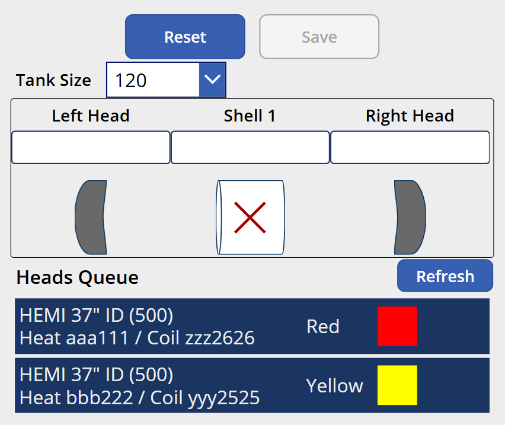

# MES v2 — Fitup Work Center Specification

## 1. Work Center Overview

| Attribute | Value |
|---|---|
| **Work Center** | Fitup |
| **Position in Line** | 6th — after Long Seam Inspection (and Real Time X-ray / Plasma which have no MES specs) |
| **Purpose** | Shells are married to a left head and right head to form a tank assembly. The system assigns an Alpha Code that becomes the assembly's identifier for all downstream stations. |
| **Operator Role** | Fitup Operator (6.0) |
| **NumberOfWelders** | 1 — the operator tack-welds the assembly to hold components together |
| **Auto-Print Label** | No — the alpha code is displayed on screen; operator writes it on the assembly (future: downstream stations look up the alpha code via shell barcode) |
| **Input Modes** | External Input (barcode scanning) and Manual Mode (touch) |

### 1.1 Relationship to Fitup Queue

Heads are a purchased raw material. **Material Handlers** document head lot details (heat number, coil number, product description) at a separate station documented in [SPEC_WC_FITUP_QUEUE.md](SPEC_WC_FITUP_QUEUE.md). This populates the **Heads Queue**. The Fitup operator pulls head material into the assembly by scanning a **kanban card** (`KC;`), which looks up the associated queue entry.

### 1.2 Assembly Composition by Tank Size

| Tank Size | Shells | Heads | Layout |
|---|---|---|---|
| **≤ 500** (120, 250, 320, 500) | 1 | 2 (Left, Right) | H1 — S1 — H2 |
| **1000** | 2 | 2 (Left, Right) | H1 — S1 — S2 — H2 |
| **> 1000** (1450, 1990) | 3 | 2 (Left, Right) | H1 — S1 — S2 — S3 — H2 |

See [MANFACTURING_CONCEPTS.MD](MANFACTURING_CONCEPTS.MD) for the Components and Weld Position diagrams.

### 1.3 Alpha Codes

| Property | Value |
|---|---|
| **Format** | Two-letter code: AA through ZZ |
| **Sequence** | Sequential per plant (AA, AB, AC, ... AZ, BA, BB, ... ZZ, then restart at AA) |
| **Total codes** | 676 per cycle |
| **Assignment** | Automatically assigned by the system on Save |
| **Purpose** | Becomes the assembly's identifier for all downstream traceability |

---

## 2. Screen Layout

This screen renders inside the Work Center Content Area of the Operator Work Center Layout (per [SPEC_OPERATOR_WC_LAYOUT.md](SPEC_OPERATOR_WC_LAYOUT.md)).



```
+------------------------------------------------------------------+
|  [  Reset  ]                              [  Save  ]              |
|                                                                    |
|  Tank Size  [ ▾ 120 ]                                             |
|                                                                    |
|  +--------------------------------------------------------------+ |
|  | Left Head       |   Shell 1   |   (Shell 2)  |  Right Head   | |
|  |  [lot info]     | [serial no] | [serial no]  |  [lot info]   | |
|  +--------------------------------------------------------------+ |
|  |    ⟨            |    ⊗        |              |         ⟩     | |
|  +--------------------------------------------------------------+ |
|                                                                    |
|  Heads Queue                                         [Refresh]    |
|  +--------------------------------------------------------------+ |
|  | HEMI 37" ID (500)  Heat aaa111 / Coil zzz2626    Red  [■]   | |
|  | HEMI 37" ID (500)  Heat bbb222 / Coil yyy2525    Yellow [■]  | |
|  +--------------------------------------------------------------+ |
+------------------------------------------------------------------+
```

### 2.1 Visual Assembly Diagram

The center of the screen displays a visual representation of the tank assembly. It dynamically adjusts based on the tank size:

| Tank Size | Visual Components |
|---|---|
| **≤ 500** | Left Head — Shell 1 — Right Head |
| **1000** | Left Head — Shell 1 — Shell 2 — Right Head |
| **> 1000** | Left Head — Shell 1 — Shell 2 — Shell 3 — Right Head |

Each component slot shows:
- **Header label**: "Left Head", "Shell 1", "Shell 2", etc.
- **Data field**: Serial number (for shells) or lot info (for heads). Empty/placeholder until scanned.
- **Visual icon**: A graphic representation of the component (head shape, cylinder for shell). Unfilled/X when not yet scanned, filled/highlighted when scanned.

As the operator scans each component, the visual updates in real-time — the corresponding slot fills in with the scanned data and the icon changes to indicate completion.

---

## 3. Workflow — New Assembly

### 3.1 Sequence Diagram

```mermaid
sequenceDiagram
    participant Op as Fitup Operator
    participant Screen as Fitup Screen
    participant API

    Op->>Screen: Scan Shell 1 (SC;XXXXXX)
    Screen->>API: GET /serial-numbers/{serial}/context
    API-->>Screen: Shell data (serial, tank size)
    Screen->>Screen: Set tank size, update visual (Shell 1 filled)

    alt Tank size 1000
        Screen->>Screen: Prompt "Scan Shell 2"
        Op->>Screen: Scan Shell 2 (SC;YYYYYY)
        Screen->>Screen: Fill Shell 2 slot
    else Tank size > 1000
        Screen->>Screen: Prompt "Scan Shell 2"
        Op->>Screen: Scan Shell 2 (SC;YYYYYY)
        Screen->>Screen: Fill Shell 2 slot
        Screen->>Screen: Prompt "Scan Shell 3"
        Op->>Screen: Scan Shell 3 (SC;ZZZZZZ)
        Screen->>Screen: Fill Shell 3 slot
    end

    Op->>Screen: Scan kanban card (KC;XX) — for heads
    Screen->>API: GET /material-queue/card/{cardId}
    API-->>Screen: Head lot info (heat, coil, product)
    Screen->>Screen: Apply lot to BOTH Left and Right Head

    opt Different lot for Right Head
        Op->>Screen: Scan second kanban card (KC;YY)
        Screen->>Screen: Left Head = first card lot, Right Head = second card lot
    end

    opt Swap heads
        Op->>Screen: Scan INP;1
        Screen->>Screen: Swap Left and Right Head lot assignments
    end

    Op->>Screen: Scan Save (INP;3)
    Screen->>API: POST /assemblies
    Note right of Screen: shells[], leftHeadLot, rightHeadLot,<br/>tankSize, workCenterId, operatorId, welderIds
    API->>API: Assign next alpha code (sequential per plant)
    API->>API: Create TraceabilityLog entries (shells → assembly, heads → assembly)
    API-->>Screen: alphaCode

    Screen->>Screen: Display alpha code prominently
    Note over Screen: Alpha code stays on screen for 30s or until next scan
```

### 3.2 Step-by-Step Flow

**1. Scan First Shell**

- Operator scans the shell barcode (`SC;XXXXXX/L1` or `/L2`).
- The system looks up the serial number and retrieves the tank size from the shell's production data.
- The tank size determines how many shells are needed. The visual assembly diagram updates to show the correct layout.
- Shell 1 slot fills in with the serial number and the visual icon highlights.

**2. Scan Additional Shells (if needed)**

- **1000**: The screen prompts "Scan Shell 2". The operator scans the second shell. Shell 2 slot fills in.
- **> 1000**: After Shell 2, the screen prompts "Scan Shell 3". The operator scans the third shell. Shell 3 slot fills in.
- Each additional shell must have a matching tank size. If a mismatched shell is scanned, red overlay — "Shell size does not match the assembly".

**3. Scan Kanban Card for Heads**

- The operator scans a kanban card (`KC;XX`).
- The system looks up which Heads Queue entry is associated with this card and retrieves the head lot info (heat number, coil number, product description).
- **First card scan**: The lot is applied to **both** the Left Head and Right Head.
- **Second card scan** (optional): If the operator scans a different kanban card, the Left Head keeps the first card's lot, and the Right Head gets the second card's lot. This supports assemblies where left and right heads come from different lots.

**4. Swap Heads (optional)**

- Scanning `INP;1` swaps the Left Head and Right Head lot assignments.
- This is useful if the operator realizes the head orientation needs to be reversed.

**5. Tank Size Change (optional)**

- If Rolls selected the wrong material, the Fitup operator can change the tank size by scanning `TS;{size}` (e.g., `TS;120`, `TS;250`, `TS;500`, `TS;1000`, `TS;1450`, `TS;1990`).
- This changes the assembly product and may change the number of shells required:
  - Changing from a 1-shell size to a 2-shell size requires scanning another shell.
  - Changing from a 2-shell size to a 1-shell size removes the second shell from the assembly.
- The visual assembly diagram updates immediately.

**6. Save**

- The operator scans `INP;3` (Save).
- The system:
  - Assigns the next alpha code in sequence for this plant (AA → AB → ... → ZZ → AA).
  - Creates an assembly record linking all shells and head lots.
  - Creates TraceabilityLog entries connecting each shell and head lot to the alpha code.
  - Records the operator, welder(s), work center, asset, and timestamp.
- The **alpha code is displayed prominently** on screen (large text, centered).
- The alpha code remains on screen for **30 seconds** or until the operator scans the next shell to begin a new assembly.
- The operator writes the alpha code on the physical assembly. (Future: this step will be eliminated because downstream stations can look up the assembly via any shell barcode through the TraceabilityLog.)

**7. Reset**

- Scanning `INP;2` or tapping the Reset button clears all scanned data and returns the screen to the initial state. No record is created.

---

## 4. Workflow — Reassembly

When a shell that is already part of an existing assembly is scanned, the system detects the conflict and initiates the reassembly flow.

### 4.1 Reassembly Detection

1. Operator scans a shell (`SC;XXXXXX`).
2. The system finds this shell is already associated with assembly alpha code (e.g., "AB").
3. **Prompt**: "This shell is part of assembly AB. Are you reassembling?"
   - **No**: Start over — treat the shell as new, ignore the existing assembly.
   - **Yes**: Enter reassembly mode.

### 4.2 Reassembly Options by Tank Size

#### ≤ 500 (1 shell, 2 heads)

The shell stays. The operator can replace one or both heads:

| Option | Action |
|---|---|
| **Replace Left Head** | Scan a new kanban card for the left head; right head keeps original lot |
| **Replace Right Head** | Scan a new kanban card for the right head; left head keeps original lot |
| **Replace Both Heads** | Scan one or two new kanban cards as in the normal flow |

The existing assembly's alpha code is retained. Head lot changes are recorded in the TraceabilityLog.

#### 1000 (2 shells, 2 heads)

All options from ≤ 500 plus the ability to **split the assembly**:

| Option | Action |
|---|---|
| **Replace head(s)** | Same as ≤ 500 — replace one or both heads |
| **Split — keep Left side** | The left shell + left head stay as one new assembly. The right shell + right head become a separate new assembly. Both get new alpha codes. |
| **Split — keep Right side** | The right shell + right head stay as one new assembly. The left shell + left head become a separate new assembly. Both get new alpha codes. |

When splitting:
- The original assembly (AB) is marked as split/inactive.
- Two new assemblies are created, each with a new alpha code (e.g., AC, AD).
- TraceabilityLog entries record: "AC was created from split of AB (left side)" and "AD was created from split of AB (right side)".
- Each new assembly may need new head lot scans or may retain the original head lots.

#### > 1000 (3 shells, 2 heads)

Same splitting concept — the assembly is split into **two** resulting assemblies (not three). The operator chooses a split point:

| Option | Action |
|---|---|
| **Replace head(s)** | Same as above |
| **Split at Shell 1/Shell 2 boundary** | Left side: H1 + S1 (becomes a ≤ 500 assembly). Right side: S2 + S3 + H2 (becomes a 1000 assembly). |
| **Split at Shell 2/Shell 3 boundary** | Left side: H1 + S1 + S2 (becomes a 1000 assembly). Right side: S3 + H2 (becomes a ≤ 500 assembly). |

Both resulting assemblies get new alpha codes. TraceabilityLog entries track the split lineage.

### 4.3 Reassembly Screen

When reassembly mode is active, the visual assembly diagram shows the existing assembly with all current component data filled in. The operator selects which components to replace or where to split. The screen should clearly indicate:
- Which components are being kept (highlighted/green).
- Which components are being replaced (highlighted/orange or red).
- The split point (visual divider) for split operations.

---

## 5. Barcode Commands

| Barcode | Action | Context |
|---|---|---|
| `SC;XXXXXX/L1` or `/L2` | Scan a shell into the assembly | Adds to the next empty shell slot |
| `KC;XX` | Scan kanban card — pull head lot from Heads Queue | First scan = both heads; second scan = right head only |
| `INP;1` | Swap heads — reverse left/right head lot assignments | After heads have been scanned |
| `INP;2` | Reset — clear all and start over | Anytime during assembly |
| `INP;3` | Save — finalize assembly, assign alpha code | When all required components are scanned |
| `TS;120` | Change tank size to 120 | Anytime before save |
| `TS;250` | Change tank size to 250 | Anytime before save |
| `TS;320` | Change tank size to 320 | Anytime before save |
| `TS;500` | Change tank size to 500 | Anytime before save |
| `TS;1000` | Change tank size to 1000 | Anytime before save |
| `TS;1450` | Change tank size to 1450 | Anytime before save |
| `TS;1990` | Change tank size to 1990 | Anytime before save |

---

## 6. Manual Mode Controls

When External Input is toggled OFF:

| Barcode Equivalent | Manual Control | Description |
|---|---|---|
| `SC;XXXXXX` | Text input for serial number | Type shell serial number |
| `KC;XX` | Tap a queue card in the Heads Queue list | Tap to select the head lot |
| `INP;1` | "Swap Heads" button | Swaps left/right head assignments |
| `INP;2` | "Reset" button | Clears all and starts over |
| `INP;3` | "Save" button | Finalize and assign alpha code |
| `TS;{size}` | Tank Size dropdown | Select from available tank sizes |

---

## 7. Heads Queue

The Heads Queue displays head material loaded by Material Handlers at the Fitup Queue station.

| Property | Value |
|---|---|
| **Display** | List of queued head material items at the bottom of the screen |
| **Each row** | Head product description (e.g., "HEMI 37\" ID (500)"), heat number, coil number, and a **color indicator** matching the physical kanban card |
| **Color indicator** | A colored square (Red, Yellow, etc.) corresponding to the kanban card color. Helps the operator visually match the physical card at their station to the queue entry. |
| **Tap action** | In manual mode, tapping a queue card applies that lot (equivalent to scanning the associated KC; barcode) |
| **Refresh button** | Refreshes the queue from the API |
| **Empty queue** | If no head material is in the queue, the operator cannot save. Display a message: "No head material in queue. Contact Material Handling." |
| **API** | `GET /workcenters/{id}/material-queue?type=heads` |

---

## 8. Validation and Error Handling

| Scenario | Behavior |
|---|---|
| **Shell already in an assembly** | Prompt: "This shell is part of assembly {alphaCode}. Are you reassembling?" Yes/No. See Section 4. |
| **Shell size mismatch** | Red overlay — "Shell size does not match the assembly" (e.g., scanning a 1000-size shell into a 500 assembly) |
| **Duplicate shell in same assembly** | Red overlay — "This shell has already been added to this assembly" |
| **Save without all shells scanned** | Save button disabled / scan rejected — "Scan all required shells before saving" |
| **Save without head lot** | Save button disabled / scan rejected — "Scan a kanban card for head material before saving" |
| **No head material in queue** | "No head material in queue. Contact Material Handling." Save blocked. |
| **Invalid kanban card** | Red overlay — "Kanban card not found or not associated with any queued material" |
| **No welder signed in** | Per Welder Minimum Enforcement — save blocked with banner |
| **Tank size change removes shells** | If changing from 1000 to 500, the second shell is removed. Warn: "Changing to {size} — Shell 2 will be removed." |
| **API failure** | "Failed to save assembly. Please try again." |

---

## 9. Data Captured

### 9.1 Assembly Record

| Field | Source | Description |
|---|---|---|
| **Alpha Code** | System-assigned (sequential per plant) | The assembly identifier (AA–ZZ) |
| **Tank Size** | From first shell scan (or TS; override) | Determines assembly product and component count |
| **Shell(s)** | SC; scans | 1, 2, or 3 shell serial numbers depending on tank size |
| **Left Head Lot** | KC; kanban card scan | Heat number, coil number for left head |
| **Right Head Lot** | KC; kanban card scan (second card, or same as left) | Heat number, coil number for right head |
| **Work Center ID** | Tablet cache | Fitup |
| **Asset ID** | Tablet cache | The specific fitup station |
| **Production Line ID** | Tablet cache | The production line |
| **Operator ID** | Session | Who performed the fitup |
| **Welder ID(s)** | Top bar welder list | Who tack-welded the assembly |
| **Timestamp** | Server-generated | When the assembly was saved |

### 9.2 TraceabilityLog Entries (on Save)

| From | To | Relationship |
|---|---|---|
| Shell 1 serial → Alpha Code | Assembly contains shell | Links shell to assembly |
| Shell 2 serial → Alpha Code | Assembly contains shell | (if 1000 or larger) |
| Shell 3 serial → Alpha Code | Assembly contains shell | (if > 1000) |
| Left Head lot → Alpha Code | Assembly uses head lot | Links head material to assembly |
| Right Head lot → Alpha Code | Assembly uses head lot | Links head material to assembly |

### 9.3 TraceabilityLog Entries (on Reassembly Split)

| From | To | Relationship |
|---|---|---|
| Original Alpha Code → New Alpha Code 1 | Split lineage | "AC was created from split of AB (left side)" |
| Original Alpha Code → New Alpha Code 2 | Split lineage | "AD was created from split of AB (right side)" |

---

## 10. Alpha Code Display After Save

| Property | Value |
|---|---|
| **Display** | Large, prominent text centered on screen (e.g., font size ~48–64px) |
| **Content** | The assigned alpha code (e.g., "AC") |
| **Duration** | Remains on screen for **30 seconds** or until the operator scans the next shell to begin a new assembly |
| **Dismiss** | Any shell scan (`SC;`) clears the alpha code display and begins the next assembly |
| **Purpose** | The operator reads the code and writes it on the physical assembly. Future: this manual step will be eliminated when downstream stations use shell barcode → TraceabilityLog lookups. |

---

## 11. API Endpoints

| Method | Endpoint | Purpose |
|---|---|---|
| `GET` | `/serial-numbers/{serial}/context` | Look up shell info and check if already in an assembly |
| `GET` | `/material-queue/card/{cardId}` | Look up head lot info by kanban card ID |
| `GET` | `/workcenters/{id}/material-queue?type=heads` | Retrieve the Heads Queue for this work center |
| `POST` | `/assemblies` | Create a new assembly — assigns alpha code, creates TraceabilityLog entries |
| `POST` | `/assemblies/{alphaCode}/reassemble` | Reassemble or split an existing assembly |
| `GET` | `/workcenters/{id}/history?date={today}&limit=5` | WC History panel |

---

## 12. Key Design Decisions

| Decision | Resolution | Rationale |
|---|---|---|
| **Alpha code assignment** | System-assigned, sequential per plant, AA–ZZ wrapping | Provides a short, human-readable identifier that operators can write on assemblies |
| **Visual assembly diagram** | Dynamic layout adjusting by tank size | Operators can see at a glance which components are scanned and which are pending |
| **One KC scan = both heads** | First kanban card applies to both heads by default | Most assemblies use the same lot for both heads; second scan overrides right head only |
| **Reassembly vs. new assembly** | Prompt on duplicate shell scan | Prevents accidental duplicates while supporting legitimate reassembly/splitting |
| **Split creates two new alpha codes** | Both sides get fresh codes, original marked inactive | Maintains clean traceability — each physical assembly has exactly one alpha code |
| **Tank size override (TS;)** | Operator can change assembly size at Fitup | Corrects upstream errors from Rolls without reprocessing |
| **Alpha code display for 30s** | Shown prominently until timeout or next scan | Gives operator time to write it on the assembly without blocking the workflow |
| **Head queue required** | Cannot save without head material | Ensures traceability — every assembly must have documented head lots |

---

## References

| Document | Relevance |
|---|---|
| [SPEC_OPERATOR_WC_LAYOUT.md](SPEC_OPERATOR_WC_LAYOUT.md) | Persistent shell, welder enforcement, scan overlay |
| [SPEC_WC_FITUP_QUEUE.md](SPEC_WC_FITUP_QUEUE.md) | Material Handling station that populates the Heads Queue |
| [SPEC_WC_ROLLS.md](SPEC_WC_ROLLS.md) | Upstream — shells originate here |
| [SPEC_WC_LONG_SEAM.md](SPEC_WC_LONG_SEAM.md) | Upstream — shells are welded before arriving at Fitup |
| [MES_V1_BARCODE_LANG.MD](MES_V1_BARCODE_LANG.MD) | Barcode command reference for Fitup |
| [MANFACTURING_CONCEPTS.MD](MANFACTURING_CONCEPTS.MD) | Tank component diagrams and weld positions |
| [GENERAL_DESIGN_INPUT.md](GENERAL_DESIGN_INPUT.md) | Data model — Assembly, TraceabilityLog, BarcodeCard |
