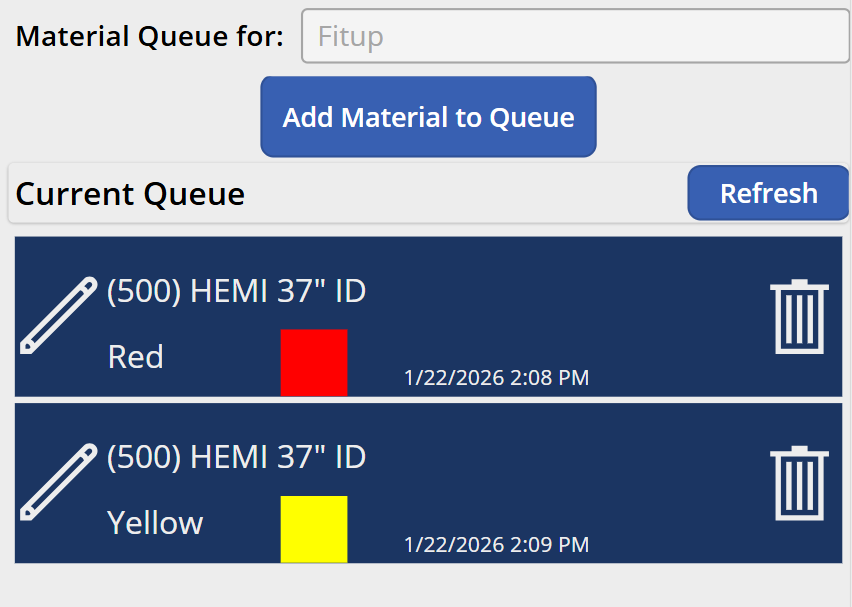
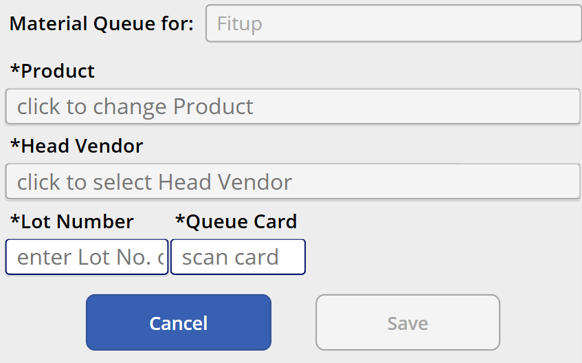
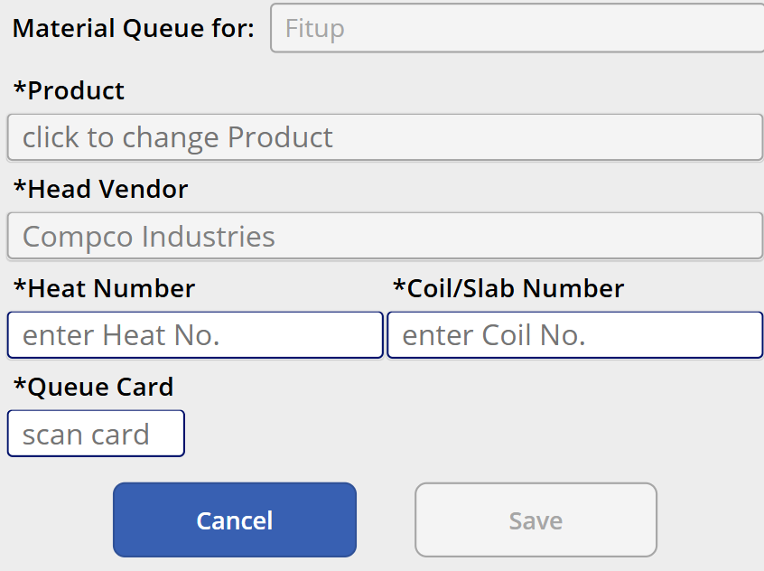

# MES v2 — Fitup Queue Work Center Specification

## 1. Work Center Overview

| Attribute | Value |
|---|---|
| **Work Center** | Fitup Queue |
| **Purpose** | Material Handlers document head material loaded for the Fitup work center. This populates the Heads Queue that the Fitup operator selects from by scanning kanban cards. |
| **Operator Role** | Material Handler / Operator (6.0) |
| **Requires Welder** | No |
| **Auto-Print Label** | No |
| **Input Modes** | Manual Mode (touch/typing) + barcode scanner for Queue Card field only |
| **Device** | Samsung tablet |

### 1.1 Relationship to Fitup

Heads are purchased raw material. Material Handlers use this screen to document the head lot details and associate them with a physical **kanban card** (a reusable colored card with a barcode). The Fitup operator then scans the kanban card (`KC;XX`) at their station to pull the associated head lot into the assembly (per [SPEC_WC_FITUP.md](SPEC_WC_FITUP.md)).

Unlike Rolls Material (where the Rolls operator auto-advances and the system removes consumed items), the Fitup Queue has **no quantity tracking**. The Material Handler is responsible for manually maintaining the queue — adding entries when new head material arrives and removing entries when the material is consumed.

---

## 2. Screen Layout

This screen renders inside the Work Center Content Area of the Operator Work Center Layout (per [SPEC_OPERATOR_WC_LAYOUT.md](SPEC_OPERATOR_WC_LAYOUT.md)).

### 2.1 Main Screen — Queue View



```
+----------------------------------------------------------+
|  Material Queue for:  Fitup                               |
|                                                           |
|             [ Add Material to Queue ]                     |
|                                                           |
|  Current Queue                              [ Refresh ]   |
|  +-----------------------------------------------------+ |
|  | ✏ (500) HEMI 37" ID                            🗑  | |
|  |   Red  [■]              1/22/2026 2:08 PM           | |
|  +-----------------------------------------------------+ |
|  | ✏ (500) HEMI 37" ID                            🗑  | |
|  |   Yellow [■]            1/22/2026 2:09 PM           | |
|  +-----------------------------------------------------+ |
|                                                           |
+----------------------------------------------------------+
```

### 2.2 Add/Edit Material Form — CMF Vendor



```
+----------------------------------------------------------+
|  Material Queue for:  Fitup                               |
|                                                           |
|  *Product         [ click to change Product        ]      |
|                                                           |
|  *Head Vendor     [ click to select Head Vendor    ]      |
|                                                           |
|  *Lot Number      [ enter Lot No.    ]                    |
|  *Queue Card      [ scan card        ]                    |
|                                                           |
|  [ Cancel ]                          [ Save ]             |
|                                                           |
+----------------------------------------------------------+
```

### 2.3 Add/Edit Material Form — Compco Vendor



```
+----------------------------------------------------------+
|  Material Queue for:  Fitup                               |
|                                                           |
|  *Product         [ click to change Product        ]      |
|                                                           |
|  *Head Vendor     [ Compco Industries              ]      |
|                                                           |
|  *Heat Number     [ enter Heat No.    ]                   |
|  *Coil/Slab No.   [ enter Coil No.    ]                   |
|                                                           |
|  *Queue Card      [ scan card        ]                    |
|                                                           |
|  [ Cancel ]                          [ Save ]             |
|                                                           |
+----------------------------------------------------------+
```

---

## 3. Queue View

### 3.1 Queue Header

| Element | Description |
|---|---|
| **"Material Queue for: Fitup"** | Identifies which work center this queue feeds |
| **"Add Material to Queue"** | Button to open the add form |
| **"Refresh"** | Refreshes the queue list from the API |

### 3.2 Queue Items

Each queue item displays:

| Field | Description |
|---|---|
| **Product description** | Head product with tank size (e.g., "(500) HEMI 37\" ID") |
| **Card color name** | The color name of the associated kanban card (e.g., "Red", "Yellow") |
| **Color swatch** | A colored square matching the kanban card's color — helps the Fitup operator visually match the physical card at their station to the queue entry |
| **Timestamp** | Date and time the item was added to the queue |
| **Edit icon** (pencil) | Opens the edit form pre-populated with this item's data |
| **Delete icon** (trash) | Removes the item from the queue (with confirmation prompt) |

---

## 4. Add / Edit Material Form

### 4.1 Common Fields (both vendors)

| Field | Type | Required | Description |
|---|---|---|---|
| **Product** | Selection popup (large list) | Yes (*) | The head product — combines tank size and head type/dimensions. Tapping opens a full-screen popup with large touch targets. |
| **Head Vendor** | Selection popup | Yes (*) | The vendor that supplied the heads. Only two options: **Commercial Metal Forming (CMF)** and **Compco Industries**. |
| **Queue Card** | Barcode scan | Yes (*) | The physical kanban card's barcode (`KC;XX`). Scanned using the barcode scanner. Displays the card code and color after scan. |

### 4.2 Vendor-Dependent Fields

The form dynamically changes based on the selected Head Vendor:

#### CMF (Commercial Metal Forming)

| Field | Type | Required | Description |
|---|---|---|---|
| **Lot Number** | Text input (keyboard) | Yes (*) | The lot identifier from CMF — typed manually |

#### Compco Industries

| Field | Type | Required | Description |
|---|---|---|---|
| **Heat Number** | Text input (keyboard) | Yes (*) | The steel heat number — typed manually |
| **Coil/Slab Number** | Text input (keyboard) | Yes (*) | The coil or slab identifier — typed manually |

### 4.3 Selection Popups

Same pattern as Rolls Material — full-screen selection popups with large touch targets for glove-friendly use. Lists are short enough to display fully on the tablet; no search/filter needed.

### 4.4 Queue Card Scanning

| Property | Value |
|---|---|
| **Input method** | Barcode scanner (the only scanned field on this screen) |
| **Barcode format** | `KC;XX` where `XX` is the card code (e.g., `KC;01`, `KC;02`) |
| **After scan** | The field displays the card code and color name (e.g., "01 — Red") |
| **Manual fallback** | In manual mode, the Material Handler can type the card code |

### 4.5 Data Sources

| Field | API Endpoint |
|---|---|
| **Product** | `GET /products?type=head` — head products with tank size and dimensions |
| **Head Vendor** | `GET /vendors?type=head&siteCode={siteCode}` — head vendors for this plant (CMF, Compco) |
| **Queue Card** | `GET /barcode-cards?siteCode={siteCode}` — available kanban cards for this plant (code + color) |

---

## 5. Kanban Card (BarcodeCard) Management

Kanban cards are reusable physical cards, each with a unique barcode and a color. A separate management screen (accessible to Team Leads and above) allows adding and removing cards.

### 5.1 BarcodeCard Entity

| Field | Type | Description |
|---|---|---|
| **Id** | GUID (PK) | Unique identifier |
| **BarcodeValue** | string | The value encoded in the barcode (e.g., "01", "02") — scanned as `KC;{value}` |
| **ColorName** | string | Display name of the card color (e.g., "Red", "Yellow", "Blue", "Green") |
| **ColorCode** | string | Hex color code for UI rendering (e.g., "#FF0000", "#FFFF00") — used to draw the color swatch |
| **SiteCode** | string (FK) | The plant this card belongs to — cards are site-specific physical objects |
| **IsActive** | bool | Whether the card is currently in the system (soft delete for removal) |

### 5.2 Card Lifecycle

1. A higher-level user (Team Lead+) creates cards in the management screen, assigning a code and color.
2. Material Handler scans a card when adding a head lot to the Fitup Queue — the card is now **associated** with that queue entry.
3. The Fitup operator scans the same card (`KC;XX`) at their station to pull the associated head lot into the assembly.
4. The Material Handler removes the queue entry when the heads are consumed.
5. The physical card returns to the pool and can be scanned again for a new queue entry.

### 5.3 Card Uniqueness

A single card can only be associated with **one active queue entry** at a time. If the Material Handler scans a card that is already linked to an existing queue entry, the system warns: "This card is already assigned to a queue item. Remove the existing entry first."

---

## 6. Workflow

### 6.1 Adding Material to the Queue

```mermaid
sequenceDiagram
    participant MH as Material Handler
    participant Screen as Fitup Queue Screen
    participant API

    MH->>Screen: Tap "Add Material to Queue"
    Screen->>Screen: Open add form

    MH->>Screen: Select Product (selection popup)
    MH->>Screen: Select Head Vendor (selection popup)

    alt CMF selected
        Screen->>Screen: Show Lot Number field
        MH->>Screen: Type Lot Number
    else Compco selected
        Screen->>Screen: Show Heat Number + Coil/Slab Number fields
        MH->>Screen: Type Heat Number and Coil/Slab Number
    end

    MH->>Screen: Scan Queue Card (KC;XX)
    Screen->>API: GET /barcode-cards/{code}
    API-->>Screen: Card info (code, color)
    Screen->>Screen: Display card code and color

    MH->>Screen: Tap Save
    Screen->>API: POST /workcenters/{fitupId}/material-queue
    Note right of Screen: productId, vendorId, lotNumber or<br/>(heatNumber + coilSlabNumber),<br/>cardCode
    API-->>Screen: Success
    Screen->>Screen: Return to queue view — new item appears
```

### 6.2 Editing a Queue Item

- Tap the **edit icon** (pencil) on any queue item to re-open the form pre-populated with that item's data.
- Make changes and tap Save.
- If the card is changed, the old card becomes available again and the new card is associated.

### 6.3 Removing a Queue Item

- Tap the **delete icon** (trash) on any queue item.
- A confirmation prompt appears: "Remove this item from the queue?"
- On confirm, the item is removed and the associated kanban card becomes available for reuse.

---

## 7. Validation and Error Handling

| Scenario | Behavior |
|---|---|
| **Required field missing** | Save button disabled until all required fields (*) are filled |
| **Queue Card already assigned** | Warn — "This card is already assigned to a queue item. Remove the existing entry first." Block save. |
| **Invalid Queue Card scan** | Red overlay — "Card not recognized. Scan a valid kanban card." |
| **Vendor changed after fields populated** | Clear the vendor-specific fields (lot number or heat/coil) and show the new vendor's fields |
| **API failure** | "Failed to save. Please try again." |

---

## 8. Data Captured

| Field | Source | Description |
|---|---|---|
| **Product ID** | Selection popup | The head product (tank size + head type/dimensions) |
| **Head Vendor ID** | Selection popup | CMF or Compco |
| **Lot Number** | Manual text input (CMF only) | Lot identifier for traceability |
| **Heat Number** | Manual text input (Compco only) | Steel heat number for traceability |
| **Coil/Slab Number** | Manual text input (Compco only) | Coil or slab identifier for traceability |
| **Queue Card Code** | Barcode scan (`KC;XX`) | Links this queue entry to a physical kanban card |
| **Work Center ID** | Tablet cache | Fitup (the target work center) |
| **Operator ID** | Session | The Material Handler who added the entry |
| **Timestamp** | Server-generated | When the item was added to the queue |

---

## 9. API Endpoints

| Method | Endpoint | Purpose |
|---|---|---|
| `GET` | `/workcenters/{fitupId}/material-queue` | Retrieve current queue items |
| `POST` | `/workcenters/{fitupId}/material-queue` | Add a new item to the queue |
| `PUT` | `/workcenters/{fitupId}/material-queue/{itemId}` | Update an existing queue item |
| `DELETE` | `/workcenters/{fitupId}/material-queue/{itemId}` | Remove a queue item |
| `GET` | `/products?type=head` | Head products for the Product selector |
| `GET` | `/vendors?type=head` | Head vendors (CMF, Compco) |
| `GET` | `/barcode-cards?siteCode={siteCode}` | Available kanban cards for this plant (code + color) |
| `GET` | `/barcode-cards/{code}` | Look up a specific card by barcode value |

---

## 10. Key Design Decisions

| Decision | Resolution | Rationale |
|---|---|---|
| **Manual entry + barcode for card only** | All fields except Queue Card are manual (popups or typed); Queue Card is scanned | Vendor labeling doesn't support barcode scanning, but the kanban cards have barcodes |
| **Vendor-dependent form** | CMF shows Lot Number; Compco shows Heat Number + Coil/Slab Number | Each vendor provides different traceability identifiers with their material |
| **Selection popups, not dropdowns** | Full-screen popup lists with large touch targets | Glove-friendly; same pattern as Rolls Material |
| **Card uniqueness enforced** | One card per active queue entry | Prevents confusion at the Fitup station — each physical card maps to exactly one head lot |
| **Cards are reusable** | After queue entry is deleted, the card returns to the pool | Limited number of physical cards; they cycle through as material is consumed |
| **No quantity tracking** | Material Handler manually manages queue lifecycle | Unlike Rolls Material, there's no per-piece decrement; the handler removes entries when heads are consumed |
| **No queue depth limit** | Typically 2–4 items, no enforced maximum | Physical space and card count naturally limit queue depth |
| **BarcodeCard management by Team Lead+** | Separate admin screen for adding/removing cards | Cards are a physical asset managed at a higher level than day-to-day material handling |

---

## 11. Differences from Rolls Material

| Aspect | Rolls Material | Fitup Queue |
|---|---|---|
| **Material type** | Steel plate (for shells) | Heads (purchased) |
| **Vendors** | Many mills/processors | Only 2: CMF, Compco |
| **Vendor-dependent fields** | No — same fields for all | Yes — form changes per vendor |
| **Queue Card** | None | Required — physical kanban card with barcode |
| **Scanning** | None | Queue Card field only |
| **Quantity tracking** | Yes — Rolls decrements per shell | None — manually maintained |
| **Queue item removal** | Auto-deleted after Rolls consumes | Manual — Material Handler deletes |

---

## References

| Document | Relevance |
|---|---|
| [SPEC_OPERATOR_WC_LAYOUT.md](SPEC_OPERATOR_WC_LAYOUT.md) | Persistent shell layout |
| [SPEC_WC_FITUP.md](SPEC_WC_FITUP.md) | The production work center that consumes this queue via kanban card scans |
| [SPEC_WC_ROLLS_MATERIAL.md](SPEC_WC_ROLLS_MATERIAL.md) | Similar queue management pattern for plate material |
| [GENERAL_DESIGN_INPUT.md](GENERAL_DESIGN_INPUT.md) | Data model — MaterialQueue, Vendor, Product, BarcodeCard |
