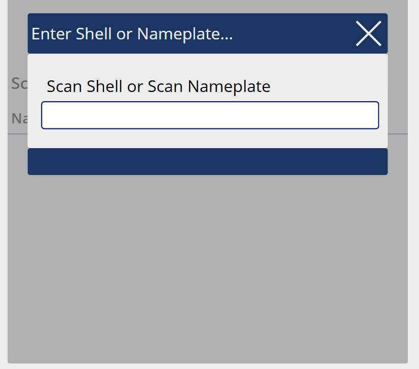
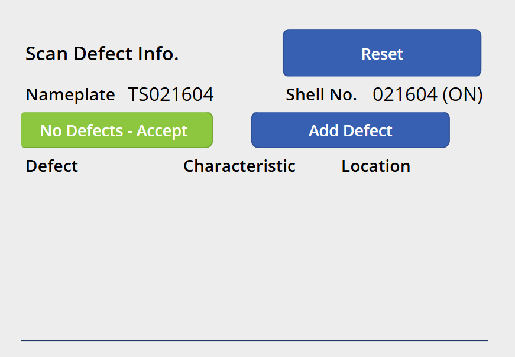
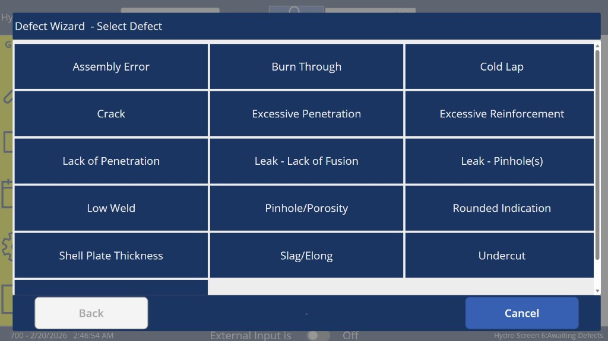
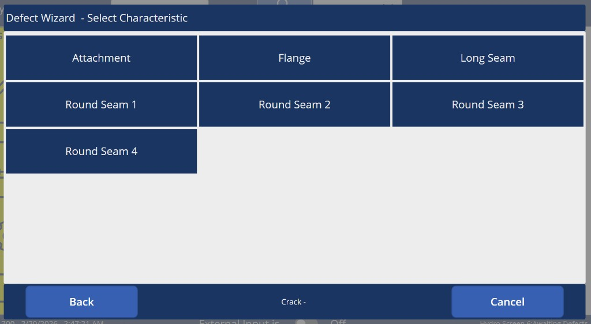
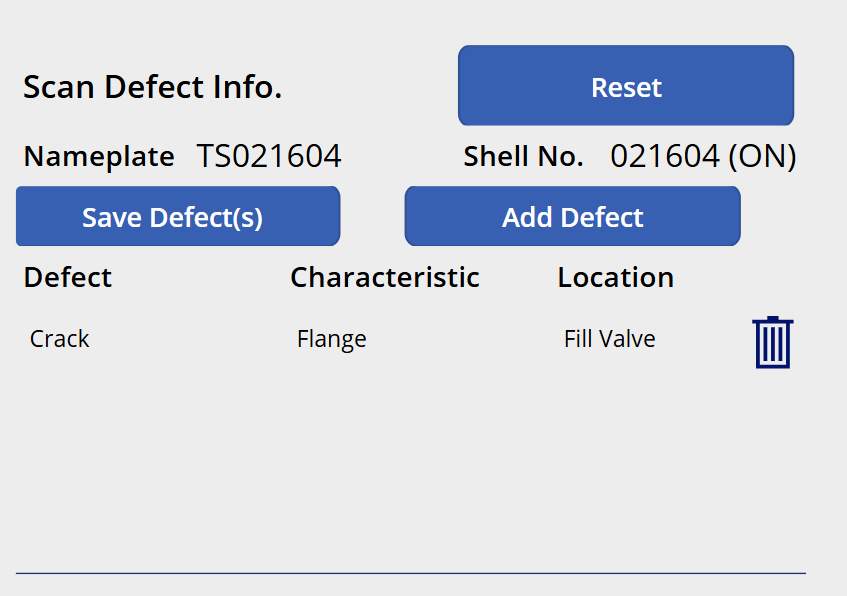

# MES v2 — Hydro Work Center Specification

## 1. Work Center Overview

| Attribute | Value |
|---|---|
| **Work Center** | Hydro (Hydrostatic Testing) |
| **Position in Line** | 11th — after Nameplate (last production station) |
| **Purpose** | The tank is filled with water and brought to pressure to test all welds. The operator marries the assembly to the finished serial number (nameplate), performs a final inspection, logs any defects, and accepts or rejects the tank. |
| **Operator Role** | Hydro Operator / Inspector (6.0) |
| **NumberOfWelders** | 0 — this is a testing/inspection station |
| **Auto-Print Label** | No |
| **Input Modes** | External Input (barcode scanning) **and** Manual Mode (touch). Both are used in the same workflow — scanning for shell/nameplate identification, touch for defect entry due to the large number of characteristic/location combinations. |

### 1.1 Key Function — Assembly to Finished Serial Number Marriage

Hydro is where the **assembly alpha code** (from Fitup) is linked to the **finished serial number** (from Nameplate). The operator scans both the shell barcode (to identify the assembly) and the nameplate barcode (the finished serial number). This creates the traceability link: Finished SN → Assembly → Shells → Plate/Head lots.

---

## 2. Screen Layout

This screen renders inside the Work Center Content Area of the Operator Work Center Layout (per [SPEC_OPERATOR_WC_LAYOUT.md](SPEC_OPERATOR_WC_LAYOUT.md)).



### 2.1 Initial State — Scan Shell or Nameplate

```
+----------------------------------------------------------+
|                                                           |
|  Scan Shell or Nameplate to begin...                     |
|                                                           |
|  +-----------------------------------------------------+ |
|  |  Enter Shell or Nameplate...                         | |
|  +-----------------------------------------------------+ |
|  |  Scan Shell or Scan Nameplate                        | |
|  |  [                                        ]          | |
|  |                                                      | |
|  |  [            SUBMIT             ]                   | |
|  +-----------------------------------------------------+ |
|                                                           |
+----------------------------------------------------------+
```

### 2.2 Both Scanned — Ready for Inspection



```
+----------------------------------------------------------+
|  Scan Defect Info.                          [ Reset ]     |
|                                                           |
|  Nameplate  TS021604          Shell No.  021604 (ON)      |
|                                                           |
|  [ No Defects - Accept ]         [ Add Defect ]           |
|                                                           |
|  Defect          Characteristic         Location          |
|  +-------------------------------------------------+     |
|  |                |                      |         |     |
|  +-------------------------------------------------+     |
|                                                           |
+----------------------------------------------------------+
```

### 2.3 Defect Wizard (step-by-step tile grid)

When the operator taps "Add Defect", a full-screen **Defect Wizard** modal opens with three steps. Each step presents a grid of large touch-friendly buttons (3-column layout). A breadcrumb at the bottom shows selections made so far.





**Step 1: Select Defect** — Grid of defect codes (e.g., Assembly Error, Burn Through, Cold Lap, Crack, Excessive Penetration, Lack of Penetration, Leak - Lack of Fusion, Pinhole/Porosity, Undercut, etc.)

**Step 2: Select Characteristic** — Grid of characteristics (e.g., Attachment, Flange, Long Seam, Round Seam 1–4). Breadcrumb shows: "Crack -"

**Step 3: Select Location** — Grid of locations filtered by the selected characteristic (e.g., for Flange: Service Valve, Fixed Liquid Level Gauge, Vapor Valve, Relief Valve, Fill Valve, Evac Tube, Float Gauge, etc.). Breadcrumb shows: "Crack - Flange"

Each step has **Back** and **Cancel** buttons. After selecting all three, the defect is added to the table.

### 2.4 After Defects Added



```
+----------------------------------------------------------+
|  Scan Defect Info.                          [ Reset ]     |
|                                                           |
|  Nameplate  TS021604          Shell No.  021604 (ON)      |
|                                                           |
|  [ Save Defect(s) ]             [ Add Defect ]            |
|                                                           |
|  Defect          Characteristic         Location          |
|  +-------------------------------------------------+     |
|  | Crack          | Flange               | Fill Valve 🗑 |
|  +-------------------------------------------------+     |
|                                                           |
+----------------------------------------------------------+
```

- The "No Defects - Accept" button changes to **"Save Defect(s)"** once defects are added.
- Each defect row has a **delete icon** (trash) to remove individual entries.
- The operator can continue adding defects via "Add Defect" or save.

---

## 3. Screen States

| State | Description | Transitions |
|---|---|---|
| **WaitingForScans** | Initial state. Operator scans shell and/or nameplate in either order. | → ReadyForInspection (when both shell and nameplate are scanned) |
| **ReadyForInspection** | Both scans complete. Assembly and nameplate SN displayed. Operator can accept with no defects or add defects. | → DefectEntry (if Add Defects tapped) or → WaitingForScans (on Accept/Reject save) |
| **DefectEntry** | Defect logging mode. Operator selects defects via touch (characteristic → location → defect code). | → ReadyForInspection (defects added, ready for Accept/Reject) |

---

## 4. Workflow

### 4.1 Sequence Diagram

```mermaid
sequenceDiagram
    participant Op as Hydro Operator
    participant Screen as Hydro Screen
    participant API

    Note over Screen: State: WaitingForScans

    Op->>Screen: Scan shell label (SC;XXXXXX)
    Screen->>API: GET /serial-numbers/{serial}/assembly
    API-->>Screen: alphaCode, tankSize
    Screen->>Screen: Assembly identified, waiting for nameplate

    Op->>Screen: Scan nameplate barcode (W00123456)
    Screen->>API: GET /nameplate-records/{serialNumber}
    API-->>Screen: Nameplate SN verified
    Screen->>Screen: State → ReadyForInspection

    alt No defects
        Op->>Screen: Tap "Accept - No Defects"
        Screen->>API: POST /hydro-records
        Note right of Screen: alphaCode, nameplateSN, result: ACCEPTED,<br/>defects: [], workCenterId, operatorId
        API->>API: Create assembly ↔ finished SN link in TraceabilityLog
        API-->>Screen: Success
        Screen->>Screen: Green overlay, State → WaitingForScans
    else Defects found
        Op->>Screen: Tap "Add Defects"
        Screen->>Screen: State → DefectEntry
        Op->>Screen: Select characteristic (touch dropdown)
        Op->>Screen: Select location (touch dropdown, filtered by characteristic)
        Op->>Screen: Select defect code (touch dropdown)
        Screen->>Screen: Defect row added to table
        Note over Screen: Repeat for additional defects
        Op->>Screen: Tap "Accept" or "Reject"
        Screen->>API: POST /hydro-records
        Note right of Screen: alphaCode, nameplateSN, result: ACCEPTED or REJECTED,<br/>defects: [{defectCode, characteristic, location}, ...]
        API-->>Screen: Success
        Screen->>Screen: Green/Red overlay based on result, State → WaitingForScans
    end
```

### 4.2 Step-by-Step Flow

**1. Scan Shell and Nameplate (either order)**

- The operator scans the **shell barcode** (`SC;XXXXXX/L1` or `/L2`). The system uses the TraceabilityLog to look up the assembly alpha code.
- The operator scans the **nameplate barcode** (just the serial number, e.g., `W00123456` — no `SC;` prefix). The system verifies the nameplate record exists.
- These can happen in **either order**. The system detects which is which:
	- If the scanned value starts with `SC;` → shell barcode, look up assembly.
	- If the scanned value has no recognized prefix → nameplate barcode, look up nameplate record.
- Once both are scanned, the screen transitions to **ReadyForInspection**, displaying the assembly alpha code, nameplate serial number, and tank size.

**2. Shell Already Matched Warning**

- If the shell (assembly) has already been matched to a nameplate in a previous Hydro record, the system shows a **warning**: "This assembly is already matched to nameplate {existingNameplateSN}. Proceeding will create a new match."
- The operator can choose to continue or cancel.

**3a. Accept — No Defects (fast path)**

- If the hydro test passes with no issues, the operator taps **"Accept - No Defects"**.
- A hydro record is saved with result = ACCEPTED and an empty defect list.
- The TraceabilityLog is updated to link the assembly alpha code to the finished serial number.
- Green overlay confirms.

**3b. Add Defects**

- The operator taps **"Add Defects"** to enter defect logging mode.
- **Characteristic**: The operator selects from a larger list of characteristics (not limited to round seams — could include any weld position, head, shell, etc.). This is done via **touch dropdown** because the possibilities are too many for scan cards.
- **Location**: After selecting a characteristic, the location dropdown is **filtered based on the selected characteristic**. This is a cascading dropdown.
- **Defect Code**: The operator selects the defect code from the applicable list for this work center.
- Each complete entry (characteristic + location + defect code) adds a row to the defect table.
- Multiple defects can be added.

**4. Accept or Reject**

- After adding defects, the operator taps either **"Accept"** or **"Reject"**:
	- **Accept**: The tank passed overall despite logged defects (defects may be minor/cosmetic).
	- **Reject**: The tank failed the hydro test.
- The hydro record is saved with the result and defect list.
- The TraceabilityLog link (assembly → finished SN) is created regardless of accept/reject.

**5. NOSHELL;0 — No Shell**

- The `NOSHELL;0` barcode is used when there is no physical shell to scan (e.g., a test run or calibration scenario). This allows the operator to proceed without a shell scan. Specific behavior TBD based on operational needs.

---

## 5. Scan Detection Logic

Since the operator can scan either a shell or nameplate barcode, the system must distinguish between them:

| Scanned Value | Detection | Action |
|---|---|---|
| Starts with `SC;` | Shell barcode | Strip prefix/suffix, look up assembly via TraceabilityLog |
| No recognized prefix | Nameplate barcode | Look up nameplate record by serial number |
| `NOSHELL;0` | No shell command | Mark as no-shell scenario |

---

## 6. Defect Entry Detail

### 6.1 Defect Wizard (not dropdowns)

At Long Seam and Round Seam Inspection, defect entry is scan-driven with laminated scan sheets. At Hydro, defect entry uses a **full-screen Defect Wizard** with large touch-friendly tile grids because:
- The characteristic list is much larger (all weld positions, flanges, attachments, etc.)
- The location list depends on the selected characteristic (cascading)
- The combinations are too numerous for scan cards
- Large tile buttons are easier to tap accurately on a tablet than small dropdown items

### 6.2 Wizard Flow

| Step | Title | Content | Breadcrumb |
|---|---|---|---|
| **1** | "Select Defect" | Grid of defect codes applicable to this work center | (empty) |
| **2** | "Select Characteristic" | Grid of characteristics applicable to this work center | "{Defect} -" |
| **3** | "Select Location" | Grid of locations **filtered by the selected characteristic** | "{Defect} - {Characteristic}" |

Each step:
- Displays options as a **3-column grid of large buttons** (dark background, white text)
- Has **Back** (go to previous step) and **Cancel** (close wizard, discard entry) buttons at the bottom
- Shows a **breadcrumb** of selections made so far at the bottom center

### 6.3 Defect Code (Step 1)

| Property | Value |
|---|---|
| **UI** | Tile grid of large buttons |
| **Source** | Master Defect Code table, filtered by this work center via DefectWorkCenter |
| **Examples** | Assembly Error, Burn Through, Cold Lap, Crack, Excessive Penetration, Excessive Reinforcement, Lack of Penetration, Leak - Lack of Fusion, Leak - Pinhole(s), Low Weld, Pinhole/Porosity, Rounded Indication, Shell Plate Thickness, Slag/Elong, Undercut |

### 6.4 Characteristic (Step 2)

| Property | Value |
|---|---|
| **UI** | Tile grid of large buttons |
| **Source** | Characteristic table, filtered by this work center via CharacteristicWorkCenter |
| **Examples** | Attachment, Flange, Long Seam, Round Seam 1, Round Seam 2, Round Seam 3, Round Seam 4 |

### 6.5 Location (Step 3 — cascading)

| Property | Value |
|---|---|
| **UI** | Tile grid of large buttons — **filtered by the characteristic selected in Step 2** |
| **Source** | Defect Location table, filtered by characteristic and work center |
| **Examples (for Flange)** | Service Valve, Fixed Liquid Level Gauge, Vapor Valve, Relief Valve, UG Riser Flange, Bottom Drain, Multi-Valve, Fill Valve, Evac Tube, Float Gauge |

### 6.6 After Wizard Completes

- The defect (Defect + Characteristic + Location) is added as a row in the defect table.
- Each row has a **delete icon** (trash) to remove individual entries — unlike upstream inspection stations where only "Clear All" (`CL;1`) is available.
- The operator can tap "Add Defect" again to open the wizard for another entry.
- When defects exist, the "No Defects - Accept" button changes to "Save Defect(s)".

---

## 7. Barcode Commands

| Barcode | Action | Context |
|---|---|---|
| `SC;XXXXXX/L1` or `/L2` | Scan shell — look up assembly | State: WaitingForScans |
| `{nameplateSN}` (no prefix) | Scan nameplate — look up finished serial number | State: WaitingForScans |
| `NOSHELL;0` | No shell present | State: WaitingForScans |

Defect entry uses touch controls, not barcode scanning.

---

## 8. Manual Mode Controls

| Action | Manual Control |
|---|---|
| Shell identification | Type serial number in text input |
| Nameplate identification | Type nameplate SN in text input |
| Add defects | Touch dropdowns (characteristic → location → defect code) |
| Accept - No Defects | Button |
| Accept (with defects) | Button |
| Reject | Button |

---

## 9. Validation and Error Handling

| Scenario | Behavior |
|---|---|
| **Valid shell scan** | Assembly identified, waiting for nameplate (or vice versa) |
| **Shell not in any assembly** | Red overlay — "This shell is not part of any assembly" |
| **Shell already matched to a nameplate** | Warning — "This assembly is already matched to nameplate {SN}. Proceeding will create a new match." Allow continue or cancel. |
| **Nameplate SN not found** | Red overlay — "Nameplate serial number not found" |
| **Duplicate scan (same type)** | Replace the previous scan of that type (e.g., scanning a second shell replaces the first) |
| **Save without both scans** | Accept/Reject buttons disabled until both shell and nameplate are scanned |
| **Defect entry with missing fields** | Warn — "Complete all defect fields before adding" |
| **API failure** | "Failed to save hydro record. Please try again." |

---

## 10. Data Captured

### 10.1 Hydro Record

| Field | Source | Description |
|---|---|---|
| **Assembly Alpha Code** | Shell scan → TraceabilityLog | The assembly being tested |
| **Nameplate Serial Number** | Nameplate barcode scan | The finished tank serial number |
| **Result** | Accept / Reject button | ACCEPTED or REJECTED |
| **Work Center ID** | Tablet cache | Hydro |
| **Asset ID** | Tablet cache | The specific hydro test station |
| **Operator ID** | Session | Who performed the test |
| **Timestamp** | Server-generated | When the record was saved |
| **Defects** | Defect entries (0 or more) | Array of defect records |

### 10.2 TraceabilityLog Entry (on Save)

| From | To | Relationship |
|---|---|---|
| Assembly Alpha Code → Finished Serial Number | Assembly produces finished tank | Links the assembly to the customer-facing serial number |

---

## 11. API Endpoints

| Method | Endpoint | Purpose |
|---|---|---|
| `GET` | `/serial-numbers/{serial}/assembly` | Look up assembly from shell serial |
| `GET` | `/nameplate-records/{serialNumber}` | Verify nameplate exists |
| `GET` | `/workcenters/{id}/defect-codes` | Defect codes for this work center |
| `GET` | `/workcenters/{id}/characteristics` | Characteristics for this work center (wider list than upstream) |
| `GET` | `/characteristics/{id}/locations` | Locations filtered by selected characteristic |
| `POST` | `/hydro-records` | Save hydro test record (accept/reject, defects, assembly↔nameplate link) |
| `GET` | `/workcenters/{id}/history?date={today}&limit=5` | WC History panel |

---

## 12. Key Design Decisions

| Decision | Resolution | Rationale |
|---|---|---|
| **Shell + Nameplate marriage** | Both scanned at Hydro, linked in TraceabilityLog | This is the point where the assembly gets its customer-facing serial number |
| **Either-order scanning** | Shell or nameplate can be scanned first | Operator flexibility; system detects which is which by prefix |
| **Defect Wizard with tile grids** | Full-screen 3-step wizard (Defect → Characteristic → Location) with large touch buttons instead of dropdowns or scan sheets | Too many combinations for scan cards; large tile buttons are easier to tap than small dropdown items on a tablet |
| **Cascading location step** | Location grid filtered by selected characteristic | Reduces invalid combinations; guides the operator to valid entries |
| **Individual defect delete** | Trash icon per row (unlike CL;1 clear-all at other stations) | More granular control needed when building a multi-defect list through a wizard flow |
| **Accept - No Defects fast path** | Single button for the clean path | Most tanks pass; fastest possible workflow for the common case |
| **Accept with defects allowed** | Defects can be logged and the tank still accepted | Some defects are minor/cosmetic and don't warrant rejection |
| **Already-matched warning** | Warn but allow re-match | Handles rework scenarios where a tank goes through Hydro again |

---

## References

| Document | Relevance |
|---|---|
| [SPEC_OPERATOR_WC_LAYOUT.md](SPEC_OPERATOR_WC_LAYOUT.md) | Persistent shell, scan overlay, input modes |
| [SPEC_WC_NAMEPLATE.md](SPEC_WC_NAMEPLATE.md) | Creates the finished serial number and barcode that is scanned here |
| [SPEC_WC_FITUP.md](SPEC_WC_FITUP.md) | Creates the assembly alpha code |
| [MANFACTURING_CONCEPTS.MD](MANFACTURING_CONCEPTS.MD) | Traceability diagram — Finished SN → Assembly → Shells → Lots |
| [MES_V1_BARCODE_LANG.MD](MES_V1_BARCODE_LANG.MD) | Barcode command reference (NOSHELL;0) |
| [GENERAL_DESIGN_INPUT.md](GENERAL_DESIGN_INPUT.md) | Data model — TraceabilityLog, DefectCode, Characteristic |
