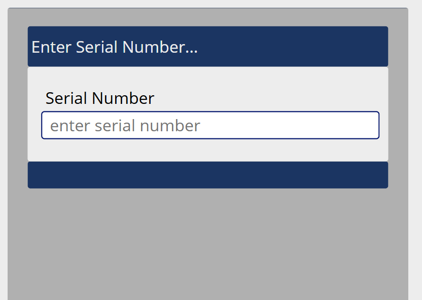

# MES v2 — Long Seam Work Center Specification

## 1. Work Center Overview

| Attribute | Value |
|---|---|
| **Work Center** | Long Seam |
| **Position in Line** | 2nd — after Rolls |
| **Purpose** | The longitudinal seam on the rolled shell is fully welded shut. In terms of the MES application, this is a scan-through station — the operator scans the shell's barcode label to record that it passed through this work center, capturing the timestamp and welder. |
| **Operator Role** | Long Seam Operator (6.0) |
| **Requires Welder** | Yes — the operator welds the longitudinal seam |
| **Auto-Print Label** | No — the shell already has pre-printed labels from Rolls |
| **Input Modes** | External Input (barcode scanning) and Manual Mode (touch) |

---

## 2. Screen Layout

This screen renders inside the Work Center Content Area of the Operator Work Center Layout (per [SPEC_OPERATOR_WC_LAYOUT.md](SPEC_OPERATOR_WC_LAYOUT.md)).



```
+----------------------------------------------------------+
|                                                           |
|  +-----------------------------------------------------+ |
|  |  Enter Serial Number...                              | |
|  +-----------------------------------------------------+ |
|  |                                                      | |
|  |  Serial Number                                       | |
|  |  [ enter serial number          ]                    | |
|  |                                                      | |
|  |  [            SUBMIT             ]                   | |
|  +-----------------------------------------------------+ |
|                                                           |
|                                                           |
+----------------------------------------------------------+
```

This is one of the simplest work center screens. The content area contains a single input for the shell serial number and a submit action.

On occasion, the Rolls operator affixes the barcodes but forgets to scan. When the shell arrives at Long Seam and the serial number is not found in the system, Long Seam creates the serial number record and the Long Seam production record, but it cannot create the TraceabilityLog back to the material lot because the system cannot be 100% certain which lot the shell came from. The system assumes it is the same lot as the previous shell, but an **automatic annotation** is created flagging the record so that someone (Team Lead, Supervisor, or Quality) can validate and correct the material lot assignment. See Section 3.3 below.

---

## 3. Workflow

### 3.1 Sequence Diagram

```mermaid
sequenceDiagram
    participant Op as Long Seam Operator
    participant Screen as Long Seam Screen
    participant API

    Op->>Screen: Scan shell label (SC;XXXXXX/L1 or /L2)
    Screen->>Screen: Extract serial number (strip /L1 or /L2 suffix)
    Screen->>API: POST /production-records
    Note right of Screen: serialNumber, workCenterId, assetId,<br/>productionLineId, operatorId, welderIds, timestamp

    alt Serial number exists (normal flow)
        API-->>Screen: Success
        Screen->>Screen: Green overlay — "Shell {serial} recorded"
    else Serial number not found (Rolls missed scan)
        API->>API: Create serial number record
        API->>API: Assume material lot from previous shell
        API->>API: Create auto-annotation flagging lot for validation
        API-->>Screen: Success (with warning)
        Screen->>Screen: Green overlay — "Shell {serial} recorded (Rolls missed — annotation created)"
    end

    Screen->>Screen: Clear input, ready for next scan
```

### 3.2 Step-by-Step Flow (Normal)

1. **Shell arrives** from Rolls with two pre-printed barcode labels already affixed.
2. The operator welds the longitudinal seam.
3. The operator scans either label (`SC;XXXXXX/L1` or `SC;XXXXXX/L2`) — the system accepts either one.
4. The system extracts the serial number by stripping the `/L1` or `/L2` suffix.
5. A production record is created capturing:
	- Shell serial number
	- Work center ID, asset ID, production line ID (from tablet cache)
	- Operator ID (from session)
	- Welder ID(s) (from the top bar welder list)
	- Timestamp
6. Green scan overlay confirms the record.
7. The input is cleared, ready for the next shell.

### 3.3 Missing Rolls Record (Catch-Up Flow)

On occasion, the Rolls operator affixes the pre-printed barcode labels to a shell but forgets to scan them into the system. When this shell arrives at Long Seam, the serial number does not exist in the system.

**Instead of rejecting the scan**, Long Seam handles this gracefully:

1. The operator scans the label. The API detects the serial number is unknown.
2. The API **creates the serial number record**. All data needed for the serial number itself is available (the serial is on the label).
3. The API **assumes the material lot** is the same as the previous shell scanned at this work center. This is a best-guess assumption based on production sequence.
4. The API **does not create a full TraceabilityLog** linking back to the material lot, because the lot assignment cannot be confirmed with certainty.
5. The API **automatically creates an annotation** on this production record flagging it for material lot validation. The annotation indicates:
	- "Serial number was not scanned at Rolls. Material lot assumed from previous shell. Lot assignment requires validation."
	- Annotation type: system-generated / auto-annotation.
6. The production record for Long Seam is created normally.
7. The operator sees a **green overlay with a note**: "Shell {serial} recorded (Rolls missed — annotation created)". The green overlay is used because the Long Seam action itself succeeded — the annotation flags the upstream data issue for later resolution.
8. A Team Lead, Supervisor, or Quality personnel can later review the annotation (visible in the WC History panel via the annotation flag) and correct the material lot assignment.

---

## 4. Barcode Commands

| Barcode | Action | Notes |
|---|---|---|
| `SC;XXXXXX/L1` | Record shell through Long Seam | Either label suffix is accepted |
| `SC;XXXXXX/L2` | Record shell through Long Seam | Either label suffix is accepted |

No other barcode commands are used at this work center.

---

## 5. Manual Mode Controls

When External Input is toggled OFF:

| Barcode Equivalent | Manual Control | Description |
|---|---|---|
| `SC;XXXXXX` | Text input + Submit button | Operator types the serial number into the "Serial Number" field and taps Submit |

The v1 screen shows manual mode: a "Serial Number" text input with placeholder "enter serial number" and a Submit button below it.

---

## 6. Validation and Error Handling

| Scenario | Behavior |
|---|---|
| **Valid serial number (Rolls record exists)** | Green overlay — production record created |
| **Unknown serial number (Rolls missed scan)** | Serial number is created, material lot assumed from previous shell, auto-annotation created. Green overlay with note — "Shell {serial} recorded (Rolls missed — annotation created)". See Section 3.3. |
| **Duplicate scan** | Red overlay — "This shell has already been recorded at Long Seam". Prevents double-counting. |
| **No welder signed in** | This work center requires a welder. Per [SPEC_OPERATOR_WC_LAYOUT.md](SPEC_OPERATOR_WC_LAYOUT.md) Section 3.4 (Welder Minimum Enforcement), save is blocked with a banner: "A welder must be signed in before logging data." |
| **API failure** | "Failed to save record. Please try again." |

---

## 7. Data Captured

| Field | Source | Description |
|---|---|---|
| **Serial Number** | Barcode scan (extracted from `SC;XXXXXX/L1` or `/L2`) | The shell identifier from Rolls |
| **Work Center ID** | `cachedWorkCenterId` from `localStorage` | Identifies this as a Long Seam record |
| **Asset ID** | `cachedAssetId` from `localStorage` | The specific asset/lane at this work center |
| **Production Line ID** | `cachedProductionLineId` from `localStorage` | The production line |
| **Operator ID** | JWT session | Who operated the station |
| **Welder ID(s)** | Top bar welder list | Who performed the weld |
| **Timestamp** | Server-generated | When the record was created |

---

## 8. API Endpoints

| Method | Endpoint | Purpose |
|---|---|---|
| `POST` | `/production-records` | Create a production record for the shell at Long Seam |
| `GET` | `/workcenters/{id}/history?date={today}&limit=5` | WC History panel — today's count and last 5 records |

---

## 9. Key Design Decisions

| Decision | Resolution | Rationale |
|---|---|---|
| **Accept either /L1 or /L2** | Strip the suffix, use the serial number | The operator may scan whichever label is easier to reach; both identify the same shell |
| **No additional data entry** | Only the shell scan is needed | All traceability data (heat, coil, shell size) was captured at Rolls; Long Seam just logs passage through the station |
| **Graceful catch-up for missed Rolls scans** | Create the serial number, assume lot from previous shell, auto-annotate for validation | Production cannot stop because Rolls forgot to scan; the shell was physically rolled and labeled, the data gap is flagged for correction |
| **Simple screen** | Minimal UI — just a scan prompt | The operator's focus is on welding; the app interaction should be as fast as possible |

---

## References

| Document | Relevance |
|---|---|
| [SPEC_OPERATOR_WC_LAYOUT.md](SPEC_OPERATOR_WC_LAYOUT.md) | Persistent shell, welder enforcement, scan overlay |
| [SPEC_WC_ROLLS.md](SPEC_WC_ROLLS.md) | Upstream station — creates the shell and its serial number |
| [MES_V1_BARCODE_LANG.MD](MES_V1_BARCODE_LANG.MD) | Barcode command reference |
| [GENERAL_DESIGN_INPUT.md](GENERAL_DESIGN_INPUT.md) | Overall design patterns |
