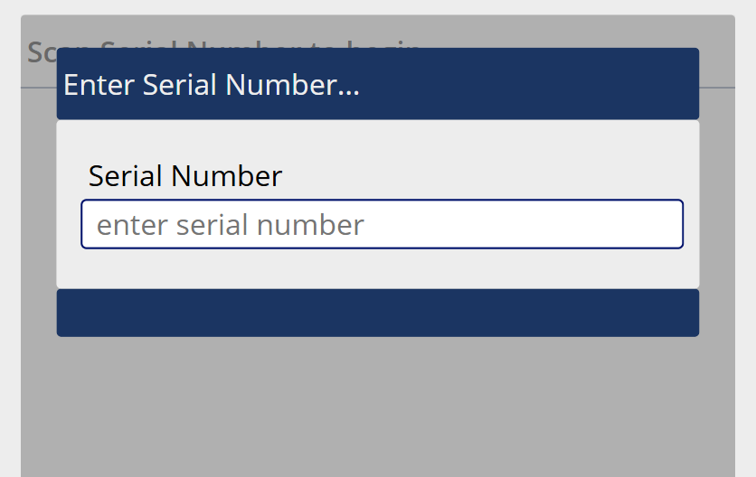
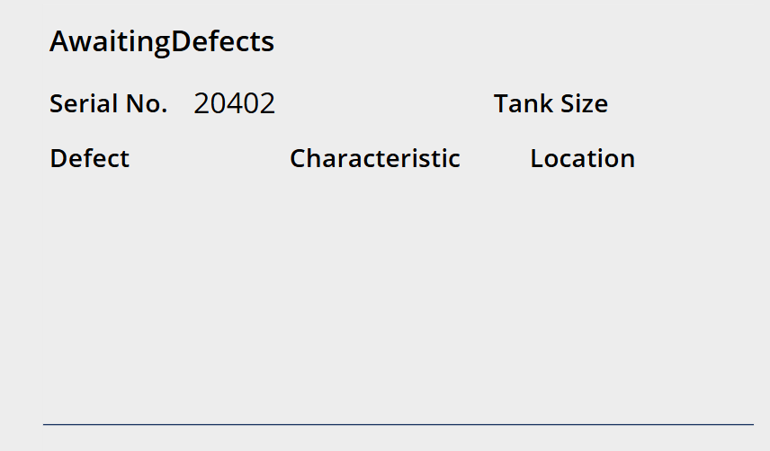

# MES v2 — Long Seam Inspection Work Center Specification

## 1. Work Center Overview

| Attribute | Value |
|---|---|
| **Work Center** | Long Seam Inspection |
| **Position in Line** | 3rd — after Long Seam |
| **Purpose** | The inspector visually inspects the longitudinal weld seam on each shell and logs any defects found. If no defects are found, the shell is saved with a clean record. |
| **Operator Role** | Inspector / Operator (6.0) |
| **NumberOfWelders** | 0 — this is an inspection station |
| **Auto-Print Label** | No — the shell already has labels from Rolls |
| **Input Modes** | External Input (barcode scanning) and Manual Mode (touch) |
| **Scan Sheets** | Laminated reference sheets at the station for defect codes and location codes |

### 1.1 Inspection Concept

The inspector checks the long seam weld for quality defects. For each shell:
- If the weld is clean: scan the shell, then scan Save (`S;1`) — no defects recorded.
- If defects are found: scan the shell, then scan one or more defect entries (defect code + location), then scan Save.

The **Characteristic** (what is being inspected) is assumed to be the Long Seam characteristic at this work center — the inspector does not need to scan or select it separately.

---

## 2. Screen Layout

This screen renders inside the Work Center Content Area of the Operator Work Center Layout (per [SPEC_OPERATOR_WC_LAYOUT.md](SPEC_OPERATOR_WC_LAYOUT.md)).

### 2.1 Initial State — Waiting for Shell Scan



```
+----------------------------------------------------------+
|                                                           |
|  Scan Serial Number to begin...                          |
|                                                           |
|  +-----------------------------------------------------+ |
|  |  Enter Serial Number...                              | |
|  +-----------------------------------------------------+ |
|  |                                                      | |
|  |  Serial Number                                       | |
|  |  [ enter serial number          ]                    | |
|  |                                                      | |
|  |  [            SUBMIT             ]                   | |
|  +-----------------------------------------------------+ |
|                                                           |
+----------------------------------------------------------+
```

### 2.2 Defect Entry State — Awaiting Defects



```
+----------------------------------------------------------+
|  AwaitingDefects                                          |
|                                                           |
|  Serial No.  20402              Tank Size  120            |
|                                                           |
|  Defect          Characteristic         Location          |
|  +-------------------------------------------------+     |
|  | Porosity       | Long Seam            | LS1     |     |
|  | Undercut       | Long Seam            | LS1     |     |
|  |                |                      |         |     |
|  +-------------------------------------------------+     |
|                                                           |
+----------------------------------------------------------+
```

After the shell is scanned, the screen transitions to defect entry mode. The serial number and tank size are displayed at the top. A table below shows any defects logged so far (Defect, Characteristic, Location). The Characteristic column will always show the Long Seam characteristic for this work center.

---

## 3. Screen States

The screen operates as a simple state machine:

| State | Description | Transitions |
|---|---|---|
| **WaitingForShell** | Initial state. Screen shows "Scan Serial Number to begin..." and the manual entry form. | → AwaitingDefects (on successful shell scan) |
| **AwaitingDefects** | Shell is loaded. Serial number and tank size displayed. Inspector scans defect codes and locations, or saves immediately. | → WaitingForShell (on Save) |

---

## 4. Workflow

### 4.1 Sequence Diagram

```mermaid
sequenceDiagram
    participant Insp as Inspector
    participant Screen as LS Insp Screen
    participant API

    Note over Screen: State: WaitingForShell

    Insp->>Screen: Scan shell label (SC;XXXXXX)
    Screen->>API: GET /serial-numbers/{serial}/context
    API-->>Screen: serialNumber, tankSize, shellSize
    Screen->>Screen: State → AwaitingDefects
    Screen->>Screen: Display serial number, tank size, empty defect table

    alt No defects found
        Insp->>Screen: Scan Save (S;1)
        Screen->>API: POST /inspection-records
        Note right of Screen: serialNumber, workCenterId, defects: []
        API-->>Screen: Success
        Screen->>Screen: Green overlay, State → WaitingForShell
    else Defects found
        Insp->>Screen: Scan defect code (D;XXX)
        Screen->>Screen: Add defect code to current entry
        Insp->>Screen: Scan location (L;XXX)
        Screen->>Screen: Complete defect entry, add row to table
        Note over Screen: Repeat for additional defects
        Insp->>Screen: Scan Save (S;1)
        Screen->>API: POST /inspection-records
        Note right of Screen: serialNumber, workCenterId,<br/>defects: [{defectCode, characteristic, location}, ...]
        API-->>Screen: Success
        Screen->>Screen: Green overlay, State → WaitingForShell
    end
```

### 4.2 Step-by-Step Flow

**1. Scan Shell**

- The inspector scans the shell's barcode label (`SC;XXXXXX/L1` or `/L2`).
- The system strips the label suffix, looks up the serial number, and retrieves the tank size.
- **If the serial number is not found** (both Rolls and Long Seam were missed): the same catch-up logic from [SPEC_WC_LONG_SEAM.md](SPEC_WC_LONG_SEAM.md) Section 3.3 applies — the serial number record is created, material lot is assumed from the previous shell, and an automatic annotation is created flagging the record for lot validation. The inspection proceeds normally after the catch-up.
- The screen transitions to **AwaitingDefects** — displaying the serial number, tank size, and an empty defect table.

**2. Log Defects (zero or more)**

- **Individual defect scanning**: The inspector scans a defect code (`D;XXX`) and then a location (`L;XXX`). The system automatically applies the Long Seam characteristic. A row is added to the defect table.
- **Compound defect scanning**: The inspector scans a full defect barcode (`FD;XXX-YYY-ZZZ` where XXX = DefectCode, YYY = Characteristic, ZZZ = Location). A row is added in one scan.
- Multiple defects can be logged for the same shell. Each scan adds a row.

**3. Clear Defects (optional)**

- If the inspector made mistakes, scanning `CL;1` clears all defect entries from the table. The screen stays in AwaitingDefects — the inspector can re-enter defects or save clean.

**4. Save**

- The inspector scans `S;1` to save the inspection record.
- If defects were logged: an inspection record is created with the defect list attached.
- If no defects: an inspection record is created with an empty defect list (clean pass).
- Green overlay confirms the save.
- The screen returns to **WaitingForShell**, ready for the next shell.

---

## 5. Defect Entry Detail

### 5.1 Defect Code

| Property | Value |
|---|---|
| **Source** | Master Defect Code table, filtered by this work center via the DefectWorkCenter relationship |
| **Barcode** | `D;XXX` where XXX is the defect code ID |
| **Manual mode** | Dropdown selector showing only defects applicable to this work center |
| **Scan sheet** | Laminated sheet at the station listing all applicable defect codes with their barcodes |

### 5.2 Characteristic

| Property | Value |
|---|---|
| **Behavior at this work center** | Assumed to be the **Long Seam** characteristic — the inspector does not need to scan or select it |
| **Source** | CharacteristicWorkCenter relationship — the characteristic assigned to this work center |
| **Override** | The `FD;` compound barcode can specify a different characteristic if needed, but this is not the normal flow |

### 5.3 Defect Location

| Property | Value |
|---|---|
| **Source** | Defect Location table, filtered by this work center |
| **Barcode** | `L;XXX` where XXX is the location ID |
| **Manual mode** | Dropdown selector showing only locations applicable to this work center |
| **Scan sheet** | Laminated sheet at the station listing all applicable locations with their barcodes |
| **Examples** | LS1 (for single-shell tanks), LS1/LS2 (for multi-shell tanks, per the weld position diagram) |

### 5.4 Defect Entry Sequence

When scanning individual codes (not `FD;`), the system accepts defect code and location in either order:

| Scan Order | Result |
|---|---|
| `D;XXX` then `L;YYY` | Defect row added: DefectCode=XXX, Characteristic=assumed, Location=YYY |
| `L;YYY` then `D;XXX` | Defect row added: DefectCode=XXX, Characteristic=assumed, Location=YYY |
| `FD;XXX-YYY-ZZZ` | Defect row added in one scan: DefectCode=XXX, Characteristic=YYY, Location=ZZZ |

A defect entry is complete when both a defect code and a location have been provided. The system should visually indicate which part(s) are still pending (e.g., highlight the Defect or Location column if only one has been scanned).

---

## 6. Barcode Commands

| Barcode | Action | Context |
|---|---|---|
| `SC;XXXXXX/L1` or `/L2` | Load a shell for inspection | State: WaitingForShell |
| `D;XXX` | Log a defect code | State: AwaitingDefects |
| `L;XXX` | Log a defect location | State: AwaitingDefects |
| `FD;XXX-YYY-ZZZ` | Log a full defect (DefectCode-Characteristic-Location) in one scan | State: AwaitingDefects |
| `S;1` | Save the inspection record (with or without defects) | State: AwaitingDefects |
| `CL;1` | Clear all defect entries | State: AwaitingDefects |

---

## 7. Manual Mode Controls

When External Input is toggled OFF:

| Barcode Equivalent | Manual Control | Description |
|---|---|---|
| `SC;XXXXXX` | Text input + Submit | Type serial number to load the shell |
| `D;XXX` | Defect Code dropdown | Select from defect codes applicable to this work center |
| `L;XXX` | Location dropdown | Select from locations applicable to this work center |
| `FD;` | Not needed | Individual dropdowns replace compound scanning |
| `S;1` | Save button | Save the inspection record |
| `CL;1` | Clear All button | Clear all defect entries |

---

## 8. Validation and Error Handling

| Scenario | Behavior |
|---|---|
| **Valid shell scan (upstream records exist)** | Green overlay, transition to AwaitingDefects |
| **Unknown serial number (Rolls + Long Seam missed)** | Catch-up flow: serial number created, material lot assumed from previous shell, auto-annotation created. Green overlay with note, transition to AwaitingDefects. See [SPEC_WC_LONG_SEAM.md](SPEC_WC_LONG_SEAM.md) Section 3.3. |
| **Serial exists but no Long Seam record** | Allowed — the shell proceeds to inspection. The missing Long Seam record is a data gap but does not block inspection. An auto-annotation is created noting Long Seam was skipped. |
| **Invalid defect code for this work center** | Red overlay — "Defect code not applicable at this work center" |
| **Invalid location for this work center** | Red overlay — "Location not applicable at this work center" |
| **Save with incomplete defect entry** | If a defect code was scanned but no location (or vice versa), warn: "Incomplete defect entry — add location/defect code or clear" |
| **Duplicate shell scan while in AwaitingDefects** | Red overlay — "Save or clear current shell before scanning a new one" |
| **API failure on save** | "Failed to save inspection record. Please try again." |

---

## 9. Data Captured

### 9.1 Inspection Record

| Field | Source | Description |
|---|---|---|
| **Serial Number** | Shell scan | The shell being inspected |
| **Work Center ID** | Tablet cache | Long Seam Inspection |
| **Operator ID** | Session | The inspector |
| **Timestamp** | Server-generated | When the inspection was saved |
| **Defects** | Defect entries (0 or more) | Array of defect records |

### 9.2 Each Defect Record

| Field | Source | Description |
|---|---|---|
| **Defect Code ID** | `D;XXX` scan or dropdown | References the DefectCode table |
| **Characteristic ID** | Assumed (Long Seam) or from `FD;` | References the Characteristic table |
| **Location ID** | `L;XXX` scan or dropdown | References the DefectLocation table |

---

## 10. API Endpoints

| Method | Endpoint | Purpose |
|---|---|---|
| `GET` | `/serial-numbers/{serial}/context` | Retrieve shell info (tank size, etc.) for display |
| `GET` | `/workcenters/{id}/defect-codes` | Defect codes applicable to this work center |
| `GET` | `/workcenters/{id}/defect-locations` | Defect locations applicable to this work center |
| `GET` | `/workcenters/{id}/characteristics` | Characteristics for this work center (returns the assumed Long Seam characteristic) |
| `POST` | `/inspection-records` | Save the inspection record with defects |
| `GET` | `/workcenters/{id}/history?date={today}&limit=5` | WC History panel |

---

## 11. Key Design Decisions

| Decision | Resolution | Rationale |
|---|---|---|
| **Assumed characteristic** | Long Seam characteristic auto-applied; inspector doesn't scan it | Reduces scan count; at this work center only the long seam is being inspected |
| **Defect code + location in either order** | System accepts D; then L; or L; then D; | Inspectors develop their own scanning habits; flexibility reduces errors |
| **FD; compound barcode supported** | Single scan captures defect, characteristic, and location | Faster for inspectors who have compound barcodes printed on their scan sheets |
| **Save with no defects = clean pass** | Scan shell → scan Save immediately | Most shells pass; the clean path should be the fastest (two scans total) |
| **Clear all, not individual delete** | CL;1 removes all defect entries | Simpler for barcode-driven workflow; individual row delete available in manual mode if needed |
| **Graceful catch-up for missed upstream scans** | Create serial number if unknown, auto-annotate for lot validation. Allow inspection even if Long Seam record is missing (auto-annotate the gap). | Production cannot stop due to missed scans upstream; data gaps are flagged for correction. This is the last station where catch-up applies — downstream stations require the shell to exist. |

---

## References

| Document | Relevance |
|---|---|
| [SPEC_OPERATOR_WC_LAYOUT.md](SPEC_OPERATOR_WC_LAYOUT.md) | Persistent shell, scan overlay, input modes |
| [SPEC_WC_LONG_SEAM.md](SPEC_WC_LONG_SEAM.md) | Upstream station — the weld this inspection is checking |
| [MES_V1_BARCODE_LANG.MD](MES_V1_BARCODE_LANG.MD) | Barcode command reference for Long Seam Inspection |
| [MANFACTURING_CONCEPTS.MD](MANFACTURING_CONCEPTS.MD) | Weld position diagram — LS1, LS2, LS3 locations |
| [GENERAL_DESIGN_INPUT.md](GENERAL_DESIGN_INPUT.md) | Data model — DefectCode, DefectLocation, Characteristic, DefectWorkCenter, CharacteristicWorkCenter |
