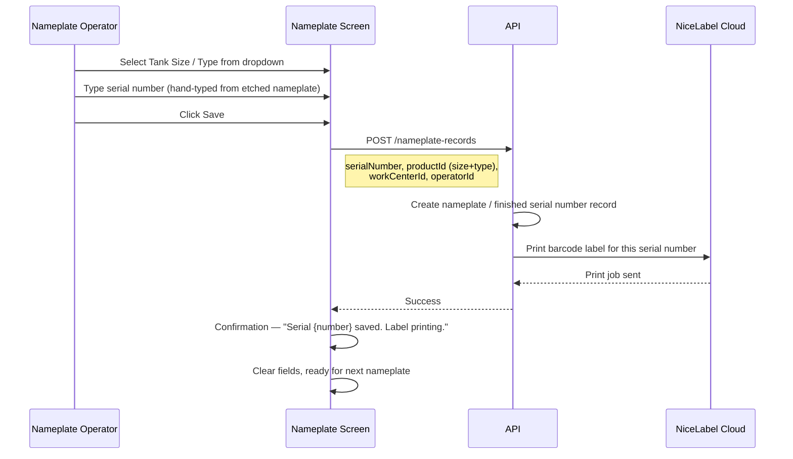

# MES v2 — Nameplate Work Center Specification

## 1. Work Center Overview

| Attribute | Value |
|---|---|
| **Work Center** | Nameplate |
| **Position in Line** | 10th — after Spot X-ray |
| **Purpose** | Creates the nameplate that is welded onto the tank at Hydro. The nameplate is a steel plate etched with tank information. After etching, the operator enters the serial number into the MES, which prints a barcode label. A foil cover is placed over the nameplate and the printed barcode is affixed on top. |
| **Operator Role** | Nameplate Operator (6.0) |
| **NumberOfWelders** | 0 — etching equipment, not welding (nameplate is welded onto the tank later at Hydro) |
| **Auto-Print Label** | Yes — a barcode label is printed on Save (via NiceLabel Cloud) |
| **Input Device** | PC (not a tablet) — this station uses a desktop computer to access the MES application |
| **Input Modes** | Manual Mode only — no barcode scanner at this station |

### 1.1 Key Differences from Other Work Centers

| Aspect | Typical Work Center | Nameplate |
|---|---|---|
| **Device** | Samsung tablet | PC / desktop |
| **Primary input** | Barcode scanner | Keyboard (manual typing) |
| **External Input mode** | Used | Not used — no scanner |
| **Label printing** | Rarely (most use pre-printed) | Always — barcode printed on every save |

---

## 2. Screen Layout

This screen renders inside the Work Center Content Area of the Operator Work Center Layout (per [SPEC_OPERATOR_WC_LAYOUT.md](SPEC_OPERATOR_WC_LAYOUT.md)). Since this is accessed from a PC, the layout will render at desktop resolution but the same shell structure applies.

```
+----------------------------------------------------------+
|                                                           |
|  Tank Size / Type    [ ▾ 500 - Propane           ]       |
|                                                           |
|  Serial Number       [ W00123456                  ]      |
|                                                           |
|             [            SAVE            ]                |
|                                                           |
|                                                           |
+----------------------------------------------------------+
```

A minimal screen with two fields and a Save button.

---

## 3. Data Fields

### 3.1 Tank Size / Type

| Property | Value |
|---|---|
| **Type** | Dropdown selector (single field combining size and type) |
| **Label** | "Tank Size / Type" |
| **Data source** | `GET /products?type=sellable&siteCode={siteCode}` — returns the list of sellable tank products (size + type combinations) for this plant |
| **Examples** | "120 - Propane", "250 - Propane", "500 - Propane", "1000 - Propane" |
| **Default** | No default — operator must select |
| **Required** | Yes |

### 3.2 Serial Number

| Property | Value |
|---|---|
| **Type** | Text input (keyboard entry) |
| **Label** | "Serial Number" |
| **Input** | The operator manually types the serial number that was just etched onto the physical nameplate |
| **Format** | Alphanumeric (e.g., "W00123456"). The format follows the finished serial number convention from the traceability diagram. |
| **Required** | Yes |
| **Validation** | Must not be empty. Should be checked for duplicates (a serial number already in use should be rejected). |

---

## 4. Workflow

### 4.1 Sequence Diagram



### 4.2 Step-by-Step Flow

1. The operator etches the nameplate with tank information using the etching equipment (outside the MES).
2. The operator selects the **Tank Size / Type** from the dropdown.
3. The operator types the **serial number** that was just etched onto the nameplate.
4. The operator clicks **Save**.
5. The system:
	- Creates a nameplate record linking the finished serial number to the product (size + type).
	- Triggers a barcode label print via **NiceLabel Cloud** to the local printer.
6. The operator:
	- Places a foil cover over the etched nameplate (protects the etching).
	- Affixes the freshly printed barcode label on top of the foil.
7. The nameplate (with foil and barcode) is ready to be welded onto the tank at Hydro.
8. The screen clears, ready for the next nameplate.

---

## 5. Barcode Commands

None — this work center does not use a barcode scanner.

---

## 6. Validation and Error Handling

| Scenario | Behavior |
|---|---|
| **No Tank Size / Type selected** | Save button disabled until a selection is made |
| **Empty serial number** | Save button disabled until a value is entered |
| **Duplicate serial number** | Red error — "This serial number already exists in the system" |
| **Invalid serial number format** | Warn if the format doesn't match the expected pattern (configurable) |
| **Print failure** | "Label saved but print failed. Check printer connection." The record is saved regardless — the operator can reprint from the system. |
| **API failure** | "Failed to save nameplate record. Please try again." |

---

## 7. Data Captured

| Field | Source | Description |
|---|---|---|
| **Serial Number** | Hand-typed by operator | The finished tank serial number etched on the nameplate |
| **Product ID** | Tank Size / Type dropdown | The product (size + type combination) |
| **Work Center ID** | Tablet/PC cache | Nameplate station |
| **Operator ID** | Session | Who created the nameplate record |
| **Timestamp** | Server-generated | When the record was saved |

---

## 8. Label Printing

| Property | Value |
|---|---|
| **Trigger** | Automatic on successful save |
| **Integration** | NiceLabel Cloud — API call to print |
| **Content** | Barcode encoding the finished serial number only — **no prefix** (e.g., `W00123456`, not `SC;W00123456`). Downstream stations (Hydro) detect this as a nameplate barcode by the absence of the `SC;` prefix. |
| **Printer** | Cloud-connected printer at the Nameplate station |
| **Reprint** | If the print fails or the label is damaged, the operator should be able to reprint from the record (e.g., a "Reprint" button on the confirmation screen or accessible via the Gear menu) |

---

## 9. API Endpoints

| Method | Endpoint | Purpose |
|---|---|---|
| `GET` | `/products?type=sellable&siteCode={siteCode}` | Retrieve sellable tank size/type combinations for this plant |
| `POST` | `/nameplate-records` | Create the nameplate record and trigger label print |
| `POST` | `/nameplate-records/{id}/reprint` | Reprint a barcode label for an existing record |
| `GET` | `/workcenters/{id}/history?date={today}&limit=5` | WC History panel |

---

## 10. Key Design Decisions

| Decision | Resolution | Rationale |
|---|---|---|
| **PC-based, not tablet** | Desktop computer at this station | Etching equipment is at a workbench; a PC fits the workspace better than a mounted tablet |
| **Manual typing only** | No barcode scanner | The serial number is freshly etched — there's no existing barcode to scan at this point |
| **Combined Tank Size / Type dropdown** | Single field instead of separate size and type dropdowns | Simplifies the UI; the operator makes one selection |
| **Auto-print on save** | Barcode label prints automatically | Every nameplate needs a barcode label; no reason to make the operator trigger it manually |
| **Reprint capability** | Available for damaged or failed prints | Printers can jam or labels can be damaged during the foil/affix process |

---

## References

| Document | Relevance |
|---|---|
| [SPEC_OPERATOR_WC_LAYOUT.md](SPEC_OPERATOR_WC_LAYOUT.md) | Persistent shell — same layout renders on PC at desktop resolution |
| [GENERAL_DESIGN_INPUT.md](GENERAL_DESIGN_INPUT.md) | NiceLabel Cloud integration (Section 8.2), data model |
| [MANFACTURING_CONCEPTS.MD](MANFACTURING_CONCEPTS.MD) | Tank traceability — finished serial number (W00123456) |
