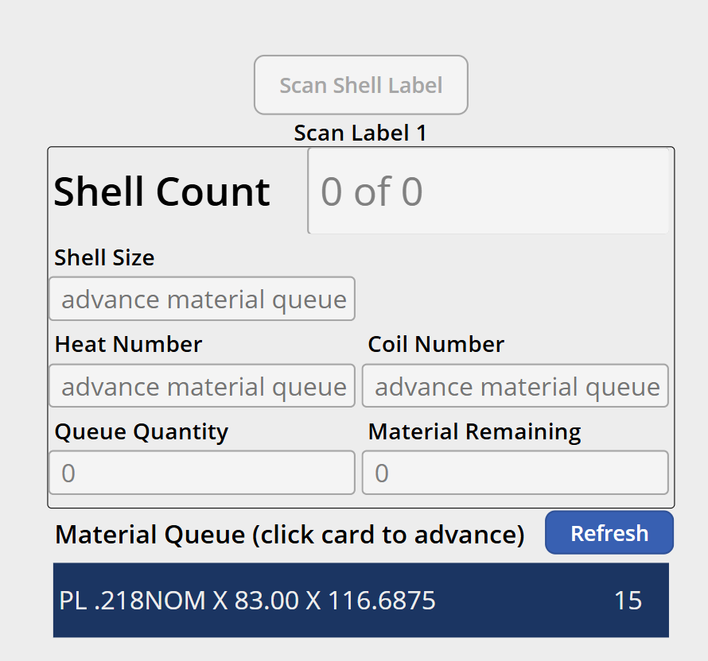

# MES v2 — Rolls Work Center Specification

## 1. Work Center Overview

| Attribute | Value |
|---|---|
| **Work Center** | Rolls |
| **Position in Line** | 1st — first station in the production sequence |
| **Purpose** | Steel plate is fed into a rolling machine that forms it into a cylindrical tank shell. The operator tack-welds the shell to hold its shape, affixes two pre-printed barcode labels, and scans both to create a production record. |
| **Operator Role** | Rolls Operator (6.0) |
| **NumberOfWelders** | 1 — the operator tack-welds the rolled shell to keep it closed |
| **Auto-Print Label** | No — pre-printed barcodes are used because weld dust in the environment damages printers |
| **Input Modes** | External Input (barcode scanning) and Manual Mode (touch) |

### 1.1 Relationship to Rolls Material

The Rolls operator does not load the steel plate — **Material Handlers** do this at a separate station documented in [SPEC_WC_ROLLS_MATERIAL.md](SPEC_WC_ROLLS_MATERIAL.md). The Rolls operator is physically too far from the loading area to see plate details. Material Handlers document the plate's heat number, coil number, shell size, and quantity at their station, which populates the **Material Queue**. The Rolls operator pulls this data into the active state by **advancing the queue**.

---

## 2. Screen Layout

This screen renders inside the Work Center Content Area of the Operator Work Center Layout (per [SPEC_OPERATOR_WC_LAYOUT.md](SPEC_OPERATOR_WC_LAYOUT.md)).



```
+----------------------------------------------------------+
|  [ Scan Shell Label ]           (manual mode button)      |
|                                                           |
|  Scan Label 1  /  Scan Label 2   (scan state indicator)   |
|                                                           |
|  +-----------------------------------------------------+ |
|  |  Shell Count          |   X of Y                    | |
|  |                       |                              | |
|  |  Shell Size           |  {from active queue}        | |
|  |  Heat Number          |  {from active queue}        | |
|  |  Coil Number          |  {from active queue}        | |
|  |  Queue Quantity        |  {total batch size}         | |
|  |  Material Remaining    |  {decrements per shell}     | |
|  +-----------------------------------------------------+ |
|                                                           |
|  Material Queue (click card to advance)       [Refresh]   |
|  +-----------------------------------------------------+ |
|  | PL .218NOM X 83.00 X 116.6875              | 15     | |
|  | PL .250NOM X 83.00 X 116.6875              | 20     | |
|  +-----------------------------------------------------+ |
+----------------------------------------------------------+
```

---

## 3. Data Fields

### 3.1 Active Production Data (from Material Queue)

These fields are populated when the operator advances the material queue. They are read-only and reflect the currently active plate batch.

| Field | Source | Description |
|---|---|---|
| **Shell Size** | Material Queue → Product/Shell Size | The tank shell size determined by the plate dimensions |
| **Heat Number** | Material Queue → Heat Number | The steel heat number for traceability |
| **Coil Number** | Material Queue → Coil Number | The coil identifier for traceability |
| **Queue Quantity** | Material Queue → Quantity Loaded | Total number of shells that can be produced from this plate batch |
| **Material Remaining** | Calculated | Starts at Queue Quantity, decrements by 1 each time a shell is scanned successfully |

### 3.2 Shell Count

| Property | Value |
|---|---|
| **Format** | `X of Y` where X = shells produced from this batch, Y = Queue Quantity |
| **Display** | Large, prominent (similar to the Day Count in WC History) |
| **Updates** | Increments X and decrements Material Remaining each time a matched label pair is scanned |

### 3.3 Pre-Printed Barcode Labels

Because weld dust in the Rolls environment damages printers, **pre-printed barcode labels** are used instead of auto-printed labels.

| Property | Value |
|---|---|
| **Format** | `SC;XXXXXX/L1` and `SC;XXXXXX/L2` — same sequential serial number, different label suffix |
| **Serial number** | Sequential, currently 6 characters. Length may change in the future; the system should not hard-code a fixed length. |
| **Label 1 suffix** | `/L1` |
| **Label 2 suffix** | `/L2` |
| **Physical process** | Operator affixes both labels to the rolled shell, then scans them in sequence |

---

## 4. Workflow

### 4.1 Sequence Diagram

```mermaid
sequenceDiagram
    participant Op as Rolls Operator
    participant Screen as Rolls Screen
    participant API

    Note over Screen: No active material — fields show "advance material queue"

    Op->>Screen: Advance queue (INP;2 scan or tap queue card)
    Screen->>API: POST /workcenters/{id}/queue/advance
    API-->>Screen: Active material data (shellSize, heatNo, coilNo, qty)
    Screen->>Screen: Populate fields, set Material Remaining = qty

    Note over Screen: First shell after advance — thickness inspection required

    Op->>Screen: Scan Label 1 (SC;XXXXXX/L1)
    Screen->>Screen: Store Label 1 serial, prompt "Scan Label 2"

    Op->>Screen: Scan Label 2 (SC;XXXXXX/L2)
    Screen->>Screen: Verify Label 1 serial == Label 2 serial

    alt Labels match
        Screen->>Screen: Show thickness inspection popup (first shell only)
        Op->>Screen: Pass or Fail
        alt Pass
            Screen->>API: POST /production-records (shell data + inspection: pass)
            Screen->>Screen: Increment Shell Count, decrement Material Remaining
            Note over Screen: Subsequent shells skip inspection
        else Fail
            Screen->>API: POST /production-records (shell data + inspection: fail)
            Screen->>Screen: Increment Shell Count, decrement Material Remaining
            Note over Screen: Next shell will also prompt for inspection
        end
    else Labels do not match
        Screen->>Screen: Red overlay — "Labels do not match"
        Screen->>Screen: Reset to "Scan Label 1"
    end

    Note over Screen: Material Remaining reaches 0

    Screen->>Screen: Prompt "Advance the queue?"
    Op->>Screen: Yes (INP;3) or No (INP;4)
    alt Yes
        Screen->>API: POST /workcenters/{id}/queue/advance
        API-->>Screen: Next material data
    else No
        Screen->>Screen: Continue (operator believes counts are off)
    end
```

### 4.2 Step-by-Step Flow

**Initial State (No Active Material)**

1. All data fields display "advance material queue" (greyed out placeholder text).
2. The scan state indicator shows nothing or prompts the operator to advance the queue.
3. The Material Queue section at the bottom shows queued items from the Rolls Material station.

**Advancing the Queue**

4. The operator advances the queue by:
	- **External Input mode**: Scanning `INP;2`
	- **Manual mode**: Tapping a queue card at the bottom of the screen
5. The system calls the API to advance the queue. The next item's data (Shell Size, Heat Number, Coil Number, Queue Quantity) is loaded into the active fields. Material Remaining is set to the Queue Quantity.
6. The previous queue item is removed from the queue list.
7. The scan state indicator changes to **"Scan Label 1"**.
8. A **thickness inspection flag** is set, indicating the first shell from this batch requires inspection.

**Scanning a Shell (per shell)**

9. The operator rolls a plate into a shell, tack-welds it, and affixes two pre-printed barcode labels.
10. The operator scans **Label 1** (`SC;XXXXXX/L1`).
	- The system extracts the serial number (everything before `/L1`) and stores it.
	- The scan state indicator changes to **"Scan Label 2"**.
11. The operator scans **Label 2** (`SC;XXXXXX/L2`).
	- The system extracts the serial number (everything before `/L2`).
	- **Match check**: If Label 1 serial == Label 2 serial → proceed. If not → red overlay "Labels do not match", reset to "Scan Label 1".

**Thickness Inspection (first shell after queue advance only)**

12. If the thickness inspection flag is set, a popup appears:
	- **Title**: "Thickness Inspection"
	- **Message**: "Did the thickness inspection pass?"
	- **Actions**: Pass / Fail (barcode: `INP;3` for Pass, `INP;4` for Fail)
13. **If Pass**: The inspection result is recorded against the production record. The thickness inspection flag is cleared — no further inspection prompts for this batch.
14. **If Fail**: The inspection result is recorded. The thickness inspection flag remains set — the next shell will also prompt for inspection. This continues until the operator gets a passing result or the batch runs out (Material Remaining reaches 0) or the operator advances the queue.

**Production Record Created**

15. A production record is created with:
	- Shell serial number
	- Shell size, heat number, coil number (from active queue data)
	- Work center ID, asset ID, production line ID (from tablet cache)
	- Operator ID, welder ID(s) (from session)
	- Thickness inspection result (if applicable)
	- Timestamp
16. Shell Count increments by 1 (`X of Y` → X increases).
17. Material Remaining decrements by 1.

**Material Remaining Reaches Zero (or Below)**

18. When Material Remaining hits 0 or goes below (possible if counts are off), the system prompts:
	- **Title**: "Advance Queue?"
	- **Message**: "Material remaining has reached zero. Advance to the next material in the queue?"
	- **Actions**: Yes / No (barcode: `INP;3` for Yes, `INP;4` for No)
19. **If Yes**: Queue advances (go to step 5).
20. **If No**: The system allows the operator to continue scanning shells. This handles situations where the material count was incorrect.

---

## 5. Barcode Commands

| Barcode | Action | Context |
|---|---|---|
| `SC;XXXXXX/L1` | Scan Label 1 — stores serial number and prompts for Label 2 | When scan state is "Scan Label 1" |
| `SC;XXXXXX/L2` | Scan Label 2 — verifies match with Label 1, creates production record | When scan state is "Scan Label 2" |
| `INP;2` | Advance the material queue | Anytime (loads next queue item into active state) |
| `INP;3` | Yes / Pass | In response to "Advance queue?" or "Thickness inspection" prompts |
| `INP;4` | No / Fail | In response to "Advance queue?" or "Thickness inspection" prompts |
| `FLT;{text}` | Log a machine fault (e.g., "Button Stuck", "Gnd Fault") | Anytime — displayed to operator, then cleared |

### 5.1 Barcode Context Sensitivity

The same barcode can mean different things depending on context:

| Barcode | During "Advance Queue?" Prompt | During "Thickness Inspection" Prompt | No Active Prompt |
|---|---|---|---|
| `INP;3` | Yes — advance the queue | Pass — inspection passed | Ignored or invalid |
| `INP;4` | No — don't advance | Fail — inspection failed | Ignored or invalid |

---

## 6. Manual Mode Controls

When External Input is toggled OFF, the following touch controls replace barcode scanning:

| Barcode Equivalent | Manual Control | Description |
|---|---|---|
| `SC;XXXXXX/L1` / `SC;XXXXXX/L2` | "Scan Shell Label" button + text input | Operator taps the button and types the serial number. System handles both label scans as a single entry in manual mode. |
| `INP;2` | Tap a queue card in the Material Queue list | Tapping a card advances the queue to that item |
| `INP;3` / `INP;4` | Yes / No or Pass / Fail buttons in popup dialogs | Large touch buttons in the prompt |
| `FLT;{text}` | Not applicable in manual mode | Fault codes originate from hardware; no manual equivalent needed |

### 6.1 Material Queue List (Manual Advance)

| Property | Value |
|---|---|
| **Display** | List of queued material items at the bottom of the screen |
| **Each row** | Plate product description (e.g., "PL .218NOM X 83.00 X 116.6875") and quantity |
| **Tap action** | Tapping a queue card advances the queue to that item (equivalent to `INP;2`) |
| **Refresh button** | Refreshes the queue list from the API |
| **API** | `GET /workcenters/{id}/material-queue` |

---

## 7. Fault Handling (`FLT;`)

Fault codes originate from external hardware (e.g., physical button panels at the station). They are not inspection-related.

| Property | Value |
|---|---|
| **Source** | Hardware sends `FLT;{description}` via the barcode scanner interface |
| **Examples** | `FLT;Button Stuck`, `FLT;Gnd Fault`, `FLT;Check Wiring` |
| **Display** | A notification or banner appears on screen showing the fault description |
| **Dismiss** | Operator acknowledges/clears the fault. The banner disappears. |
| **Logging** | Fault events are logged to the API for troubleshooting but do not block production or create production records |
| **API** | `POST /workcenters/{id}/faults` with fault description and timestamp |

---

## 8. Validation and Error Handling

| Scenario | Behavior |
|---|---|
| **Labels do not match** | Red scan overlay with message "Labels do not match". Reset scan state to "Scan Label 1". No production record created. |
| **Scan Label 2 without Label 1** | Red overlay — "Scan Label 1 first". The system requires Label 1 before Label 2. |
| **Scan Label 1 when already waiting for Label 2** | Replace the stored Label 1 serial with the new scan. This handles the case where the operator made a mistake on the first scan. |
| **No active material** | All data fields show "advance material queue". Shell label scans are rejected with a red overlay — "Advance the material queue first". |
| **Queue is empty** | When the operator tries to advance but no items are in the queue, show an error: "No material in queue. Contact Material Handling." |
| **Duplicate serial number** | If the scanned serial number already exists in the system, red overlay — "This serial number has already been used". Reject the scan. |
| **API failure** | "Failed to save production record. Please try again." Retry logic or local queue for offline resilience. |

---

## 9. Thickness Inspection Detail

| Property | Value |
|---|---|
| **Trigger** | First shell after each queue advance |
| **Popup title** | "Thickness Inspection" |
| **Popup message** | "Did the thickness inspection pass?" |
| **Pass action** | `INP;3` (scan) or Pass button (manual). Clears the inspection flag — no further prompts for this batch. |
| **Fail action** | `INP;4` (scan) or Fail button (manual). Inspection flag remains set — next shell also prompts. |
| **Fail loop** | Continues prompting on every shell until a Pass is received, the batch runs out, or the queue is advanced. |
| **Recording** | The pass/fail result is stored on the production record for the inspected shell. |
| **Scope** | A passing result covers the entire plate batch (all shells from the same queue item). |

---

## 10. API Endpoints

| Method | Endpoint | Purpose |
|---|---|---|
| `GET` | `/workcenters/{id}/material-queue` | Retrieve the material queue for this work center |
| `POST` | `/workcenters/{id}/queue/advance` | Advance to the next item in the queue; returns the new active material data |
| `POST` | `/production-records` | Create a new production record (shell scan + inspection result) |
| `POST` | `/workcenters/{id}/faults` | Log a machine fault event |
| `GET` | `/workcenters/{id}/history?date={today}&limit=5` | Retrieve today's production count and last 5 records (for WC History panel) |

---

## 11. Key Design Decisions

| Decision | Resolution | Rationale |
|---|---|---|
| **Pre-printed barcodes** | No auto-printing; two pre-printed labels per shell | Weld dust environment destroys printers |
| **Dual-label scan verification** | Both labels must have matching serial numbers | Prevents mislabeling — ensures both labels on a shell are the same unit |
| **Material queue driven** | Active data comes from queue populated by Material Handlers | Rolls operator is physically separated from the plate loading area |
| **Thickness inspection per batch** | Prompted on first shell after queue advance only (unless failed) | One passing inspection covers the entire plate batch; reduces redundant checks |
| **Thickness fail loop** | Keeps prompting on every shell until pass or batch exhausted | Ensures quality is verified before continuing with a suspect batch |
| **Flexible serial number length** | System does not hard-code 6-character length | Currently 6 characters but may change; parse based on prefix/suffix delimiters |
| **Advance queue prompt at zero** | Operator can decline if counts are off | Real-world count discrepancies happen; operator judgment takes precedence |

---

## References

| Document | Relevance |
|---|---|
| [SPEC_OPERATOR_WC_LAYOUT.md](SPEC_OPERATOR_WC_LAYOUT.md) | Persistent shell (top bar, bottom bar, left panel, WC History) that wraps this content |
| [SPEC_WC_ROLLS_MATERIAL.md](SPEC_WC_ROLLS_MATERIAL.md) | Material Handling station that populates the material queue for Rolls |
| [MES_V1_BARCODE_LANG.MD](MES_V1_BARCODE_LANG.MD) | Barcode command reference for Rolls |
| [MANFACTURING_CONCEPTS.MD](MANFACTURING_CONCEPTS.MD) | Tank component diagrams and traceability |
| [GENERAL_DESIGN_INPUT.md](GENERAL_DESIGN_INPUT.md) | Overall design patterns, input modes, data architecture |
