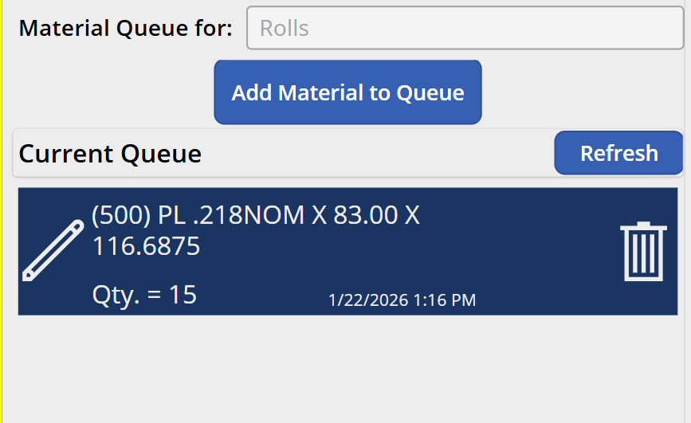
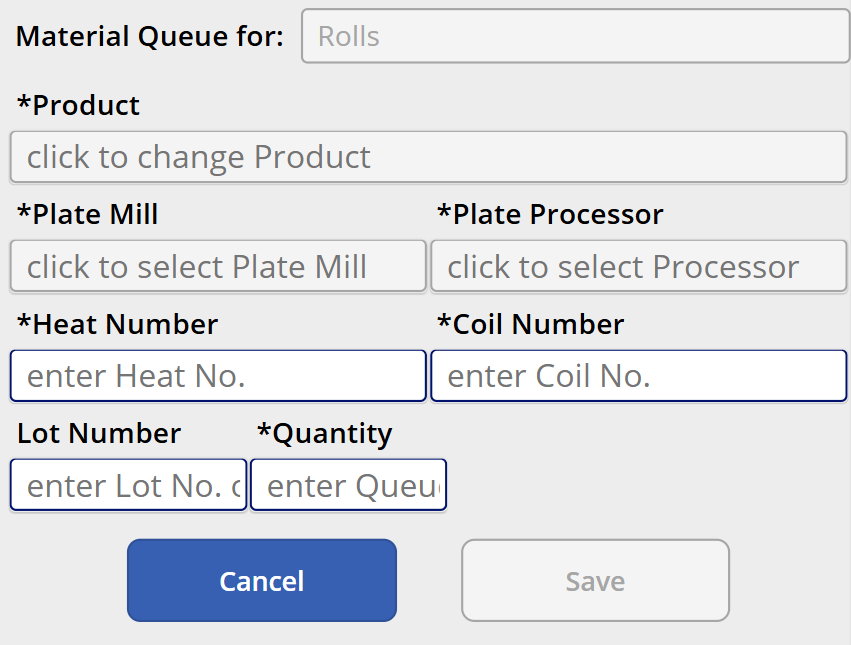

# MES v2 — Rolls Material Work Center Specification

## 1. Work Center Overview

| Attribute | Value |
|---|---|
| **Work Center** | Rolls Material |
| **Purpose** | Material Handlers document the steel plate loaded for the Rolls work center. This populates the material queue that the Rolls operator advances from. |
| **Operator Role** | Material Handler / Operator (6.0) |
| **NumberOfWelders** | 0 |
| **Auto-Print Label** | No |
| **Input Modes** | Manual Mode only — no barcode scanner (vendors don't barcode plate well enough for scanning) |
| **Device** | Samsung tablet (same as other work centers) |

### 1.1 Relationship to Rolls

The Rolls operator is physically too far from the plate loading area to see material details. Material Handlers use this screen to document what plate has been loaded and add it to the queue. The Rolls operator then advances the queue (per [SPEC_WC_ROLLS.md](SPEC_WC_ROLLS.md)) to pull this data into their active state.

---

## 2. Screen Layout

This screen renders inside the Work Center Content Area of the Operator Work Center Layout (per [SPEC_OPERATOR_WC_LAYOUT.md](SPEC_OPERATOR_WC_LAYOUT.md)).

### 2.1 Main Screen — Queue View



```
+----------------------------------------------------------+
|  Material Queue for:  Rolls                               |
|                                                           |
|             [ Add Material to Queue ]                     |
|                                                           |
|  Current Queue                              [ Refresh ]   |
|  +-----------------------------------------------------+ |
|  | ✏ (500) PL .218NOM X 83.00 X 116.6875          🗑  | |
|  |   Qty. = 15              1/22/2026 1:16 PM          | |
|  +-----------------------------------------------------+ |
|  | ✏ (250) PL .187NOM X 72.00 X 96.500             🗑  | |
|  |   Qty. = 20              1/22/2026 2:30 PM          | |
|  +-----------------------------------------------------+ |
|                                                           |
+----------------------------------------------------------+
```

### 2.2 Add/Edit Material Form



```
+----------------------------------------------------------+
|  Material Queue for:  Rolls                               |
|                                                           |
|  *Product         [ click to change Product        ]      |
|                                                           |
|  *Plate Mill      [ click to select Plate Mill     ]      |
|  *Plate Processor [ click to select Processor      ]      |
|                                                           |
|  *Heat Number     [ enter Heat No.    ]                   |
|  *Coil Number     [ enter Coil No.    ]                   |
|                                                           |
|  Lot Number       [ enter Lot No. o   ]                   |
|  *Quantity        [ enter Queu...     ]                   |
|                                                           |
|  [ Cancel ]                          [ Save ]             |
|                                                           |
+----------------------------------------------------------+
```

---

## 3. Queue View

The main screen shows the current material queue for the Rolls work center.

### 3.1 Queue Header

| Element | Description |
|---|---|
| **"Material Queue for: Rolls"** | Identifies which work center this queue feeds |
| **"Add Material to Queue"** | Button to open the add form |
| **"Refresh"** | Refreshes the queue list from the API |

### 3.2 Queue Items

Each queue item displays:

| Field | Description |
|---|---|
| **Product description** | Tank size and plate dimensions (e.g., "(500) PL .218NOM X 83.00 X 116.6875") |
| **Quantity** | Number of shells that can be produced from this plate batch |
| **Timestamp** | Date and time the item was added to the queue |
| **Edit icon** (pencil) | Opens the edit form pre-populated with this item's data |
| **Delete icon** (trash) | Removes the item from the queue (with confirmation prompt) |

Queue items are displayed in the order they were added (FIFO — the Rolls operator advances from the top).

---

## 4. Add / Edit Material Form

### 4.1 Fields

| Field | Type | Required | Description |
|---|---|---|---|
| **Product** | Selection popup (large list) | Yes (*) | The plate product — combines tank size and plate dimensions. Tapping opens a full-screen popup with a large selectable list. |
| **Plate Mill** | Selection popup (large list) | Yes (*) | The steel mill that produced the plate (vendor). Tapping opens a popup list. |
| **Plate Processor** | Selection popup (large list) | Yes (*) | The processor/distributor of the plate. Tapping opens a popup list. |
| **Heat Number** | Text input (keyboard) | Yes (*) | The steel heat number from the plate certificate — typed manually |
| **Coil Number** | Text input (keyboard) | Yes (*) | The coil identifier — typed manually |
| **Lot Number** | Text input (keyboard) | No | Optional lot number — typed manually |
| **Quantity** | Numeric input (keyboard) | Yes (*) | Number of shells that can be produced from this plate batch |

### 4.2 Selection Popups (not dropdowns)

The Product, Plate Mill, and Plate Processor fields use **full-screen selection popups** instead of standard dropdowns. When tapped, a large list opens as a popup/modal with big touch targets. This is more user-friendly when the operator is wearing gloves.

| Property | Value |
|---|---|
| **Trigger** | Tap the field to open the popup |
| **Display** | Full-screen or large modal with a scrollable list of options |
| **Item size** | Large touch targets (64px+ height per item) for glove-friendly use |
| **Search** | Not needed — lists are short enough to display fully on the tablet |
| **Selection** | Tap an item to select it and return to the form |

### 4.3 Data Sources

| Field | API Endpoint |
|---|---|
| **Product** | `GET /products?type=plate&siteCode={siteCode}` — plate products with size and dimensions for this plant |
| **Plate Mill** | `GET /vendors?type=mill&siteCode={siteCode}` — steel mills for this plant |
| **Plate Processor** | `GET /vendors?type=processor&siteCode={siteCode}` — plate processors for this plant |

---

## 5. Workflow

### 5.1 Adding Material to the Queue

1. Material Handler loads plate onto the Rolls machine area.
2. They open the Rolls Material screen and tap **"Add Material to Queue"**.
3. They select the Product (plate dimensions/tank size) from the popup list.
4. They select the Plate Mill and Plate Processor from their popup lists.
5. They manually type the Heat Number, Coil Number, and optionally the Lot Number from the plate certificate or markings.
6. They enter the Quantity (number of shells this batch will produce).
7. They tap **Save**. The item appears in the queue.

### 5.2 Editing a Queue Item

- Tap the **edit icon** (pencil) on any queue item to re-open the form pre-populated with that item's data.
- Make changes and tap Save.
- The Rolls operator sees updated data the next time they advance or refresh.

### 5.3 Removing a Queue Item

- Tap the **delete icon** (trash) on any queue item.
- A confirmation prompt appears: "Remove this item from the queue?"
- On confirm, the item is removed.

---

## 6. Validation and Error Handling

| Scenario | Behavior |
|---|---|
| **Required field missing** | Save button disabled until all required fields (*) are filled |
| **Duplicate Heat + Coil** | Warn — "This Heat/Coil combination already exists in the queue. Continue?" Allow save (could be intentional). |
| **Queue item already advanced by Rolls** | The queue row is **deleted** once the Rolls operator finishes with it (all traceability data — heat, coil, lot — is already captured in the serial number records). Items currently being used by Rolls cannot be edited or deleted. |
| **API failure** | "Failed to save. Please try again." |

---

## 7. Data Captured

| Field | Source | Description |
|---|---|---|
| **Product ID** | Selection popup | The plate product (size + dimensions) |
| **Plate Mill ID** | Selection popup | The vendor/mill that produced the plate |
| **Plate Processor ID** | Selection popup | The processor/distributor |
| **Heat Number** | Manual text input | Steel heat number for traceability |
| **Coil Number** | Manual text input | Coil identifier for traceability |
| **Lot Number** | Manual text input (optional) | Additional lot identifier |
| **Quantity** | Manual numeric input | Number of shells in this batch |
| **Work Center ID** | Tablet cache | Rolls (the target work center) |
| **Operator ID** | Session | The Material Handler who added the entry |
| **Timestamp** | Server-generated | When the item was added to the queue |

---

## 8. API Endpoints

| Method | Endpoint | Purpose |
|---|---|---|
| `GET` | `/workcenters/{rollsId}/material-queue` | Retrieve current queue items |
| `POST` | `/workcenters/{rollsId}/material-queue` | Add a new item to the queue |
| `PUT` | `/workcenters/{rollsId}/material-queue/{itemId}` | Update an existing queue item |
| `DELETE` | `/workcenters/{rollsId}/material-queue/{itemId}` | Remove a queue item |
| `GET` | `/products?type=plate&siteCode={siteCode}` | Plate products for the Product selector |
| `GET` | `/vendors?type=mill&siteCode={siteCode}` | Steel mills for the Plate Mill selector |
| `GET` | `/vendors?type=processor&siteCode={siteCode}` | Processors for the Plate Processor selector |

---

## 9. Key Design Decisions

| Decision | Resolution | Rationale |
|---|---|---|
| **Manual entry only** | No barcode scanning | Vendors don't barcode plate well enough; all data is hand-typed or selected |
| **Selection popups, not dropdowns** | Full-screen popup lists with large touch targets | Material Handlers wear gloves; standard dropdowns are too small to tap accurately |
| **FIFO queue order** | Items are displayed and advanced in the order added | Matches the physical loading sequence at the Rolls station |
| **Edit and delete allowed** | Material Handlers can modify queue items before they're advanced | Mistakes happen; correcting before the Rolls operator advances prevents bad data |
| **Queue row deleted after use** | Once the Rolls operator finishes with a queue item, it is deleted | All traceability data (heat, coil, lot) is already persisted in serial number records; the queue is a transient pointer, not a permanent record |
| **No queue depth limit** | Typically 1–3 items, no enforced maximum | The physical process naturally limits how much plate is staged at once |

---

## References

| Document | Relevance |
|---|---|
| [SPEC_OPERATOR_WC_LAYOUT.md](SPEC_OPERATOR_WC_LAYOUT.md) | Persistent shell layout |
| [SPEC_WC_ROLLS.md](SPEC_WC_ROLLS.md) | The production work center that consumes this queue |
| [GENERAL_DESIGN_INPUT.md](GENERAL_DESIGN_INPUT.md) | Data model — MaterialQueue, Vendor, Product |
