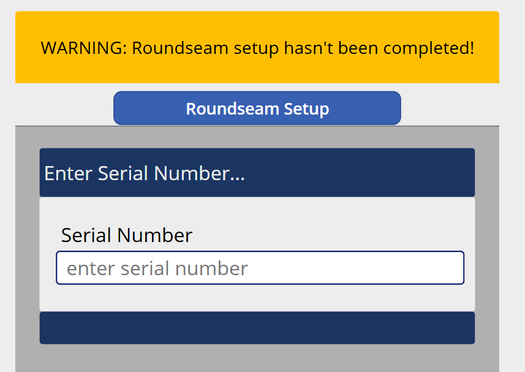
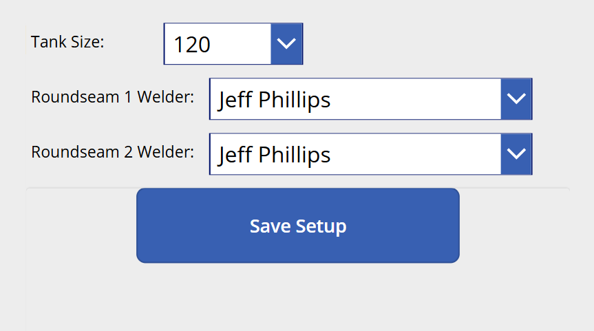

# MES v2 — Round Seam Work Center Specification

## 1. Work Center Overview

| Attribute | Value |
|---|---|
| **Work Center** | Round Seam |
| **Position in Line** | 7th — after Fitup |
| **Purpose** | The circumferential (round seam) welds are made using automated weld machines, joining shells to heads and shells to shells. Each round seam weld position is tracked to the individual welder who performed it. |
| **Operator Role** | Round Seam Operator (6.0) |
| **Requires Welder** | Yes — automated weld machines are operated by certified welders |
| **Auto-Print Label** | No |
| **Input Modes** | External Input (barcode scanning) and Manual Mode (touch) |
| **Weld Machines** | SAW (Submerged Arc Weld) and MIG machines — the specific machine is identified by the tablet's cached **Asset** |

### 1.1 Key Difference — Assembly-Level Data

Unlike upstream work centers (Rolls, Long Seam, Long Seam Inspection) which log data against individual **shell** serial numbers, Round Seam logs data against the **assembly** (alpha code) created at Fitup. The operator scans a shell barcode, and the system uses the TraceabilityLog to look up which assembly alpha code that shell belongs to.

### 1.2 Round Seam Positions by Tank Size

| Tank Size | Round Seams | Positions |
|---|---|---|
| **≤ 500** (1 shell) | 2 | RS1 (left head to shell), RS2 (shell to right head) |
| **1000** (2 shells) | 3 | RS1, RS2, RS3 |
| **≥ 1500** (3 shells) | 4 | RS1, RS2, RS3, RS4 |

See [MANFACTURING_CONCEPTS.MD](MANFACTURING_CONCEPTS.MD) for the Components and Weld Position diagrams.

---

## 2. Screen Layout

This screen renders inside the Work Center Content Area of the Operator Work Center Layout (per [SPEC_OPERATOR_WC_LAYOUT.md](SPEC_OPERATOR_WC_LAYOUT.md)).

### 2.1 Main Screen



```
+----------------------------------------------------------+
|                                                           |
|  +-----------------------------------------------------+ |
|  | ⚠ WARNING: Roundseam setup hasn't been completed!   | |  ← Yellow banner (if setup not done)
|  +-----------------------------------------------------+ |
|                                                           |
|             [ Roundseam Setup ]                           |  ← Opens setup screen
|                                                           |
|  +-----------------------------------------------------+ |
|  |  Enter Serial Number...                              | |
|  +-----------------------------------------------------+ |
|  |  Serial Number                                       | |
|  |  [ enter serial number          ]                    | |
|  |                                                      | |
|  |  [            SUBMIT             ]                   | |
|  +-----------------------------------------------------+ |
|                                                           |
+----------------------------------------------------------+
```

### 2.2 Setup Screen



```
+----------------------------------------------------------+
|                                                           |
|  Tank Size:           [ ▾ 120 ]                          |
|                                                           |
|  Roundseam 1 Welder:  [ ▾ Jeff Phillips ]                |
|                                                           |
|  Roundseam 2 Welder:  [ ▾ Jeff Phillips ]                |
|                                                           |
|  (Roundseam 3 Welder: [ ▾ ... ] )  ← shown for 1000+   |
|                                                           |
|  (Roundseam 4 Welder: [ ▾ ... ] )  ← shown for 1500+   |
|                                                           |
|             [ Save Setup ]                                |
|                                                           |
+----------------------------------------------------------+
```

---

## 3. Round Seam Setup

Before any production records can be saved, the operator must complete the Round Seam Setup. This identifies which welder is responsible for each round seam position.

### 3.1 Setup Requirements

| Property | Value |
|---|---|
| **When required** | Before any shell scans can be saved. A yellow warning banner appears until setup is complete. |
| **Trigger** | Tap/scan the "Roundseam Setup" button |
| **Tank Size** | Dropdown to select the current tank size being run. Determines how many welder assignments are needed. |
| **Welder dropdowns** | One dropdown per round seam position (2, 3, or 4 depending on tank size). Populated from the work center's welder list (same list as the top bar welder widget). |
| **Same welder allowed** | The same welder can be assigned to all seam positions |
| **Save** | "Save Setup" button persists the assignments for the current session |

### 3.2 Setup Persistence

| Property | Value |
|---|---|
| **Scope** | Setup is active for the current session/shift at this work center |
| **Storage** | Server-side, associated with the work center + current date/shift |
| **Mid-shift changes** | If a new welder starts working during the shift, the operator re-opens setup and updates the welder assignments. A button or link to re-run setup should be easily accessible from the main screen (not just when the warning is shown). |
| **Setup carries forward** | After setup is saved, the warning banner disappears and all subsequent scans use the configured welder-per-seam assignments |

### 3.3 Welder-Per-Seam Data

After setup is saved, each production record automatically includes:

| Field | Example (≤ 500) | Example (1000) | Example (≥ 1500) |
|---|---|---|---|
| RS1 Welder | Jeff Phillips | Jeff Phillips | Jeff Phillips |
| RS2 Welder | Jeff Phillips | Mike Johnson | Mike Johnson |
| RS3 Welder | — | Jeff Phillips | Jeff Phillips |
| RS4 Welder | — | — | Mike Johnson |

This per-seam welder data is critical for downstream **Spot X-ray** — when a specific seam is x-rayed, the system needs to know which welder made that weld.

---

## 4. Workflow

### 4.1 Sequence Diagram

```mermaid
sequenceDiagram
    participant Op as RS Operator
    participant Screen as Round Seam Screen
    participant API

    Note over Screen: Warning: Setup not completed

    Op->>Screen: Open Roundseam Setup
    Op->>Screen: Select tank size, assign welders per seam
    Op->>Screen: Tap Save Setup
    Screen->>API: POST /workcenters/{id}/round-seam-setup
    Note right of Screen: tankSize, rs1WelderId, rs2WelderId, ...
    API-->>Screen: Setup saved
    Screen->>Screen: Warning banner removed, ready for scans

    Op->>Screen: Scan shell label (SC;XXXXXX)
    Screen->>API: POST /production-records/round-seam
    Note right of Screen: serialNumber (for assembly lookup),<br/>workCenterId, assetId, operatorId,<br/>welderPerSeam from setup
    API->>API: Look up assembly alpha code via TraceabilityLog
    API->>API: Create production record against assembly
    API-->>Screen: Success (assembly alphaCode displayed)
    Screen->>Screen: Green overlay — "Assembly {alphaCode} recorded"
    Screen->>Screen: Clear input, ready for next scan
```

### 4.2 Step-by-Step Flow

**1. Complete Setup (once per session or when welders change)**

- If setup has not been completed, a **yellow warning banner** is displayed: "WARNING: Roundseam setup hasn't been completed!"
- The operator taps "Roundseam Setup" to open the setup screen.
- They select the tank size and assign a welder to each round seam position.
- Tap "Save Setup" — the warning disappears, and the main screen is ready.

**2. Scan Shell**

- The operator scans a shell barcode (`SC;XXXXXX/L1` or `/L2`).
- The API strips the label suffix, looks up the serial number, and uses the **TraceabilityLog** to find the assembly alpha code that this shell belongs to.
- A production record is created against the **assembly** (not the shell) capturing:
	- Assembly alpha code
	- Work center ID, asset ID (SAW or MIG machine), production line ID
	- Operator ID
	- Welder-per-seam assignments from the current setup
	- Timestamp
- Green overlay confirms: "Assembly {alphaCode} recorded".
- The input is cleared, ready for the next shell/assembly.

**3. Re-run Setup (mid-shift)**

- A "Roundseam Setup" button remains accessible on the main screen at all times (not only when the warning is shown).
- If a new welder starts during the shift, the operator taps the button, updates the welder assignments, and saves.
- All subsequent production records use the updated assignments.

---

## 5. Barcode Commands

| Barcode | Action | Context |
|---|---|---|
| `SC;XXXXXX/L1` or `/L2` | Scan shell — look up assembly, create production record | After setup is complete |

No other barcode commands are used at this work center. The setup screen is touch-only (dropdowns and buttons).

---

## 6. Manual Mode Controls

When External Input is toggled OFF:

| Barcode Equivalent | Manual Control | Description |
|---|---|---|
| `SC;XXXXXX` | Text input + Submit button | Type shell serial number to look up the assembly |

The setup screen is always manual (dropdown selectors for tank size and welders).

---

## 7. Validation and Error Handling

| Scenario | Behavior |
|---|---|
| **Setup not completed** | Yellow warning banner. Shell scans are blocked — "Complete Roundseam Setup before scanning." |
| **Valid shell scan (assembly found)** | Green overlay — production record created against the assembly |
| **Shell not found in any assembly** | Red overlay — "This shell is not part of any assembly. It must go through Fitup first." |
| **Assembly already recorded at Round Seam** | Red overlay — "Assembly {alphaCode} has already been recorded at Round Seam." Prevents duplicates. |
| **No welder signed in (top bar)** | Per Welder Minimum Enforcement — save blocked with banner |
| **Setup welder not in current welder list** | If a welder was assigned in setup but has since been removed from the top bar welder list, warn on scan — "Setup welder {name} is no longer active. Please update Roundseam Setup." |
| **Tank size mismatch** | If the assembly's actual tank size doesn't match the setup tank size, warn — "Assembly {alphaCode} is size {actual} but setup is configured for {setup}. Update setup or verify." |
| **API failure** | "Failed to save record. Please try again." |

---

## 8. Data Captured

### 8.1 Setup Record

| Field | Source | Description |
|---|---|---|
| **Work Center ID** | Tablet cache | Which round seam station |
| **Tank Size** | Setup dropdown | Determines number of welder assignments |
| **RS1 Welder ID** | Setup dropdown | Welder for Round Seam 1 position |
| **RS2 Welder ID** | Setup dropdown | Welder for Round Seam 2 position |
| **RS3 Welder ID** | Setup dropdown (if 1000+) | Welder for Round Seam 3 position |
| **RS4 Welder ID** | Setup dropdown (if 1500+) | Welder for Round Seam 4 position |
| **Timestamp** | Server-generated | When setup was saved |

### 8.2 Production Record (per assembly)

| Field | Source | Description |
|---|---|---|
| **Assembly Alpha Code** | Looked up via shell → TraceabilityLog | The assembly being processed |
| **Work Center ID** | Tablet cache | Round Seam |
| **Asset ID** | Tablet cache | Specific weld machine (SAW or MIG) |
| **Production Line ID** | Tablet cache | The production line |
| **Operator ID** | Session | Who operated the station |
| **RS1 Welder ID** | From active setup | Who welded Round Seam 1 |
| **RS2 Welder ID** | From active setup | Who welded Round Seam 2 |
| **RS3 Welder ID** | From active setup (if applicable) | Who welded Round Seam 3 |
| **RS4 Welder ID** | From active setup (if applicable) | Who welded Round Seam 4 |
| **Timestamp** | Server-generated | When the record was created |

---

## 9. API Endpoints

| Method | Endpoint | Purpose |
|---|---|---|
| `POST` | `/workcenters/{id}/round-seam-setup` | Save the welder-per-seam setup |
| `GET` | `/workcenters/{id}/round-seam-setup` | Retrieve current setup (to check if complete and display current assignments) |
| `POST` | `/production-records/round-seam` | Create a production record — looks up assembly from shell, applies setup welder data |
| `GET` | `/workcenters/{id}/welders` | Welder list for the setup dropdowns |
| `GET` | `/workcenters/{id}/history?date={today}&limit=5` | WC History panel |

---

## 10. Key Design Decisions

| Decision | Resolution | Rationale |
|---|---|---|
| **Per-seam welder tracking** | Setup screen assigns a welder to each RS position | Spot X-ray downstream needs to know which welder made the weld being x-rayed; this is a quality/compliance requirement |
| **Setup required before scanning** | Yellow warning banner blocks production until setup is done | Ensures welder data is captured for every record; prevents records without welder attribution |
| **Data logged against assembly** | Shell scan → TraceabilityLog → alpha code | From Fitup onward, the assembly (not individual shells) is the production unit |
| **Asset = weld machine type** | SAW vs MIG identified by tablet's cached asset | Different machine types may affect weld quality parameters and are tracked for traceability |
| **Mid-shift setup changes** | Setup button always accessible | Welders rotate during shifts; the system must allow updates without disrupting the workflow |
| **Same welder for all seams allowed** | No restriction on duplicate assignments | Many assemblies have one welder doing all positions; the system should not add unnecessary constraints |

---

## References

| Document | Relevance |
|---|---|
| [SPEC_OPERATOR_WC_LAYOUT.md](SPEC_OPERATOR_WC_LAYOUT.md) | Persistent shell, welder enforcement, scan overlay |
| [SPEC_WC_FITUP.md](SPEC_WC_FITUP.md) | Upstream — creates the assembly and alpha code |
| [MANFACTURING_CONCEPTS.MD](MANFACTURING_CONCEPTS.MD) | Weld position diagram — RS1, RS2, RS3, RS4 positions |
| [MES_V1_BARCODE_LANG.MD](MES_V1_BARCODE_LANG.MD) | Barcode command reference |
| [GENERAL_DESIGN_INPUT.md](GENERAL_DESIGN_INPUT.md) | Data model — Assembly, TraceabilityLog, WelderLog |
