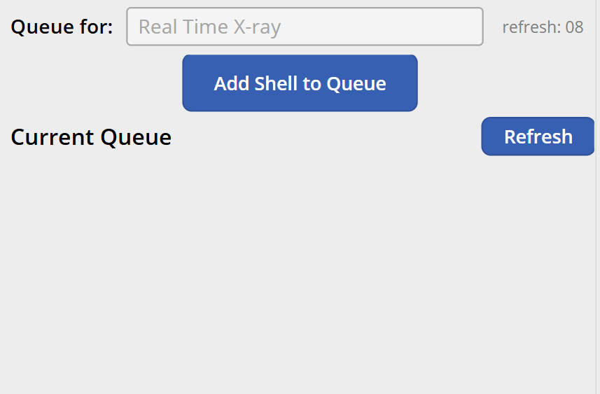

# MES v2 — Real Time X-ray Queue Work Center Specification

## 1. Work Center Overview

| Attribute | Value |
|---|---|
| **Work Center** | Real Time X-ray Queue |
| **Purpose** | An operator near the x-ray loading area scans shell barcodes into a queue. The Real Time X-ray operator — who cannot see or scan the shell once it's inside the equipment — pulls from this queue in a separate application. |
| **Operator Role** | Operator (6.0) |
| **Requires Welder** | No |
| **Auto-Print Label** | No |
| **Input Modes** | External Input (barcode scanning) — primary mode; Manual Mode available as fallback |
| **Device** | Samsung tablet |

### 1.1 Relationship to Real Time X-ray

The Real Time X-ray operator uses a **separate application** that interfaces directly with the x-ray equipment. That application reads from this queue to identify which shell is currently being inspected. Once the RT X-ray operator saves their inspection record, the corresponding queue row is automatically removed.

This MES screen exists solely to bridge the gap: the shell is physically loaded into the x-ray machine and is no longer visible or scannable, so someone must record the shell identity before it disappears inside.

---

## 2. Screen Layout

This screen renders inside the Work Center Content Area of the Operator Work Center Layout (per [SPEC_OPERATOR_WC_LAYOUT.md](SPEC_OPERATOR_WC_LAYOUT.md)).



```
+----------------------------------------------------------+
|  Queue for:  Real Time X-ray                              |
|                                                           |
|             [ Add Shell to Queue ]                        |
|                                                           |
|  Current Queue                              [ Refresh ]   |
|  +-----------------------------------------------------+ |
|  | 123456              1/22/2026 2:15 PM           🗑  | |
|  +-----------------------------------------------------+ |
|  | 123457              1/22/2026 2:18 PM           🗑  | |
|  +-----------------------------------------------------+ |
|                                                           |
+----------------------------------------------------------+
```

---

## 3. Queue View

### 3.1 Queue Header

| Element | Description |
|---|---|
| **"Queue for: Real Time X-ray"** | Identifies which work center this queue feeds |
| **"Add Shell to Queue"** | Button — in manual mode, opens a text input for the serial number. In External Input mode, not typically needed since scanning auto-adds (see Section 4). |
| **"Refresh"** | Manually refreshes the queue list from the API |

### 3.2 Queue Items

Each queue item displays:

| Field | Description |
|---|---|
| **Shell serial number** | The scanned shell's serial number |
| **Timestamp** | Date and time the shell was added to the queue |
| **Delete icon** (trash) | Removes the item from the queue (with confirmation prompt) — for correcting mistakes |

Queue items are displayed in FIFO order (first scanned = first pulled by the RT X-ray operator).

---

## 4. Workflow

### 4.1 Adding a Shell to the Queue

In **External Input mode** (the primary mode for this station):

1. The operator scans the shell barcode (`SC;XXXXXX/L1` or `/L2`).
2. The system strips the `/L1` or `/L2` suffix to extract the serial number.
3. The shell is immediately added to the queue — no form, no additional input.
4. Green overlay — "Shell {serial} added to queue."
5. The queue list **auto-refreshes** after the save, showing the updated list (which also reflects any removals made by the RT X-ray app).

In **Manual Mode**:

1. The operator taps "Add Shell to Queue".
2. A text input appears for the serial number.
3. They type the serial number and tap Save.
4. Same result — shell added to queue, list refreshes.

### 4.2 Queue Item Removal

Items are removed in two ways:

| Trigger | Description |
|---|---|
| **RT X-ray app saves** | The separate RT X-ray application pulls the next shell from the queue and removes it after saving the inspection record. This happens automatically. |
| **Manual delete** | The queue operator taps the trash icon to remove an incorrectly scanned shell. Confirmation prompt: "Remove this shell from the queue?" |

### 4.3 Queue Auto-Refresh

The queue list refreshes automatically each time the operator scans a new shell (the save response returns the updated queue). This keeps the display current by reflecting removals made by the RT X-ray operator without requiring manual refresh. The Refresh button is available for manual refresh at any time.

```mermaid
sequenceDiagram
    participant Op as Queue Operator
    participant Screen as RT X-ray Queue Screen
    participant API
    participant RTApp as RT X-ray App (separate)

    Op->>Screen: Scan shell (SC;XXXXXX/L1)
    Screen->>Screen: Extract serial number (strip /L1 suffix)
    Screen->>API: POST /workcenters/{id}/xray-queue
    Note right of Screen: serialNumber, operatorId, timestamp
    API-->>Screen: Success + updated queue list
    Screen->>Screen: Green overlay — "Shell {serial} added to queue"
    Screen->>Screen: Refresh queue display

    Note over RTApp: RT X-ray operator pulls next shell

    RTApp->>API: GET /workcenters/{id}/xray-queue/next
    API-->>RTApp: Shell serial number
    RTApp->>RTApp: Perform inspection
    RTApp->>API: POST /xray-records (saves + removes from queue)
    API-->>RTApp: Success

    Note over Screen: Next time queue operator scans...

    Op->>Screen: Scan next shell (SC;YYYYYY/L2)
    Screen->>API: POST /workcenters/{id}/xray-queue
    API-->>Screen: Success + updated queue list
    Screen->>Screen: Queue display now reflects RT X-ray's removal
```

---

## 5. Validation and Error Handling

| Scenario | Behavior |
|---|---|
| **Duplicate shell in queue** | Warn — "Shell {serial} is already in the queue." Block add. |
| **Unknown serial number** | Red overlay — "Serial number not found." Block add. Shell must exist in the system before it can be queued for X-ray. |
| **API failure** | "Failed to add shell. Please try again." |

---

## 6. Data Captured

| Field | Source | Description |
|---|---|---|
| **Serial Number** | Barcode scan (`SC;XXXXXX`) | The shell being queued for RT X-ray |
| **Work Center ID** | Tablet cache | Real Time X-ray |
| **Operator ID** | Session | The operator who scanned the shell |
| **Timestamp** | Server-generated | When the shell was added to the queue |

---

## 7. API Endpoints

| Method | Endpoint | Purpose |
|---|---|---|
| `GET` | `/workcenters/{id}/xray-queue` | Retrieve current queue items |
| `POST` | `/workcenters/{id}/xray-queue` | Add a shell to the queue |
| `DELETE` | `/workcenters/{id}/xray-queue/{itemId}` | Remove a queue item (manual delete) |

---

## 8. Key Design Decisions

| Decision | Resolution | Rationale |
|---|---|---|
| **Scan-to-add (no form)** | Scanning a shell barcode immediately adds it to the queue | Simplest possible workflow — operator just scans as shells are loaded into the machine |
| **Auto-refresh on save** | Queue list refreshes each time a new shell is added | Keeps the display current by reflecting removals from the RT X-ray app without a separate timer or polling mechanism |
| **Manual delete available** | Trash icon on each queue row with confirmation | Allows correcting mistakes (wrong shell scanned) |
| **FIFO order** | First scanned = first pulled by RT X-ray app | Matches the physical order of shells entering the machine |
| **Queue row auto-removed by RT X-ray app** | The separate RT X-ray application removes the row when it saves | The queue is a transient handoff mechanism — no permanent data stored here |
| **Separate application for RT X-ray** | The actual x-ray inspection is handled outside MES | The x-ray equipment has its own specialized software; MES only provides the shell identification queue |

---

## References

| Document | Relevance |
|---|---|
| [SPEC_OPERATOR_WC_LAYOUT.md](SPEC_OPERATOR_WC_LAYOUT.md) | Persistent shell layout |
| [GENERAL_DESIGN_INPUT.md](GENERAL_DESIGN_INPUT.md) | Data model — MaterialQueue, SerialNumber |
